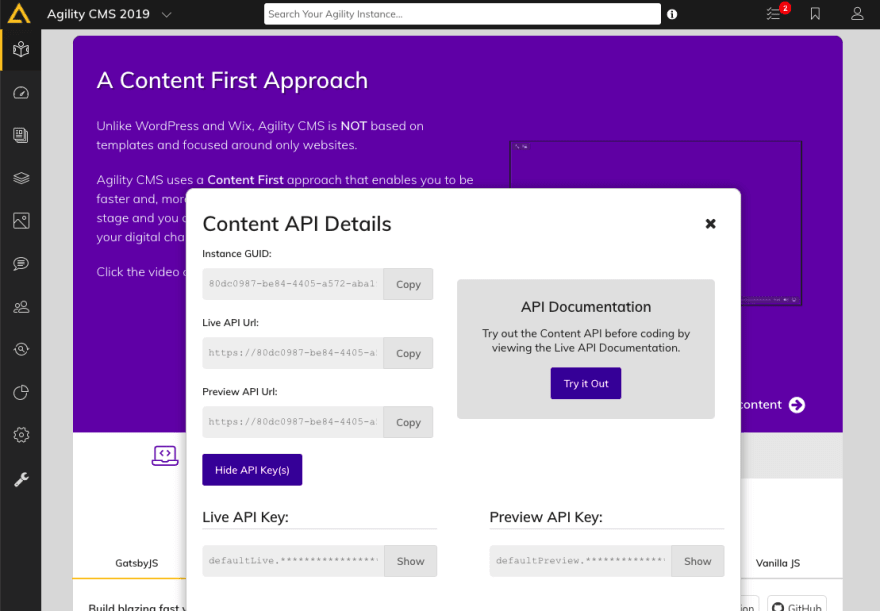
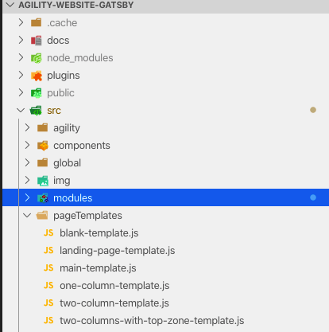
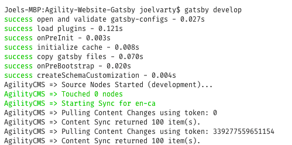
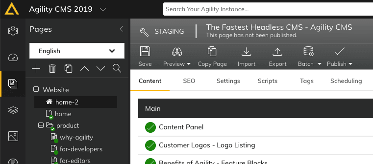
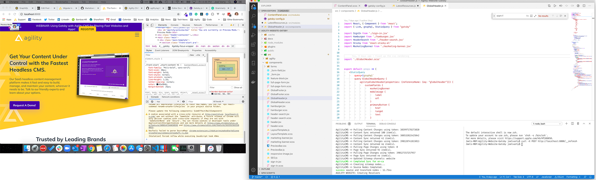
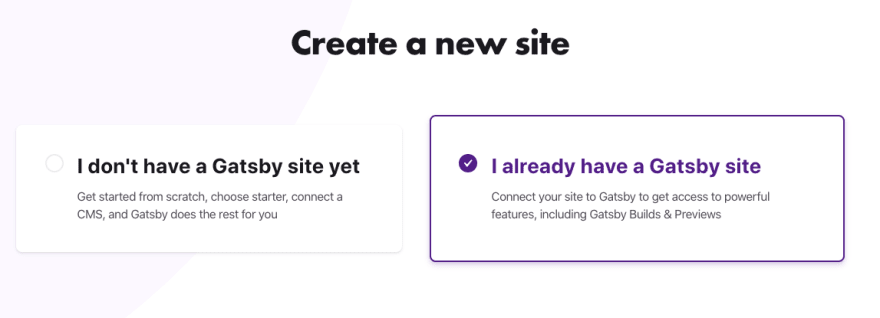

I've been preaching about JAMStack for a while now, and lately I've been talking a lot about how you can [move your website to JAMStack without rebuilding everything](https://agilitycms.com/resources/posts/migrate-to-jamstack-now-no-excuses).

I decided it was time to take my own advice and upgrade my company's website, [agilitycms.com](https://agilitycms.com), starting with the home page, and adding pages and sections over time. Agility CMS is a headless content management system running in the cloud (Microsoft Azure). The current website is built on ASP.Net Core. Our marketing team came to me with a request to build a brand new home page which included not only updating content, but a brand new design, new modules, and new integrations with mar-tech.

This was just the opportunity I’d been looking for: A chance to practice what I've been preaching! What's also great is the current .net website is already built using a headless CMS, so I don't have to rewrite or migrate any content.

## Goals

- Build the new home page using [Gatsby](https://www.gatsbyjs.org/)
- Re-use much of the existing site content from [our headless cms](https://agilitycms.com/)
- Zero downtime

## tl;dr

For those of you who just want to see the code for the new site (it only has code for the modules that are on the homepage right now, but it will expand over time), it's all here on GitHub: https://github.com/agility/agility-website-gatsby.

## Steps

Here's what I did to get everything up and running, right from coding the new site, to deploying, testing and flipping over the DNS.

Get it running locally with Gatsby
Implement the Header and Footer
Create a new Home Page
Run it in Gatsby Cloud
Deploy to Netlify
Setup the CDN to do the Edge Routing

What's really cool is that this workflow isn't just for upgrading Agility websites to JAMstack - you can use it for any website! Now let’s break each step into specific details.

## Step 1: Get it running locally with Gatsby

It's really easy to get started creating a Gatsby website with Agility CMS. Just clone the [starter repo from github](https://github.com/agility/agility-gatsby-starter), open up the folder in [VS Code](https://code.visualstudio.com/) and pop in your API Keys.

```shell
git clone https://github.com/agility/agility-gatsby-starter.git
```

Now, find your API keys on the Getting Started page of the [Agility CMS Content Manager](https://manager.agilitycms.com/)



Put your keys into the **.env.development** and **.env.production** files. They look something like this and have instructions about which values go where.

```text
# Your Instance Id
AGILITY_GUID=

# Your Preview API Key (recommended) - you can get this from the Getting Started Page in Agility CMS
AGILITY_API_KEY=

# If using your Preview API Key, set this to true
AGILITY_API_ISPREVIEW=true

# If you want to enable <host>/__refresh endpoint
ENABLE_GATSBY_REFRESH_ENDPOINT=true
```

Now, check out the **gatsby.config** file - it has a section for plugins, and the Agility CMS source plugin is called **@agility/gatsby-source-agilitycms**. Check that the language code and channel name matches what you have in your Agility CMS instance.

### Modules and Page Templates

Since this was an existing website, we already had a few Page Templates and Module Definitions set up in the instance. We need to make sure we at least have placeholders in our new Gatsby project for those, and we'll just implement whatever is needed for our new home page.



There are folders for Page Templates and Modules, and you can just put in placeholder React code for these right now.

Here's an example Page Template component with a single content zone called "Main":

```jsx
import React from "react"
import ContentZone from "../agility/components/ContentZone"

const MainTemplate = props => {
  return (
    <div className="main-template">
      <ContentZone name="Main" {...props} />
    </div>
  )
}
export default MainTemplate
```

Here's an example Module component that doesn't do anything except output its name.

```jsx
import React from "react"

const LatestResources = ({ item }) => {
  return <section className="container">LatestResources</section>
}

export default LatestResources
```

When I got all those things in place, I started up Gatsby to see what would happen.

```shell
gatsby develop
```

Gatsby will pull down all the content for our website and put it into GraphQL. This is a _content sync_, so from now on it will only pull down a delta (what's changed) from Agility CMS.


## Step 2: Implement the Header and Footer

We need to make our new website look just like the old one, so we need to match the colors, fonts, and other visual styles as much as we can. You may want to pull in the CSS from your old site—or start from scratch if you want to make a clean break.

Either way, this is a great time to familiarize yourself with the GraphQL data in your website. Point your browser to [http://localhost:8000/\_\_\_graphql](http://localhost:8000/___graphql) to start exploring your data, and you can build the query access and Shared Content or Sitemap data. You can see that all content is available, grouped by content definition name.

Here's the query that I used to grab a Global Header shared content item, as well as the nested sitemap as JSON.

```graphql
query GlobalHeaderQuery {
  agilityGlobalHeader(properties: { referenceName: { eq: "globalheader" } }) {
    customFields {
      marketingBanner
      logo {
        url
        label
      }
    }
    preHeaderLinks {
      customFields {
        title
        uRL {
          href
          target
          text
        }
      }
    }
  }
  agilitynestedsitemap {
    internal {
      content
    }
  }
}
```

Your query will look different, of course, but I hope you get the idea of how to query your Agility CMS content.

Now, you can create a component that uses a `<StaticQuery>` to pull in the data and make it available. Check out the example `GlobalHeader.js` component in your project for an example of that.

## Step 3: Create a new Home Page

In Agility CMS, the first page in your sitemap is considered your Home Page. So, I created a new home page and temporarily called it home-2. I didn't publish it, but this meant that I could use this to build out the modules on the new home page.



I created a couple of new Module Definitions that I needed for the new page design, so I created new react components in the **modules** folder for those. The amazing thing about the Agility CMS Gatsby implementation is that nearly all the data that you need to render a module on a page is given to you in a property called **item**.

What I normally do is just `console.log("ModuleName", item)` so I can see exactly what that data looks like. Then run the site locally in your browser http://localhost:8000 and open up your Developer Tools to see what it looks like in the console.

### Hot Reloading - Code and Content

One of the best things about React development with Gatsby is that everything can be hot reloaded, including the content!

If you leave your browser open beside your code, you can just make changes and see them. Additionally, if you open a second terminal window, you can also pull down any changes that you make to the content in Agility CMS without having to run `gatsby develop` again.

```shell
curl -X POST http://localhost:8000/__refresh
```

Here's a side-by-side screenshot of my 2 monitor setup. You can see that I have 2 terminal windows opened in VS Code.



I really love this workflow! It makes it really easy to tweak things and see the changes instantly.

## Step 4: Run it in Gatsby Cloud

To get going, [Gatsby Cloud](https://www.gatsbyjs.com/) is the easiest way to Preview and Build Gatsby sites. The free version is enough to get you started.

Push your code to a GitHub repo, sign up for Gatsby Cloud, and create a new site. When asked, simply choose "I already have a Gatsby site" and don't add any integrations just now.



You can securely add your API Keys in the Environment Variable section of Settings.


Now you can take the Preview link from Gatsby and plug that into Agility CMS in the Domain Configuration area of the Settings section.

Additionally, Gatsby gives you webhook URLs for Preview and Build. You can go ahead and plug these into the Webhook area in Agility Settings.

## Step 5: Deploy to Netlify

Netlify is a really great service to easily host static websites. Even better, it integrates seamlessly so that Gatsby can automatically deploy your website to Netlify when it builds!

Go ahead and create a free Netlify account and point to it under the Gatsby **Hosting Integrations** settings section.

Since Gatsby is going to be building the LIVE version of our site, we need to publish our new Homepage in Agility. If you've reviewed everything in Preview and you're ready to go, the first thing you need to do is to disable the Syncing Web Servers for the existing website in Agility CMS. You'll have to coordinate this with your content team, of course.

When I was testing all this out, I actually built my new site using the Preview API Keys temporarily. That way I could verify everything was working first.

In the end, you're going to end up with a URL to your new home page in Netlify.

## Step 6: Setup the CDN to do the Edge Routing

We can use Edge computing to decide whether to route to the new website or the old one, depending on the page.

In this example, I decided to use a [Stackpath](https://www.stackpath.com/) Script to do this for us.

You set up a Stackpath site just like normal, but pointing to your OLD website's unique hostname. It can't be your public DNS name - you need to have another unique way to address that site. For example, since our website is hosted in an Azure App Service, we get an azurewebsites.net URL.

Now you create a Script in Stackpath to do the routing. In our case, we ONLY want to route requests to the home page, plus any Gatsby-specific stuff, to our new website.

You can also see that I'm only allowing for 60 seconds on caching in the CDN for all requests. This is because we don't have anything built into this workflow to clear the cache in this CDN, and I don't want my content team to have to wait too long to see their changes. I'll take care of that later.

```javascript
// sample script
addEventListener("fetch", event => {
  event.respondWith(handleRequest(event.request))
})

/**
 * Fetch and return the request body
 * @param {Request} request
 */
async function handleRequest(request) {
  // Wrap your script in a try/catch and return the error stack to view error information
  try {
    /* The request can be modified here before sending it with fetch */

    const originalUrl = request.url
    const url = new URL(request.url)
    // we need get the url in order to figure out where to route them
    let path = url.pathname

    //secondary domain...
    const secDomain = "https://my-new-website.netlify.com"

    if (
      path == "/" || //redirect the home page...
      path.indexOf("/webpack") != -1 ||
      path.indexOf("/common") != -1 ||
      path.indexOf("/component") != -1 ||
      path.indexOf("/page-data") != -1 ||
      path.indexOf("/styles") != -1 ||
      path.indexOf("/app-") != -1
    ) {
      // we need get the url in order to figure out where to route them
      request.url = secDomain + path
    }

    const response = await fetch(request)

    response.headers.set("Cache-Control", "public, max-age=60")

    return response
  } catch (e) {
    return new Response(e.stack || e, { status: 500 })
  }
}
```

You can now test this whole thing with the unique Stackpath URL that you get (123xyz.stackpathcdn.com).

Once you are happy with everything, you simply switch your DNS to point to Stackpath.

That's it—you’re finished!

If you have any questions about JAMstack or migrating to this technology, reach out!

## Next Steps

I encourage you to go ahead and use this technique as the starting point for one of the pages on your own website! You can use [Agility CMS for free](https://agilitycms.com/v3-free-signup-developers?source=devto) to do it.

## BONUS CONTENT!

As a companion to this article, I recorded a video that walks you through the steps I took and the different tools involved. I also highlight some of the really neat features of Agility CMS, Gatsby, Netlify, and Stackpath.

[](https://www.youtube.com/embed/WSIzYKDgJuE "Migrating a website to JAMstack with Gatsby")
