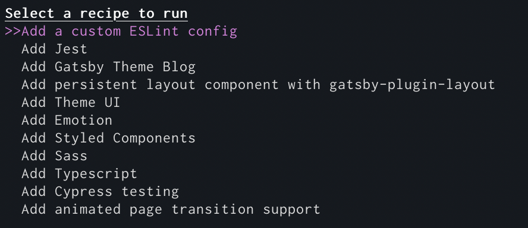

I'm excited to announce Gatsby Recipes, a new tool to automate common site building tasks.

Recipes are run from the CLI and automate common tasks like creating pages and layouts, installing and setting up plugins, adding a blog to a site, setting up Typescript, and many more.

Gatsby ships with a number of default recipes and it's easy to create your own for use on your sites. Recipes allow you to install NPM packages, add Gatsby plugins, generate pages and other code. Recipes are written using markdown and React components.

To kickstart the new era of Gatsby Recipes, we’ve created 11 official recipes with more on the way! These include recipes for adding Typescript, ThemeUI, Sass, Cypress, and setting up useful techniques like animated page transitions, and persistent layout components.

**Watch me add [ThemeUI](https://theme-ui.com/) to a Gatsby site in under 45 seconds**

<video controls="controls" autoplay="true" loop="true">
  <source type="video/mp4" src="./gatsby-recipes-theme-ui.mp4" />
  <p>Sorry! Your browser doesn't support this video.</p>
</video>

Gatsby has 1000s of plugins and themes and is an incredibly flexible tool for creating for the web. With this comes the problem of discovering how to accomplish a specific task. It's a challenge when users enter the Gatsby ecosystem, they have to translate "I want to do x" to how "x" is done in Gatsby. Last year, Marcy Sutton led our effort to add [dozens of "recipes" to help people with this on gatsbyjs.org](https://www.gatsbyjs.org/docs/recipes/). But we think these will work even better if you can run them directly on the CLI. Gatsby Recipes teach users how to accomplish desired tasks in Gatsby while also enabling them to automate the process.

So now, instead of Googling how to add Styled Components support to Gatsby, you simply run `gatsby recipes styled-components` and an interactive workflow walks you through the steps.

Similarly if you want to add a blog, you can now run `gatsby recipes gatsby-theme-blog` and immediately start blogging.

We want there to be 10s of thousands of recipes you can search, run, and remix per your needs.

## Human-friendly automation

Recipes are written in [MDX](https://mdxjs.com/)—a combination of Markdown and React components—readable by both humans and machines. (Other “infrastructure as code” automations, like AWS CloudFormation, use kinda-sorta legible yaml templates that favor the machines). We picked MDX to make Gatsby Recipes instructions and explanations easily readable for humans while using React components syntax to _declare_ to Gatsby Recipes the desired state of the world. This means Gatsby Recipes read like actual little recipes. Writing and using them could be...dare we say it..._fun_.

We take a lot of inspiration from literate programming tools like [Eve](http://witheve.com/deepdives/literate.html) and [HyperCard](https://en.wikipedia.org/wiki/HyperCard).

To try out Recipes, update to the latest version of the Gatsby by running:

- `npm install -g gatsby-cli@latest`
- `npm install gatsby@latest`

Then run `gatsby recipes` to see the list of recipes and to try one out.



We want to see what you come up with! Share your recipes with the community in the [Gatsby Recipes umbrella issue](https://github.com/gatsbyjs/gatsby/issues/22991)!

We're very excited to ship Recipes. We care a lot about the Gatsby developer experience and we want to make setting up and maintaining sites a lot lot easier. This release is the first step towards adding a lot more automation capabilities to Gatsby.

## FAQs

### What does a recipe look like?

Recipes are written in MDX, so a combination of Markdown and React components. The React components instruct Gatsby Recipes to make sure things exist like files or NPM packages e.g. .

A full recipe for adding the CSS-in-JS library Emotion looks like the following:

```mdx
# Setup Emotion

[Emotion](https://emotion.sh/) is a powerful CSS-in-JS library that supports both inline CSS styles and styled components. You can use each styling feature individually or together in the same file.

---

Install necessary NPM packages

<NPMPackage name="gatsby-plugin-emotion" />
<NPMPackage name="@emotion/core" />
<NPMPackage name="@emotion/styled" />

---

Install the Emotion plugin in gatsby-config.js

<GatsbyPlugin name="gatsby-plugin-emotion" />

---

Sweet, now it's ready to go.

Let's also write out an example page you can use to play
with Emotion.

<File
  path="src/pages/emotion-example.js"
  content="https://gist.githubusercontent.com/KyleAMathews/323bacd551df46e8e7b6146cbf827d0b/raw/5c60f168f30c505cff1ff2433e69dabe27ae9738/sample-emotion.js"
/>

---

Read more about Emotion on the official Emotion docs site:

https://emotion.sh/docs/introduction
```

### How can I write my own?

You can run local recipes or recipes at a URL. [The docs walk you through writing your first Recipe](https://github.com/gatsbyjs/gatsby/blob/master/packages/gatsby-recipes/README.md)!

### Will there be more official recipes? Do you want contributions?

Yes! We want to have official recipes for all common use cases. Even if a recipe isn't yet possible to create (i.e. it's missing a required resource), please suggest it in the Recipes Umbrella issue to start the conversation.

### What are future plans for recipes?

A few areas we're exploring.

- How to translate tutorials to Recipes. The Gatsby community has created a ton of tutorials. What if tutorials _were_ Recipes but could be still read as tutorials _and_ run as Recipes where they'd walk you through setting up sites, adding technologies and services, etc. This would be a boon to many people new to Gatsby as it'd automate fiddly details like installing packages and plugins, creating files in the right place, etc. that slow learning the concepts and technology.
- Expanding the capabilities available to Recipes. There's a lot more Recipes could automate like setting up cloud services, controlling content types, deeper integrations with Gatsby and other core web technologies, etc. Anything with an API, a recipe could automate.
- A GUI version of Recipes. We're working on a Desktop app for Gatsby and Recipes will fit beautifully into it.
- Referencing other recipes from within a recipe to create recipe "stacks". The ability to compose recipes opens up a lot of interesting possibilities.
- Executable recipes. Right now React components in recipes are static declarations but what if you could code recipe components that respond to real data from your environment? It’d be like React Native but for infrastructure 🤯

### What are some inspirations for Recipes?

- **HyperCard** for their focus on approachability and integrated IDE and card interface
- **Infrastructure as Code** — a lockfile for your cloud resources. It's an awesome paradigm and we wanted that for frontend development.
- **Literate programming** human-friendly coding which lets recipe authors teach others what the code is doing (including their future self)

### I'm curious, how did you build this?

React and GraphQL of course! ;-)

The terminal UI (like all of our Gatsby CLIs) are built with [Ink](https://github.com/vadimdemedes/ink) a very cool project that allows you to build CLIs with React. It makes building data-driven CLI apps _much_ more approachable than other methods we've tried.

The CLI app talks directly to a GraphQL API. It sends MDX recipes to the server which then parses them and constructs the operation plan which is passed back to the CLI. The user is walked through the steps of the recipe in the UI and we use GraphQL subscriptions to send back updates from the server as steps are executed.

Each resource component is operating by a resource module which implements hooks for creating/reading/updating/destroying resources. Each new resource we implement enables new types of recipes to be created.

We leverage XState to control the flow of running Recipes.

Some links to interesting bits of code:

- [CLI app](https://github.com/gatsbyjs/gatsby/blob/master/packages/gatsby-recipes/src/cli.js)
- [File resource](https://github.com/gatsbyjs/gatsby/blob/master/packages/gatsby-recipes/src/providers/fs/file.js)
- [Gatsby Plugin resource](https://github.com/gatsbyjs/gatsby/blob/master/packages/gatsby-recipes/src/providers/gatsby/plugin.js)
- [XState Machine for running a recipe](https://github.com/gatsbyjs/gatsby/blob/master/packages/gatsby-recipes/src/recipe-machine.js)
- [Code for generating the GraphQL schema](https://github.com/gatsbyjs/gatsby/blob/master/packages/gatsby-recipes/src/create-types.js)
- [Recipe MDX parsing](https://github.com/gatsbyjs/gatsby/blob/master/packages/gatsby-recipes/src/parser/index.js)
