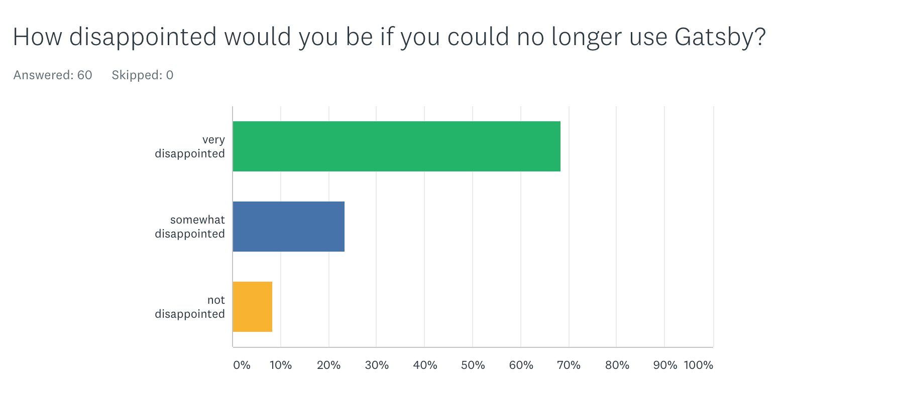
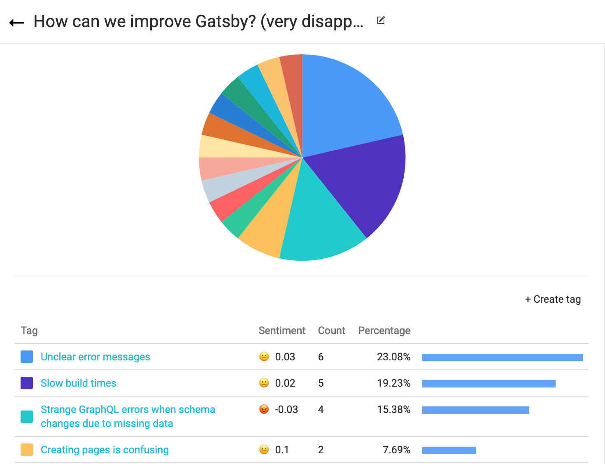

Some of you have recently seen a link in the CLI, inviting you to take a four question survey about Gatsby:

Thank you to all who responded to the survey; myself and other engineers have personally read all the responses and are summarizing them in this blogpost, in an anonymized manner!

If by chance you have not yet taken the survey, we definitely still want to hear from you! You can submit your own survey response today by upgrading your version of Gatsby in a project’s `package.json` file and rerunning dependency and install commands. Or you can install the Gatsby CLI using `npm install -g gatsby-cli` (see the [Quickstart Guide](/docs/quick-start/) for more details). To trigger the survey, you can run `gatsby feedback` at any time. Otherwise, you’ll be prompted every 3 months, at the most.

(If you’d like to opt-out, visit [our how to opt-out docs](/docs/CLI-feedback/#how-to-opt-out)).

## Why run this survey?

Gatsby added this survey as a reliable way to query active Gatsby users about their needs, problems, and feature requests. Each survey’s results will be shared in one place (a blog post each quarter) so the results can influence product priorities (and show how we did in terms of follow through on addressing issues raised by survey responses).

## What did the most recent survey reveal about Gatsby users?

Here are the questions we ask in each survey. (The questions will stay the same to measure change over time).

1. How disappointed would you be if you could no longer use Gatsby?
   - very disappointed
   - somewhat disappointed
   - not disappointed
2. What type of people do you think would benefit the most from Gatsby?
3. What is the main benefit you receive from Gatsby?
4. How can we improve Gatsby for you?

## And what did Gatsby users have to say???

Let's break the results down question by question.

### 1. How disappointed would you be if you could no longer use Gatsby?

A significant majority of respondents—68.33%!—said they would be “very disappointed” if they could no longer use Gatsby. I’ll call this group of users “high expectation users” since they expect Gatsby to perform something critical and valuable for them. Our followup query seeks to identify exactly what these critical and valuable things might be.

### 2. What type of people do you think would benefit the most from Gatsby?

Those who would only be somewhat disappointed without Gatsby responded that Gatsby is best for developers, mostly those learning React. Those who would be very disappointed without Gatsby, by contrast, responded that Gatsby is for a wider audience, including developers of all skill levels, building all kinds of websites. A few even mentioned Gatsby is for designers, marketers, and end users.

> Someone hard-pressed to make a blazingly fast and performant site without having too much time spent playing with configurations for things like tree-shaking and prefetching data. I've been using Gatsby for creating a full-fledged website in the time it takes to make a rough and dirty prototype.

> Everyone. Freelance developers, agency developers, enterprise developers. Marketers, small to large businesses, bloggers, SaaS platforms, e-commerce sites, microsites, dynamic web apps

### 3. What is the main benefit you receive from Gatsby?

There was one central takeaway: Those who responded they would be “very disappointed” without Gatsby agreed strongly that **the main benefit they receive from Gatsby is a fast & easy workflow to get an optimized site.**

“What is the main benefit you receive from Gatsby?” also prompted other, in-depth, responses explaining the value Gatsby provides to high-expectation users:

> Feeling that somebody's got my back on various little things like image loading, typeface loading, other asset and content prefetching. You get the idea.

> Simplification of complex HTML5 features (lazy-loading images at multiple resolutions, i18n, head metadata fields, pwa...), obtaining always optimized code.

> Superior workflow compared to traditional CMS (Wordpress/GRAV etc.). Freedom of choice for system design regarding tools in the React ecosystem.

> It does the job for me. The page load is amazingly fast. I have to write less code.

> Hard things, made easy.

Respondents who said they would be “somewhat disappointed” and “not disappointed” without Gatsby actually gave similar answers. The only difference being that their answers were shorter and less enthusiastic. The similarity between the answers is unexpected. It might mean that they are experiencing enough difficulties to _almost_ outweigh the benefits they’re getting from Gatsby, which is why the next question is important.

### 4. How can we improve Gatsby for you?

Those who would be “not disappointed” or “somewhat disappointed” without Gatsby still have high expectations about how Gatsby can improve, which is relatively unexpected; usually if a person isn’t receiving much benefit from a product, they don’t care if it improves or not.

So the fact that the “not disappointed” and “somewhat disappointed” groups responded likely indicates that Gatsby provides enough benefit for them to take the time to list specific improvements that would help them get even out of it. Overall, this group indicated that they’d appreciate more tutorials and documentation, TypeScript support (which is currently in progress), and incremental builds.

Those who would be “very disappointed” without Gatsby also have high expectations for Gatsby’s improvement. The number one reported problem is unclear error messages, especially when it comes to GraphQL. The second most commonly mentioned issue is slow builds (no surprise and we’re working on it!). These survey results are confirmation that we should move fast on these things and devote more resources to improving/solving them.

## How can you help improve Gatsby?

We already knew that error messages needed to be improved (see [this RFC up for improving error messages](https://github.com/gatsbyjs/rfcs/pull/37)) and have been preparing usability testing for error messages. The number one way we can use help in improving Gatsby is for you to participate in error message testing!

Here are two ways you can help by testing error messages:

1. [Setup a usability test with us](https://calendly.com/shannon-soper/gatsby-usability). If you do this, don’t “cheat” on the test and look up the errors in the repo ahead of time! It’s most useful for us to see you face the error message for the first time, without preparation.
2. [Clone this repo](https://github.com/gatsbyjs/error-testing) and find two sites under `error-testing/sites/`. Screen record yourself running one site at a time to test how fast you can resolve the errors in them. Send the screen recording to shannon@gatsbyjs.com!

## How will the data be used?

Anyone in the community, including employees, can read this and all future blog posts reporting results. This way we can publicly compare survey results side-by-side to measure the success of different features; for example, if one of our blog post summaries shows that most people have problems with unclear error messages, and the next post shows they no longer have that problem, all Gatsby community members will know something has changed.

## Thank you and keep the feedback coming!

Thank you again to all who have responded to the survey so far; your responses help guide the focus of the community to answer real-world needs. If you haven’t filled out the survey yet, you can run `gatsby feedback` at any time after upgrading your version of Gatsby in a project’s `package.json` file, and then rerunning dependency and install commands.

Otherwise, wait to see the survey appear in a CLI near you! The plan is to do this every 3 months, at the most. (Again, if you’d like to opt-out, visit the [how to opt-out docs](/docs/CLI-feedback/#how-to-opt-out)).

Thank you for being part of Gatsby 💜!
