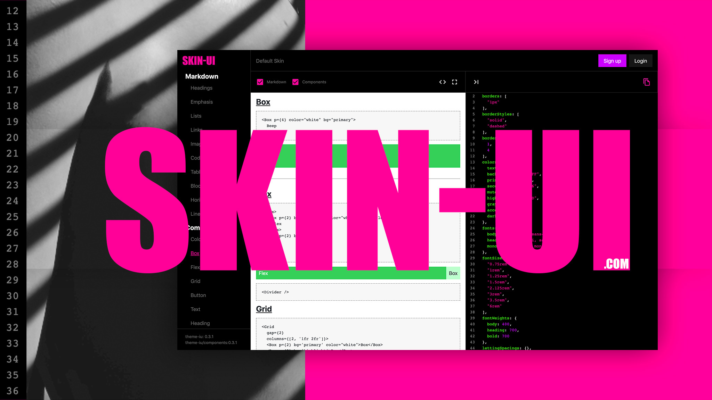
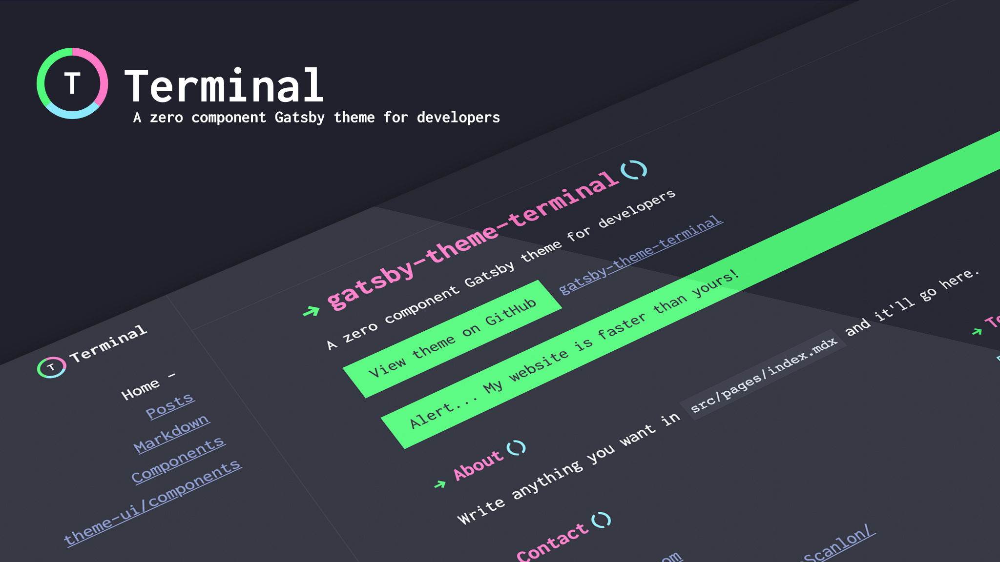
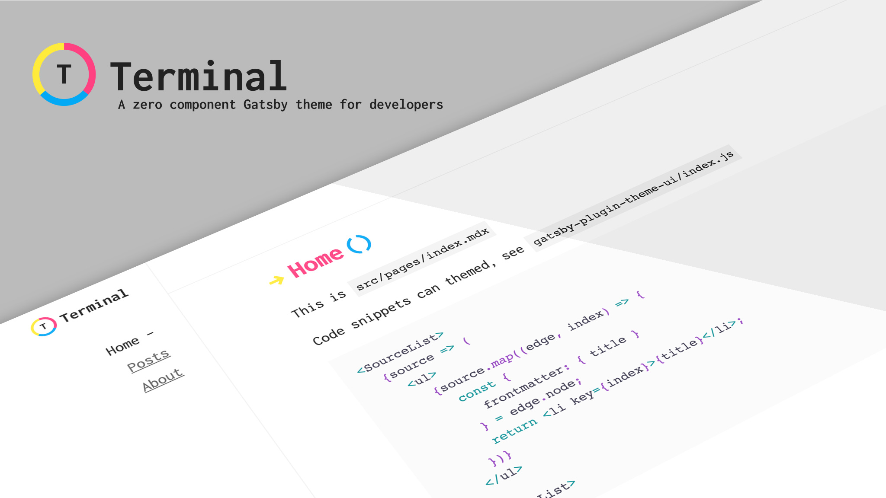
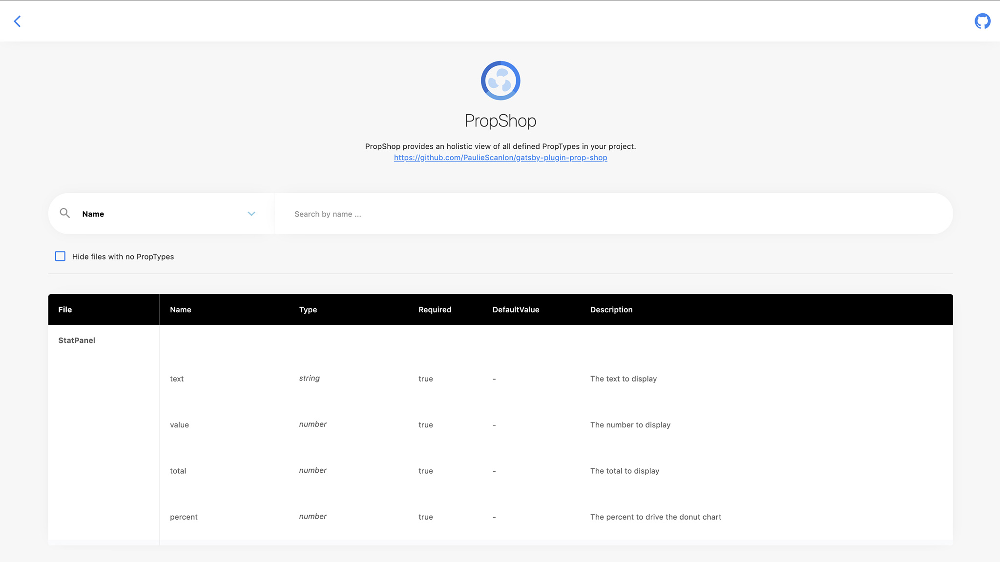
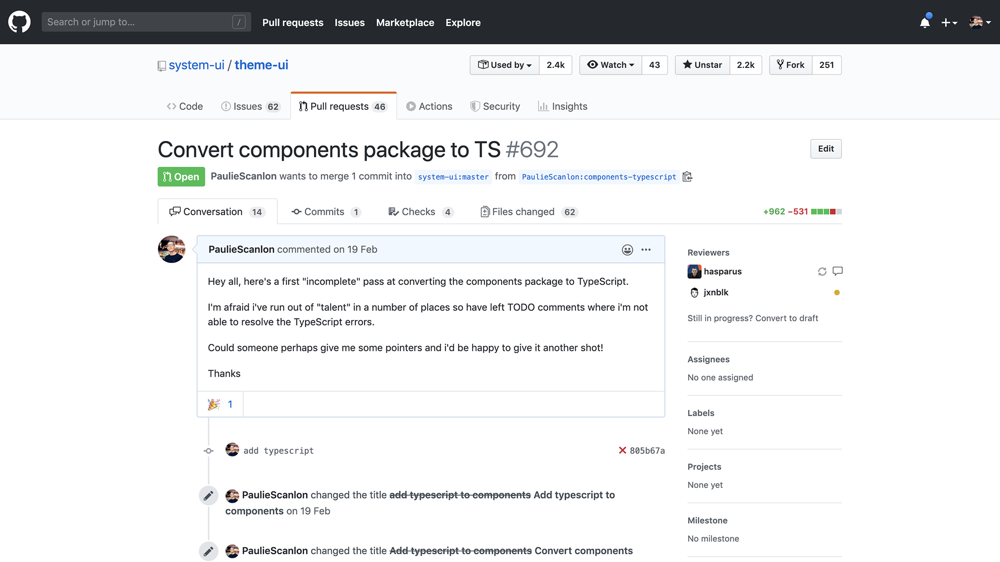
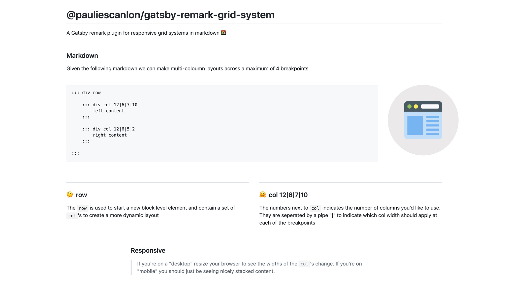
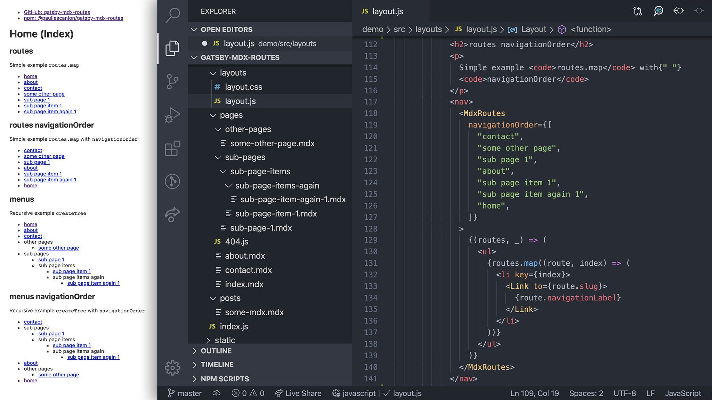
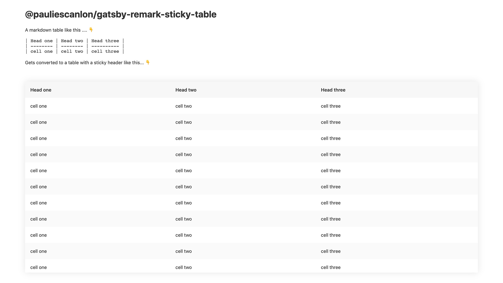

## Intro

Well hey there! 👋 I'm Paul, I'm a React UI Developer / UX Engineer and a long long time ago I was a designer but after a few years of pixel pushing I realized code is just better!

## A little context

I first found Gatsby because of my requirement to create a new, public and **S**earch **E**ngine **O**ptimized web presence. I needed a [commercial portfolio](https://www.pauliescanlon.io/) and a [blog](https://paulie.dev/) and I wanted them to look and feel the same. I also wanted a way to easily update both entities separately, but didn't want to suffer poor SEO in favor of "content managed" third party fetched data. Ideally I wanted to build these sites using React but always disliked the poor SEO performance using a framework like React produces.

After a little research I discovered that Gatsby is just React...BUT it still maintains effective Search Engine Optimization by creating static HTML pages with real and actual Google indexable metadata and Open Graph images for each and every page or post!

**When the penny dropped it was an absolute hammer blow!**

With Gatsby you get back all that good stuff we kind of lost when "Websites" became "Single Page Applications" built with React.

When the [#100DaysOfGatsby](/blog/tags/100-days-of-gatsby/) challenge was first announced I thought, _Yes, please_. I'm totally up for getting involved, but it soon transpired that pretty much every challenge was something I'd already learnt myself. _No matter,_ I thought. I can still continue to develop my React, JavaScript and Gatsby skills and by using the [hashtag](https://twitter.com/hashtag/100DaysOfGatsby) I hoped to share what I'd learnt and to find other folks out there doing the same.

So for **100** days I posted literally **every day** about the work I've been doing in and around the Gatsby eco-system. If you have a spare 103 minutes you can read about the full 100 days [here](https://paulie.dev/posts/2020/01/100DaysOfGatsby/). But because I know you're all busy busy people, here is the tl;dr summary version.

## 1. Skin UI

This is proof that Gatsby can be more than just blogs. Skin UI is a full stack Gatsby App with client-only routes, Netlify Identity, an Apollo/GraphQL serverless function API, and Fauna for database storage.

Using the Skin UI editor and live preview you can tinker with Theme UI's theme object and see the styles update the markdown and Theme UI Components right in your browser. You can also save, share, edit and download your theme.

I believe this project has legs, but I also need to do a bit more work on it before it's all singing and all dancing. I have it on good authority that something similar will make its way in to [Blocks UI](https://blocks-ui.com/)... psst hey Gatsby I'm available to help build it 😊.

[Visit site](https://www.skin-ui.com/) |
[GitHub](https://github.com/PaulieScanlon/skin-ui) |
[Blog post](https://paulie.dev/posts/2020/04/skin-ui/)

## 2. gatsby-theme-terminal

This was my second attempt at developing a theme and after making a bit of a mess of my first one [gatsby-theme-gatstats](https://gatsby-theme-gatstats.netlify.com/) I went back to the drawing board and decided to see if it was possible to write a theme with **zero components**. This is an odd concept if you're coming form WordPress, but with this theme all I'm providing are some neat little data components that help you query the nodes from GraphQL. Plus a very light skin that styles all markdown and all components provided by Theme UI Components. If you've read above about Skin UI this theme is essentially Skin UI but with some extra bits thrown in.

Having worked on Gatsby Themes for about a year now I think this approach can be really powerful. Component shadowing is awesome, don't get me wrong, but if you decouple the "components" from a theme and just provide _data_ and _styles_ the user then has full control over their UI. No more hacking over the top of CSS and no real need to shadow a "component" to change the way it looks or functions. This approach means you can just build anything you want using the components from Theme UI and boom 💥 you've got yourself a totally custom blog, site or application.

[View demo](https://gatsby-theme-terminal.netlify.com/) |
[GitHub](https://github.com/PaulieScanlon/gatsby-theme-terminal) |
[Blog post](https://paulie.dev/posts/2020/02/gatsby-theme-terminal/)

## 3. gatsby-starter-terminal

It seems fitting that if I want folks to use my theme: [gatsby-theme-terminal](https://gatsby-theme-terminal.netlify.com/) I should give them a helping hand. So here's a starter to... er... get you started 🤗

It's a pretty bare bones example of how to use the theme but it does demonstrate how to use component shadowing for the logo and how to provide a custom Theme UI object to style the theme your way. _I believe the 2 stars it has on GitHub speak for themselves_ 🌟😂.

[GitHub](https://github.com/PaulieScanlon/gatsby-starter-terminal)

## 4. gatsby-plugin-prop-shop

I think perhaps this a unique concept that the masses just aren't ready for yet 🤔. With this plugin you can get an overview of all _PropTypes_ in your components, turns out that most developers building Gatsby sites don't use _PropTypes_. In fact i've been working on a much larger project where _PropTypes_ haven't be used at all...if you're doing this...then just stop it!

I'm a massive TypeScript fan but when not using TypeScript, _PropTypes_ are the next best thing. And when building component libraries (which I've done a lot of) I have found it crucially important to provide a consistent API for props.

PropShop aims to help you with this by providing a holistic view of all defined _PropTypes_ in your project, all in one place.

I've created a [PR](https://github.com/system-ui/theme-ui/pull/669) for Theme UI but as the library is undergoing some vital TypeScript work it has yet to be merged. The feedback from the Gatsby team was promising though and to quote [Brent Jackson](https://twitter.com/jxnblk),

> Thanks! This is a really cool idea!

(If anyone in Gatsby Admin happens to read this, again, I'm available to help build it.)

[View demo](https://gatsby-plugin-prop-shop.netlify.com/prop-shop/) |
[GitHub](https://github.com/PaulieScanlon/gatsby-plugin-prop-shop) |
[Blog post](https://paulie.dev/posts/2020/02/prop-shop/)

## 5. @theme-ui/components

In the true spirit of open source I wanted to contribute to the libraries I use and love, and what better time than 100 Days of Gatsby to do this? I noticed a request for collaboration on Theme UI Components by the Gatsby team who were switching _everything_ over to TypeScript. This kind of work is right in my wheel house so I set about converting the package to TypeScript. Unfortunately I ran out of talent and the [PR](https://github.com/system-ui/theme-ui/pull/692) remains open. I believe there are bigger pieces of work that first need to be completed before this will be looked at again. However, if I suddenly become a TypeScript guru I'll be certain to pick this back up.

[PR](https://github.com/system-ui/theme-ui/pull/692)

## 6. gatsby-mdx-embed

Continuing with my interest in Gatsby plugins, this was inspired by [gatsby-remark-oembed](https://github.com/raae/gatsby-remark-oembed). This is great plugin and allows you to use all sorts of media embed codes in your markdown blog.

Yeah... markdown... what about MDX?

Spotting a gap in the market I developed this plugin to bring all the same embedded-able joy to MDX. Since MDX is essentially a superpower, much more can be achieved when combining it with `<Flex>` and `<Box>` from Theme UI Components. Imagine doing a full screen YouTube video wall on one of your blog posts, or displaying an entire Twitter timeline next to your content!

That's all possible with this plugin. There are few shortcomings with the way the props are required for each of the components and I do hope to develop this further so it's easier to use but for now if you want to embed Twitter, YouTube Instagram and many more in to your `.mdx` without imports, this is the plugin for you!

[View Demo](https://gatsby-mdx-embed.netlify.com/) |
[GitHub](https://github.com/PaulieScanlon/gatsby-mdx-embed) |
[Blog post](https://paulie.dev/posts/2020/01/gatsby-mdx-embed/)

## 7. gatsby-remark-grid-system

OK, true confession, I started building this plugin before the challenge came about and before I'd truly discovered MDX and Theme UI Components. But I was wondering why people didn't need Bootstrap style containers, rows and columns in markdown (and, for the record, I still don't know the answer to that question ).

This plugin was a head first dive into the [Markdown Abstract Syntax Tree](https://github.com/syntax-tree/mdast) and allowed me to understand what markdown and MDX do under the hood. Using visitor patterns I was able to bring responsive mobile first layouts to tired old single column markdown files.

[View Demo](https://gatsby-remark-grid-system.netlify.com/) |
[GitHub](https://github.com/PaulieScanlon/gatsby-remark-grid-system) |
[Blog post](https://paulie.dev/posts/2019/12/26/gatsby-remark-grid-system/)

## 8. gatsby-mdx-routes

Again, officially speaking, I started this plugin before the challenge started. However, I did continue to develop it over the course of the 100 days and released multiple updates as new requirements became clear. I've also used this plugin in my theme [gatsby-theme-terminal](https://gatsby-theme-terminal.netlify.com/).

Extracting navigation routes for locally sourced `.mdx` files using GraphQL in your project isn't a huge task in itself. But I try to be helpful, so this plugin aims to separate the business logic of _finding_, _sorting_ and _listing_ routes from _styling_ those routes as links or lists. It was the start of my thinking process about separation of concerns which I then used more effectively in [gatsby-theme-terminal](https://gatsby-theme-terminal.netlify.com/)

There are a few areas where it doesn't quite perform, namely in the recursive pattern, but developing this plugin really enhanced my JavaScript knowledge. And, dare I say it, but I think I finally understand [Array.prototype.reduce()](https://developer.mozilla.org/en-US/docs/Web/JavaScript/Reference/Global_Objects/Array/reduce)

[View Demo](https://gatsby-mdx-routes.netlify.com/) |
[GitHub](https://github.com/PaulieScanlon/gatsby-mdx-routes) |
[Blog post](https://paulie.dev/posts/2019/12/12/gatsby-mdx-routes/)

## 9. gatsby-remark-sticky-table

I love this plugin! Who wouldn't want sticky header tables in your markdown?!

I developed this plugin back in December 2019 and as my following grew so to did the GitHub issues. I always tried to resolve these quickly and it was a gentle introduction to life as an open-source developer which I really rather enjoy. I've found that helping people use software I've written is actually very rewarding!

So if you do want big tables in your blog but don't want neverending page scrolls, then keep it sticky with [gatsby-remark-sticky-table](https://github.com/PaulieScanlon/gatsby-remark-sticky-table)

[View Demo](https://gatsby-remark-sticky-table.netlify.com/) |
[GitHub](https://github.com/PaulieScanlon/gatsby-remark-sticky-table) |
[Blog post](https://paulie.dev/posts/2019/11/24/gatsby-remark-sticky-table/)

## 10. gatsby-theme-gatstats

... and finally, GatStats.

This was the whole reason I got into Gatsby. I released [GatStats](https://twitter.com/PaulieScanlon/status/1201514996838141952) in December 2019, before the challenge started. Due to the new exposure, though, more and more issues were raised on GitHub so I continued to support and develop this over the course of the challenge.

Knowing what I know now, post my 100 Days journey, I think it's time to retire this theme. Ultimately I would like to rebuild it using all my learnings from other Gatsby work. Also, I still want to create a dashboard theme but not sure this is it, I think there's another, much better way to approach it...Maybe 100 Days of Gatsby 2021???

(Apologies in advance if you're using this theme. They'll be an update soon about how to migrate).

[View Demo](https://gatsby-theme-gatstats.netlify.com/) |
[Storybook](https://gatsby-theme-gatstats.netlify.com/storybook/)
[GitHub](https://github.com/PaulieScanlon/gatsby-theme-gatstats) |
[Blog post](https://paulie.dev/posts/2019/11/12/gatsby-theme-gatstats/)

... and that's it 💥

Big shout out to the Gatsby team, all the folks who use the technology, plus everyone I've interacted with on [Twitter](https://twitter.com/PaulieScanlon) over the past three months. It's been an absolute pleasure.
