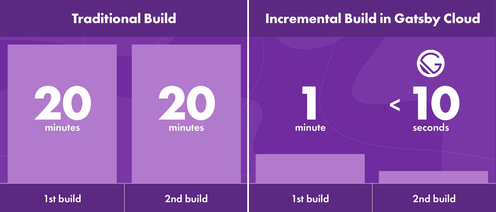

Today I’m thrilled to announce the release of Incremental Builds on Gatsby Cloud. In January we announced Gatsby Builds, bringing you up to 60x faster builds for Gatsby sites compared to other solutions. Now, when you make a data change in a CMS, the Gatsby Cloud Incremental Builds feature will rebuild only what’s necessary—giving you up to 1000x faster builds. **That is an average build time of < 10 seconds!**

I’m excited about what this means for the Gatsby community and the use cases it unlocks—and even more excited for what this means for the future of the web.

<video controls="controls" autoplay="true" loop="true">
  <source type="video/mp4" src="./inc-builds.mp4" />
  
Sorry! Your browser doesn't support this video.

</video>

## A brief history of static sites

Static websites are where the web was born.

In the beginning, the web consisted of hand-written static HTML pages. As sites grew larger and more interactive, database-driven site technology emerged to support more dynamic features. Static site generators also grew more sophisticated, however, and—thanks to pre-rendering—remained faster and more efficient. By the early 2000s there was a kind of proxy war between static vs. database approaches in the form of two different CMSs, Moveable Type and WordPress, competing for dominance as the content web expanded exponentially.

For a while it was an open question of which model was going to win. The initial favorite was Moveable Type, whose prerendering made it safer, faster and cheap to host. Despite these advantages, however, it eventually lost out to WordPress. The reason was build time. As sites grew larger, build times did too, causing creators a great deal of friction and frustration. The database model became the standard because most people just wanted to publish stuff quickly. WordPress was good enough, it was fast enough, it could scale enough—and, most important of all, it was more approachable for content editors. Eventually a large portion of the web came to be built with and powered by WordPress and similar database-driven CMSs, and static sites retreated into a niche.

Static pre-rendering never faded into complete oblivion, though. It has in fact remained the first choice of a small but vital community, the users and creators of static site generators. These have tended to be “developer’s developers” who appreciate the simplicity of the architecture and the reliability and ease of handling traffic spikes, and who are comfortable authoring text in markdown. These developers prioritize choosing what they see as the best tool and they are willing to trade off other things to get there.

One tradeoff, however, may be non-negotiable: build speed. If you've used Gatsby, or any other static site generator for that matter, you know that as sites get larger, build times tend to increase. This can be annoying if your site has 1,000 pages and one content editor. But if you have say 100,000 pages and a dozen content contributors constantly triggering new builds it becomes just straight up impossible. At that scale it's just not possible to pre-render that entire site in any reasonable amount of time.

This is a super hard problem for all static sites, not just Gatsby. It’s what hampered Moveable Type back in the 2000s, and what has kept the static site space niche ever since. Finding a way to cut build time—thereby unlocking much wider use cases for static pre-rendering—has long been the holy grail for SSGs.

We made the first important step towards much faster builds when we introduced [Gatsby Builds](https://www.gatsbyjs.org/blog/2020-01-27-announcing-gatsby-builds-and-reports/) back in January, combining distributed computing with sophisticated caching features to enable build times up to 60x faster than standard continuous deployment solutions.

There was even more speed to be captured, though: if, after an initial build, we could find a way for all subsequent builds to address only changed or new data, leaving everything else untouched.

Many people have proposed “incremental builds” as a solution for static site generators—but doing this has proved elusive. No one has ever invented a scalable, framework-based solution for implementing incremental builds.

Until now.

## Introducing Incremental Builds for Gatsby

Starting today, Incremental Builds is available in public beta on [Gatsby Cloud](http://gatsbyjs.com). It’s the fastest way yet for building pre-rendered websites—making real-time deployments a possibility.

**Using Incremental Builds on Gatsby Cloud, we are showing build speeds of under 10 seconds for data edits.** This is oftentimes a 1000x improvement over existing build solutions, where the entire site must be re-built for even the smallest data change.

This happens automatically with no configuration, with any data source, due to Gatsby’s sophisticated data engine powered by GraphQL. Gatsby’s data engine automatically tracks dependencies between pages and data, and—when data changes—schedules the minimum amount of work needed to update the site.

I think it’s not an exaggeration to say that _this changes everything_.

## Making developers and marketers _both_ happy

Another problem that has long blocked Gatsby and other static site generators: no matter how fast and elegant they are as a platform, no matter how much developers love them, content creators often find them intimidating. And, in most organizations, the marketing team gets to choose the technology stack...or at least has veto power. For a long time this meant that developers and marketers were at odds with each other when it came to deciding how sites got built. No longer.

**With Incremental Builds on Gatsby Cloud, content people can keep using their CMS.** We’ve worked with agencies who have simply swapped in Gatsby without client content editors ever knowing there's been a change. Developers can get the tools they want to help them build and ship more quickly, plus the ability to embrace modern software practices like CI/CD and automated testing. They can run the site effectively, experiment easily, and build out new features quickly. All of which drives the business outcomes that are the ultimate goal for all involved.

Incremental Builds has been available in private beta for several months for select Gatsby Cloud users. Brian Webster, founder and director of development for Los Angeles-based digital agency Delicious Simplicity, is one of them. He calls Incremental Builds “transformative:”

> There used to be a trade-off in discussing Gatsby with clients. We always wanted to use Gatsby for the great developer experience and ahead-of-time compilation, but build time was prohibitive for some of our clients—those whose sites were hundreds of thousands of pages, or who needed their changes up immediately. Before Incremental Builds, we used to wait for some sites up to twenty minutes for our builds to finish. Now we publish the data change and builds are live in ten seconds.

## Bringing the web full circle

We’ve been working towards this moment since 2016, when I designed Gatsby v1’s event-driven architecture. In 2018, when we launched the Gatsby company, we talked to [The New Stack](https://thenewstack.io/gatsbyjs-the-open-source-react-based-ssg-creates-company-to-evolve-cloud-native-website-builds/) about how central incremental builds were to the Gatsby vision:

> The impetus to create a company around open-source Gatsby came because, Mathews said, in order to reach full potential as a real-time stream processing system applied to website builds, Gatsby would need custom-built cloud support.

> The goal is “to practically eliminate the build step entirely: You’ll just make a change....and it will go live immediately.”

With this having been in the cards for so long, it’s difficult to express how excited I am. And not just for Gatsby, but for the web itself: this is how the web should work. **Whatever can be built ahead of time should be built ahead of time. When content changes, only relevant pages should be rebuilt.** This allows content and experiences to be pushed instantly and efficiently to users anywhere in the world.

This represents an evolutionary leap forward to a seamless, fast experience for the developers, content editors and end users of any website—even if that site has millions of pages.

With this launch, websites have come full circle. We started out static, then shifted to various models and methodologies as dynamic elements were first added and then expanded. Static vs dynamic, pre-built vs database-driven, [baking vs. frying](http://www.aaronsw.com/weblog/000404) -- for decades this dichotomy has divided the web.

**But now there’s a brand new way, made possible by blazing fast incremental builds, where sites can be totally dynamic and fully static, simultaneously harnessing the powerful benefits of both paradigms.**

Now, with no extra work for developers and content authors, changes can be applied just about instantly, intelligently updating just the parts of the site that are affected. We can, across an entire site, make one change, update seven different places, and deploy it all in less than ten seconds.

People have been asking us for incremental builds all along—it just makes sense: “When I change one thing, I only want that part rebuilt and not the whole thing, and I want it to happen immediately.” And now we can finally just be like, “Yeah, that's exactly what we're doing.”

## Get started with Incremental Builds

Incremental Builds is now available in public beta on [Gatsby Cloud](http://gatsbyjs.com). All Gatsby Cloud users get a free 14 day trial, with full availability on all Professional, Business, and Enterprise plans. Incremental Builds works with Gatsby 2.20.4 and higher.

We’re currently fully supporting incremental Builds for our first-class integrations with Gatsby Cloud, including Contentful, Sanity, DatoCMS and CosmicJS. WordPress and Drupal support are in alpha. If you’re interested in building a first-class integration with Gatsby Cloud for Incremental Builds, please reach out to partners@gatsbyjs.com.

_Head to Gatsby Cloud (https://gatsbyjs.com/cloud/) to try Incremental Builds today! You can also join Dustin Schau, Gatsby's Head of Product, for a webinar on May 7th for a demonstration of how build times just got **seriously** faster. Visit http://gatsbyjs.com/incrbuilds-webinar to register._
