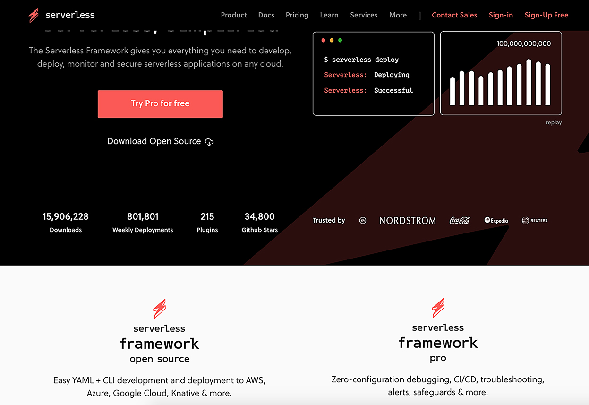

Since 2015 Serverless has been providing a platform to unify all the tools software engineers need to develop, deploy, and monitor serverless applications on any cloud. (NB: This is Serverless the company, not lower case ‘s’ serverless, the cloud computing execution model). By late 2019 the company was ready for a serious website redesign and upgrade, one that reflected the sophistication of the services they offer. The Serverless team turned to the front-end developers at Codebrahma, the San Francisco-based mobile application development shop, to help relaunch the Serverless website. “Serverless had a new brand, with a new color scheme, and wanted to use that brand to relaunch the company’s site,” says Anand Narayan, founder of Codebrahma. “We started exploring the latest front-end technologies to support this project.”

Any new front-end technologies had to mesh well with the existing site’s architecture. “The Serverless site has a blog and a documentation section, both of which pull Markdown files from GitHub repositories,” says Narayan. “We needed a way to pull those Markdown files while still maintaining a very fluent experience for the content contributors.”

## Ready to (re)launch with Gatsby 🚀
Previous experience with Gatsby led Codebrahma to choose the React-based framework for the Serverless relaunch. “We had initially explored Gatsby for the rebrand of our own website and another client’s e-commerce site,” says Narayan. “We saw how Gatsby enhances the React ecosystem with its own extensive plug-in ecosystem.”

For the Serverless project, the Codebrahma team recognized that Gatsby could easily support the existing site architecture. “Gatsby is very well suited for pulling Markdown into a blog or documentation section — it has a very nice Markdown plug-in,” says Narayan. “We felt Gatsby was a perfect fit.”

Prefetching capabilities were another key reason for adopting Gatsby. “The longer a user waits for content or interactivity, the higher the drop-off rate,” says Narayan. “When you use prefetching, the user typically waits no more than 20 to 30 milliseconds for content to load, so there is a dramatic decrease in drop-off—and a crazy increase in conversion. With Gatsby’s prefetching, we felt we could significantly enhance the user experience.”

The Codebrahma developers proposed using Gatsby for the relaunch, and the Serverless team agreed it was the right choice. “The Serverless team learned more about Gatsby and saw some of the social media buzz about how Gatsby was hot tech,” says Narayan. “The only minor concern was about adopting such bleeding-edge technology. But we explained that because Gatsby is built on React, we wouldn’t be tied down to a single platform. Serverless recognized that there was a lot of upside and very little downside, so it was a good bet to take.”

## Two months to launch
There was pressure to complete the project quickly, with a sharp ten week deadline. Fortunately, a two-person team of front end developers from Codebrahma was able to get up to speed on Gatsby quickly. “The Gatsby documentation is phenomenal,” says Narayan. “To ramp up, all we really had to do was to read all the documentation — and a lot of it was good React practices. It was a smooth ride.”

The Gatsby framework itself substantially accelerated development of the new site. **“On our own, it might have taken us three and a half months to launch the site. Gatsby reduced that time to two months,”** says Narayan. “We didn’t have to worry about building prefetch capabilities, trying to find open source plug-ins, or doing the server-side rendering. Gatsby had the capabilities we needed right out of the box.”

## Accelerating page loads 10x
The performance benefits of relaunching with Gatsby were apparent right away. “We immediately saw a 2x boost in site performance with a 10x increase in page load speeds,” says Narayan. “Since content is prefetched, pages load in tens of milliseconds instead of hundreds of milliseconds.”

Better performance and faster page loads are keeping Serverless users engaged and helping the company drive customer conversion through forms on the site. “We’ve definitely seen a decrease in the bounce rate and an increase in the conversion rate,” says Narayan. “Gatsby is enabling Serverless to create better awareness about the company’s technology and helping generate new customer leads.”

## Going forward with Gatsby
The impressive success of the Serverless site convinced Narayan to look first to Gatsby for future projects. “Gatsby is a particularly great fit for sites such as e-commerce portals with hundreds of products,” says Narayan.

> “Gatsby will work really well — and it will increase your conversion rates.”

_Learn about the power of the Gatsby plug-in ecosystem through [this webinar](https://www.gatsbyjs.com/gatsby-plugins) - and check out our newly launched [Incremental Builds](https://www.gatsbyjs.org/blog/2020-04-22-announcing-incremental-builds/) feature in Gatsby Cloud for up to **1000x** faster builds for sites built on Gatsby!_
