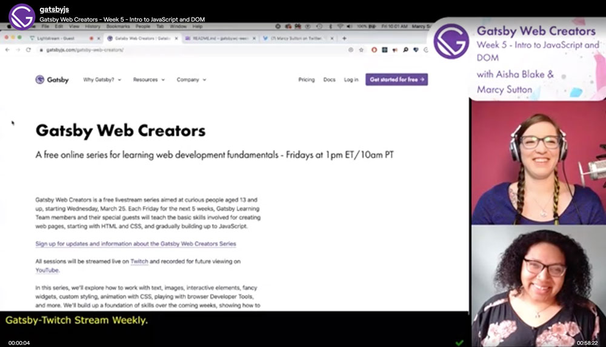

Good news! In May 2020, the Gatsby team is doing a second series of Gatsby Web Creators, our free video livestreams on creative web fundamentals for curious people aged 13 and up. We'll pick up where Series 1 on HTML, CSS, and JavaScript left off and build up the skills necessary to build your first Gatsby site.

**Starting on May 8 and running every Friday through the end of the month at 10am PT / 1pm ET**, the Gatsby team will spend an hour live coding the basics of JavaScript on [Twitch](https://twitch.tv/gatsbyjs). Video archives can also be found on [YouTube](https://youtube.com/gatsbyjs).

In Series 2, we'll begin with an artistic approach to browser JS, fetch resources from web APIs to display in a UI (likely dog related...), introduce Node.js as a server-side tool, and move into React.js and Gatsby to round it all out.

It's ambitious, but creative task-based lessons should give viewers the knowledge and skills necessary to dive into modern, accessible web scripting.

Participation is easy: [follow us on Twitch](https://twitch.tv/gatsbyjs) or catch the video archives on Gatsby's [YouTube channel](https://youtube.com/gatsbyjs).

The up-to-date schedule and list of resources for each session can be found on the [Gatsby Web Creators page](https://www.gatsbyjs.com/gatsby-web-creators/).
