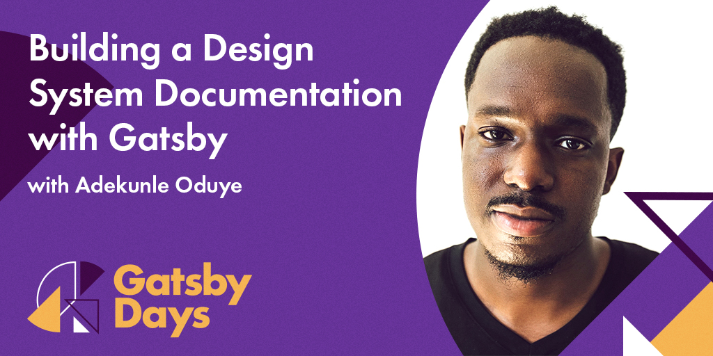

Virtual Gatsby Days is just around the corner! This two day single-track conference is a unique opportunity for the Gatsby community to come together online, develop their skills and expertise, and interact with each other and the Gatsby team. It's happening June 2nd & 3rd (9am until noon PST both days) and we are thrilled to announce our first wave of speakers today.

Stay tuned for a full schedule, including sneak peeks at upcoming Gatsby projects and additional speakers from the Gatsby team. But here is a tantalizing preview of Virtual Gatsby Days guest speakers and their topics. Before you dig in, though, go [register for this free event now](https://www.gatsbyjs.com/resources/gatsby-days/)!

The lineup includes:

- Building a Design System Documentation with Gatsby - _Adekunle Oduye_
- Gatsby + Userbase = Encrypted Menstrual Cycle Journal - _Benedicte Raae_
- Supercharge Your Mapping Apps with Gatsby - _Colby Fayock_
- Gatsby Is a Booster Rocket for Junior Developers - _Derek Murr_
- Using Gatsby to Launch Your Side Hustle for Free - _Makenna Smutz_
- A Recipe to Power Up Your Gatsby App with Auth - _Sam Julien_
- Creating more Accessible Components with Gatsby - _Tae'lur Alexis_
- The Developer Experience Experience - _Trevor Blades_

Adekunle Oduye will be offering insights on maintaining (ever-evolving!) design systems documentation and discover how Gatsby can make it easier.

You'll learn why Gatsby's a great tool for documenting a design system, how to dynamically generate pattern documentation, and strategies to update and maintain your documentation site. Follow Oduye on Twitter [@adekunleoduye](https://twitter.com/adekunleoduye).

Follow along on Benedicte Raae's journey to create POW! - an encrypted menstrual cycle tracker she built using Gatsby and Userbase.

Raae's talk will give you a rookie's introduction to web encryption and how Userbase has solved all of that for her in a smooth way. Follow Raae on Twitter [@raae](https://twitter.com/raae).

From driving directions to the spread of a pandemic, maps are a tool that can have a great impact on everyone's lives. But building a map with some data doesn't have to be hard.

Fayock will walk you through how you can easily spin up a map with Gatsby and use it to present powerful data to help scientists debug the earth. Follow Fayock on Twitter [@colbyfayock](https://twitter.com/colbyfayock).

Raise your hand if you're looking for a high-level, non-technical, first-hand account of working with Gatsby as a junior dev! If you've got a hand in the air, don't miss Derek Murr's talk about his experience of going from coding bootcamp to a job helping a small team to build an all-new website from scratch using Gatsby.

You'll learn how the combination of Gatsby's documentation, the speed with which you can get a new site up and running, the breadth of plugins, and the enthusiasm of the community all made it a great environment for him as a new developer -- and how it can help you to jump in and start building! Follow Murr on Twitter [@derekmurr.](https://twitter.com/derekmurr)

Ready to set up your drop-shipping side hustle? Great news: Makenna Smutz is here to show you how do it fast and for free.

Smutz will provide a fast-track tutorial for setting up a static site with Gatsby and Netlify (for zero up-front costs) using Stripe, Printful, Sendgrid, and GraphCMS. Follow Smutz on Twitter [@KenzSmutz](https://twitter.com/KenzSmutz).

Remember when we announced [Gatsby Recipes](https://www.gatsbyjs.org/blog/2020-04-15-announcing-gatsby-recipes/)? Sam Julien does! Julien jumped in right away and now he's excited to share how you can use a Gatsby Recipe to set up Auth on your site.

In this talk, you'll learn how to apply this fun and easy way to set up logging in and out of a Gatsby site, access protected data, and handle silent authentication when the page reloads. You'll also learn some tips and tricks to avoid common pitfalls with authentication in Gatsby. By the end, you'll be ready for the next level of your Gatsby quest! Follow Julien on Twitter [@samjulien](https://twitter.com/samjulien).

Join Tae'lur Alexis for an overview on how to take advantage of the various ways Gatsby provides accessibility right out of the box!

You'll learn best practices for JavaScript accessibility that you can implement in your next Gatsby project, hear which testing tools she highly recommends, and hear practical ways to improve accessibility in your own Gatsby sites. Follow Alexis on Twitter [@TaelurAlexis](https://twitter.com/TaelurAlexis).

Gatsby helps us ship blazing fast websites. Thanks to its excellent local development experience, iterating on them is blazing fast too. Trevor Blades will demonstrate how GraphQL, hot reloading, and Gatsby's rich plugin ecosystem empower the Apollo developer experience team to rapidly build its docs and blog websites. Follow Blades on Twitter [@trevorblades](https://twitter.com/trevorblades).

**Stay tuned for more speaker announcements coming soon, and [register for free](https://www.gatsbyjs.com/virtual-gatsby-days-registration/) now to join us at Virtual Gatsby Days on June 2nd and 3rd!** (With exclusive swag for everyone who registers).
