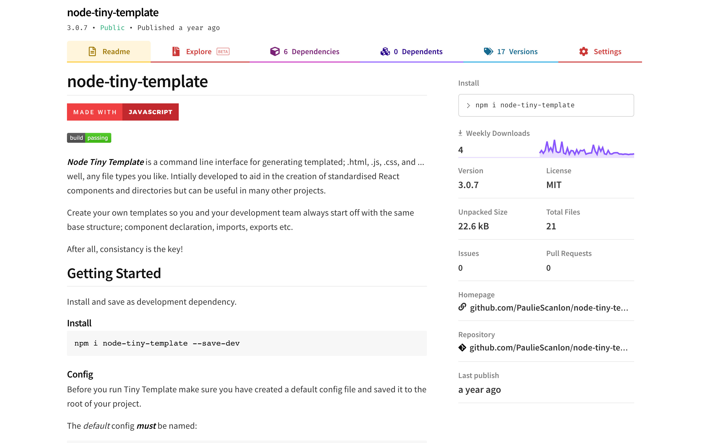

Gatsby Recipes were introduced just last month, as a new tool to automate common site building tasks. A Gatsby Recipe is a kind of task runner that can be authored in MDX and then executed from the command line using the Gatsby CLI.

Recipes can be used to automate npm installs, run npm scripts, add config options to `gatsby-config.js` and create files. A Recipe is a stepped list of tasks described in a human readable list which can be locally saved or remotely hosted, and the really good ones can be submitted via PR to be included in the Gatsby CLI.

Gatsby ships with a number of default Recipes, but it’s also really easy to create your own! In this post we are going to look at writing a Recipe to install `gatsby-plugin-google-analytics` and add it to your project’s plugins. But first let’s take a look at why Recipes are so very useful and how I got started with doing some for tasks I found particularly taxing.

(You can read more about Recipes [here](https://www.gatsbyjs.org/blog/2020-04-15-announcing-gatsby-recipes/), the experimental README is [here](https://github.com/gatsbyjs/gatsby/blob/master/packages/gatsby-recipes/README.md) and, to track the conversation, [here’s](https://github.com/gatsbyjs/gatsby/issues/22991) the Umbrella Issue on GitHub).

## Recipes: What’s all the fuss about?

I’m a React UI Developer and I work on a lot of Greenfield Component Library builds. One of the tasks I find myself doing more often than I’d like is the install and config for Storybook. This in itself isn’t a massive job, but getting Storybook and Gatsby to play nicely together can be a little tricky. Making this tricky bit happen more easily seemed like the perfect opportunity for creating a Recipe.

(I should point out that neither Storybook or Gatsby are at fault here. They are both rock solid projects but, as you can imagine, they were never intended to be _out of the box_ compatible).

To get the two playing nicely together it requires a little under the hood knowledge about Gatsby and Storybook, and this knowledge supplies the foundation for writing a Recipe to handle it:

- Gatsby is written in ES6 and isn’t transpiled to CommonJs until either the `gatsby develop` or `gatsby build` processes are run.
- Storybook requires all module code to be transpiled to CommonJs

The problem here is when you run Storybook it has no knowledge of the Gatsby build processes and will only transpile “your” ES6 code to CommonJs. This is mostly fine apart from when you attempt to create a story for a Gatsby component, or a story that embeds or composes a Gatsby component. One such component is `<Link />`

For example:

```javascript
import { Link } from ‘gatsby’
```

The reason this will cause Storybook to error is because the `<Link />` component comes from Gatsby / `node_modules` which, as mentioned above, is (as yet) un-transpiled ES6 code.

Storybook has anticipated this issue, fortunately, and so there is a method whereby you can write your own Webpack config and pass it on to combine it with the default Storybook Webpack config. This then aids in the transpiling of any ES6 code located in `node_modules` to CommonJs.

If (like me) Webpack scares you a little bit, you’ll likely want to avoid writing any Webpack config and just get on with developing your UI. You could try not creating any `.stories` that include a `<Link />` component but this will only get you so far.

You may at some point also wish to create a story for a component that contains a `useStaticQuery` hook, and if you do that you’ll again see Storybook errors but this time relating to GraphQL queries. The reason for this is because the Gatsby build processes remove any GraphQL queries when you run either of the build processes; `gatsby develop` or `gatsby build`.

So, as mentioned before, when you spin up Storybook these Gatsby-specific build processes are simply not run. In order to to strip out GraphQL queries we need to use Webpack again and utilize a package called `babel-plugin-remove-graphql-queries`.

And if (like me) Babel also scares you a little bit, you might be having a think about giving up using Storybook and Gatsby all together.

**But don’t quit just yet!**

## Recipes to the rescue

It’s for precisely this reason I created two of my own Recipes to automate the setup of Storybook and its Webpack config for both JavaScript and TypeScript Gatsby projects.

If you haven’t installed the latest Gatsby CLI run this 👇

```sh
npm install -g gatsby-cli@latest
```

Now you can now run 👇

```sh
gatsby recipes
```

You should see from the list there are two options for Storybook.

- **Add Storybook - JavaScript**
- **Add Storybook - TypeScript**

These are both largely the same with only some small differences to manage `.ts|tsx` as well as `.js|jsx` files and a little difference in the way they process props which populate the Storybook prop table.

If you’ve got this far I’m sure you’ll agree that running a simple CLI command to install and configure Storybook is way easier than manually configuring it yourself and it’s why I believe we should all be making more fuss about Recipes… they’re absolutely super brill brills!

If you’re interested, here is where you can read more about my Recipes👇

- [Storybook - Js](https://paulie.dev/posts/2020/04/gatsby-recipe-storybook-js/)
- [Storybook - Ts](https://paulie.dev/posts/2020/05/gatsby-recipe-storybook-ts/)

## Fancy writing your own Recipe?

The Recipe we’re going to write will install `gatsby-plugin-google-analytics` and add it to the plugins array in `gatsby-config.js`

This recipe will utilize two of the Recipe components/providers. The first is `<NPMPackage />` the second is `<GatsbyPlugin />`

You can read more about the components/providers [here](https://github.com/gatsbyjs/gatsby/blob/master/packages/gatsby-recipes/README.md#developing-recipes)

To get things started you can clone this bare bones repo which has just the bits we need to create and test your very first Recipe:

```sh
git clone https://github.com/PaulieScanlon/gatsby-recipe-google-analytics.git
```

Or clone from the repo here: [https://github.com/PaulieScanlon/gatsby-recipe-google-analytics](https://github.com/PaulieScanlon/gatsby-recipe-google-analytics)

Once you have the repo cloned locally, create a new file at the root of the project and call it `gatsby-recipe-ga.mdx` and add the following MDX

```javascript
// gatsby-recipe-ga.mdx

# Add `gatsby-plugin-google-analytics` to Gatsby Project

More info about the plugin can be found here: 👉 [gatsby-plugin-google-analytics](https://www.gatsbyjs.org/packages/gatsby-plugin-google-analytics/)

---

Install `gatsby-plugin-google-analytics`

<NPMPackage name="gatsby-plugin-google-analytics" />

---

Add the Google Analytics plugin to gatsby-config.js

<GatsbyPlugin
  name="gatsby-plugin-google-analytics"
  options={{
    trackingId: "YOUR GOOGLE ANALYTICS TRACKING ID",
    head: false,
    anonymize: true,
    respectDNT: true,
    exclude: ["/preview/**", "/do-not-track/me/too/"],
    pageTransitionDelay: 0,
    optimizeId: "YOUR GOOGLE OPTIMIZE TRACKING ID",
    experimentId: "YOUR GOOGLE EXPERIMENT ID",
    variationId: "YOUR GOOGLE OPTIMIZE VARIATION ID",
    defer: false,
    sampleRate: 5,
    siteSpeedSampleRate: 10,
    cookieDomain: "example.com",
  }}
/>

---

All done: 🍻

Head over to `gatsby-config.js` to complete the setup by amending or removing the plugin options. You will need a Google Analytics `trackingId`

You can read more about how to use the plugin here: 👉 [How to use](https://www.gatsbyjs.org/packages/gatsby-plugin-google-analytics/#how-to-use)

```

## Running your first Recipe

Now that you’ve written your first Recipe, it’s time to run it! 👇

```sh
gatsby recipes ./gatsby-recipe-ga.mdx
```

You should see the CLI start up. It’ll look to the root of your project and run your new Recipe. You’ll be prompted at each step to confirm the install -- hitting _Enter_ will do the trick here.

If all has gone to plan, the plugin will have been installed from `npm` and `gatsby-config.js` will have been updated with all the required options for the plugin to work.

## Automating the automation

You can probably see now how Recipes can be used to automate otherwise quite manual singular tasks, and this is great! But ask yourself: wouldn’t it be even greater if Recipes didn’t just run a task once?

Imagine if Recipes could be used over and over again to automate really monotonous tasks!

One such task might be creating new components. On any typical project this would be my component setup preference.

```javascript
├─ ComponentName
    └─ index.ts
    └─ ComponentName.tsx
    └─ ComponentName.stories.tsx
    └─ ComponentName.test.tsx
```

Of course within each of those files are a number of imports, exports, interfaces, function declarations and tests. Doing this each and every time you create a new component is tedious and can sometimes be prone to human error.

Also, and especially on larger teams, these preferences for how files should be named -- and/or how the imports, exports and declarations should be written is rarely documented in a “style guide” because that alone is also a rather tiresome task! but in my experience it's something that's rather crucial to have "locked down" at the start of a project.

In early 2018 I attempted to solve this problem by creating a node module aimed at automating the React “component” creation process, [node-tiny-template](https://www.npmjs.com/package/node-tiny-template):



The CLI args allow you to pass in the “component name” which can then be used for the function declaration, the imports, the exports and test names, etc.

Using the config file you can set options for casing, pascalCase, kebab-case etc and decide which files are generated and what their respective file extension should be. The “content” comes from handlebars template files, which receive values generated by the module and inject them when the file is written to disk.

I really thought this package was cool... At least til I saw [plop](https://plopjs.com/). Plop is a neat little boilerplate tool, and it’s great for creating templates whenever you have to be creating component files/dirs, etc. As nifty as both plop and node-tiny-template are, I do think both of these packages suffer from a faffy\* initial setup... which brings me back to Recipes.

(\*faffy is what we Brits call something that is time-consuming to do or awkward/cumbersome to make use of. Recipes are the antidote for just about any sort of faffy task you can think of!).

## Next stop: Recipes as workflow?

A logical next step for Recipes is using them as a workflow. As in, a Recipe that could take care of the config for you. Then all you’d need to do is run it from the CLI and pass in, for example the “component name”.

This might require there to be specific or “opinionated” Recipes, for example you may wish to use the `.tsx` + `.stories` + `pascalCase` Recipe, or maybe `.js` + `.test` + `.css` + `kebab-case` Recipe.

In either case a task such as this would require supporting documentation and remotely hosted template files. I wonder if at this point Gatsby would create a Recipe Package Manager, or `rpm` for short 😎.

I’m imagining a web interface which would allow you to browse the supporting files for any given Recipe, instructions of how to use it and of course versioning!

I think this would be a really nice future feature for Recipes as it allows them to exist as continuous workflow functions, rather than one-off tasks that only exist for a moment in time.

I also wonder how much more widely Gatsby could indeed cast this net. I feel like Recipes would be hugely valuable outside of the Gatsby ecosystem. There are any number of projects out there that require the install and set up of `npm` modules and I for one believe Recipes would be a healthy addition to any workflow.

If you have any questions, musings or just fancy a discussion about Recipes I’m always happy to chat.

Feel free to come find and follow me on Twitter: [@pauliescanlon](https://twitter.com/PaulieScanlon) and say hi! 👋
