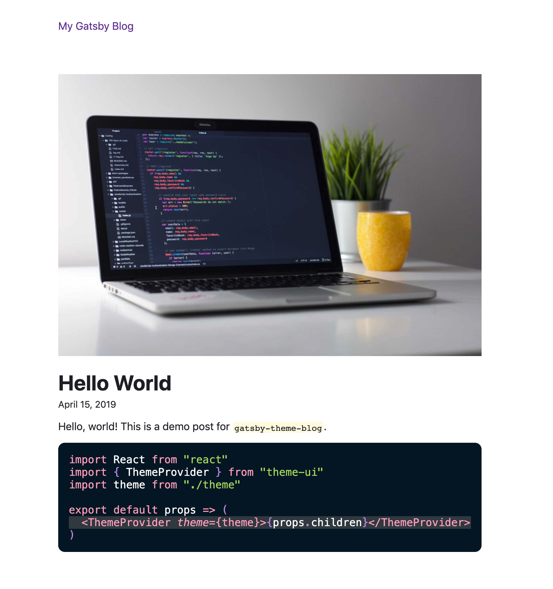

Today I'm excited to share with you a release we've been working on for the past few months. When we first released Gatsby themes we had ideas of what the community might build, but you've really blown away our expectations.

Over the past year we've watched patterns emerge, accepted practices, and come to understand how people develop and use themes. As a result, we're excited about this opportunity to introduce an update to our most popular theme, `gatsby-theme-blog`.

With new features and even more options to customize your theme, you can go from this:



To this:


And the only code needed was this:

```javascript:title=gatsby-config.js
module.exports = {
  plugins: [
    {
      resolve: `gatsby-theme-blog`,
      options: {
        // highlight-start
        preset: `theme-ui-sketchy-preset`,
        prismPreset: `oceanic-next`,
        webfontURL:
          "https://fonts.googleapis.com/css?family=Architects+Daughter",
        // highlight-end
      },
    },
  ],
}
```

## New features

### Image support

### Improved SEO

### Webfont configuration

### Line highlighting in code snippets

## Changing the look is easier than ever before

Being able to shadow styles has always been a great way to get granular with your Theme UI theme, but not everyone wants to do that! I'm not much of a designer myself and I wanted to change the look of my site without having to pick out every color.

### Presets

In Blog Theme 2.0 you can pass in a Theme UI preset to style your site. The default is `gatsby-theme-ui-preset` which looks and feels much like the existing blog theme styles, but there are a number of others open to you!

You can make use of those [provided by Theme UI](https://theme-ui.com/packages/presets), or try out something from the larger community, like [sketchy-preset](https://github.com/beerose/theme-ui-sketchy).

### Prism

## The new `gatsby-theme-blog-core`

In addition to all the changes about, we've also made some adjustments to the architecture in `gatsby-theme-blog-core`. It now comes with built-in components from displaying and individual blog post or a blog post listing. These components are completely unstyled but elements within them have classNames so you can change their look without any shadowing at all.

This gives you more tools than ever before to use this theme as an add on for site functionality.

## `gatsby-theme-blog-darkmode`

Another change is the darkmode toggle that's long been a staple of the blog theme. In order to make styling a bit more fun and remove the need for a darkmode out of the box, this is now a separate theme!

It's built on top of `gatsby-theme-blog` and available for your use today.

## Next Steps

We're so excited to see you make use of these updated themes and can't wait to see what the community builds. As always, we'd love for you to share it with us on twitter!
