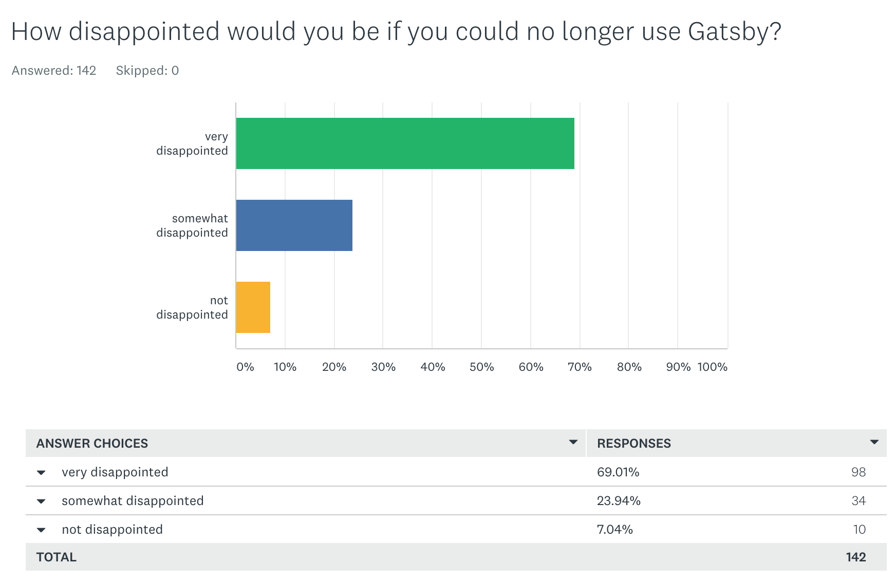
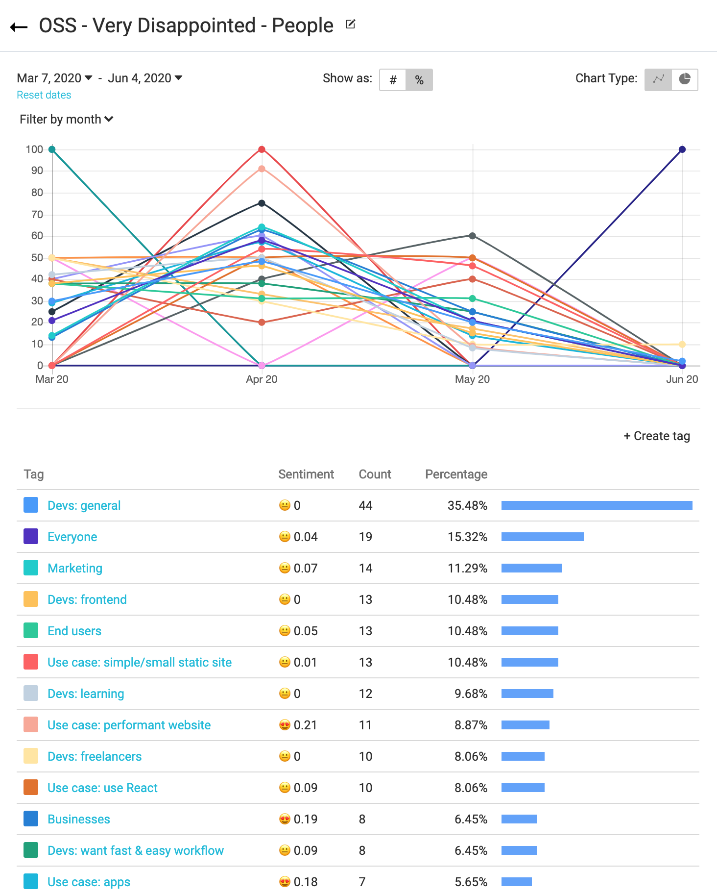
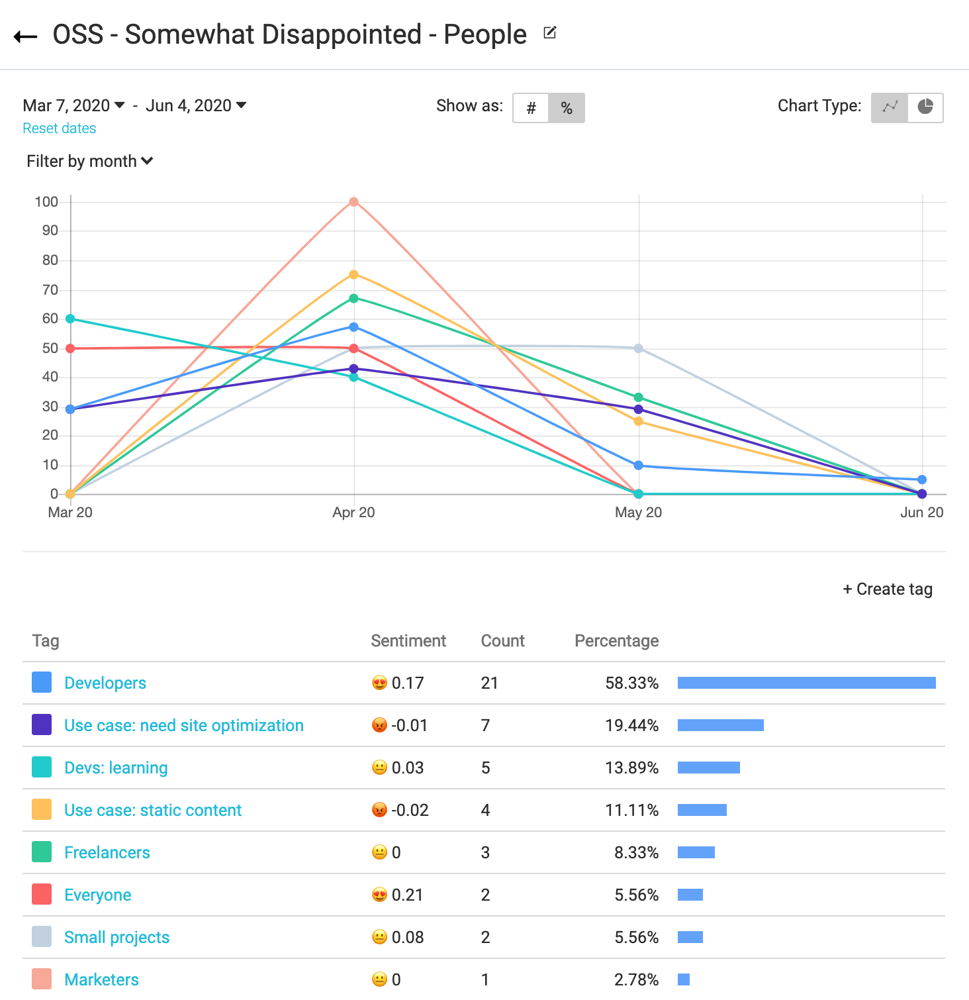
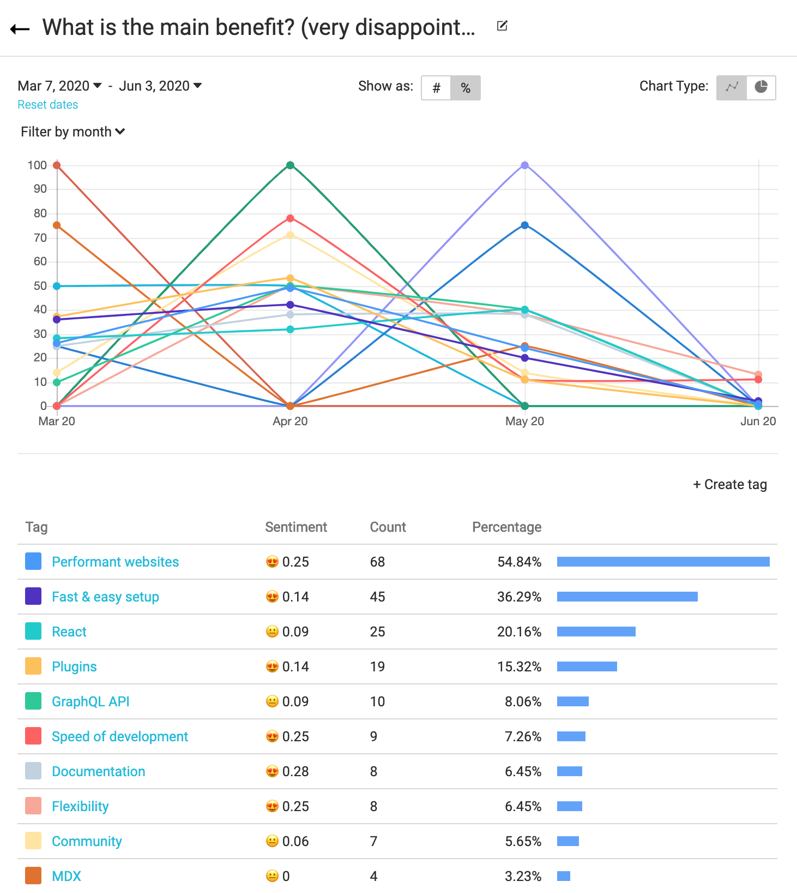
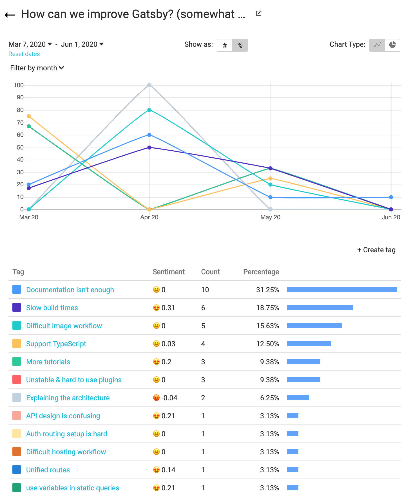

Our second set of results from the Gatsby Command Line Survey have been collected and compiled. This creates the exciting opportunity to compare survey results gathered from from 2 April through 3 June with the initial results we collected 10 March through 1 April.

## What is this survey?

You may have seen this in the command line recently:

See this previous blogpost, ["Gatsby's First Survey Goes Command Line (and here is what users have to say so far)"](https://www.gatsbyjs.org/blog/2020-04-17-gatsby-survey-goes-command-line/) for answers to the following questions:

- How can I take this survey?
- What are the survey questions?
- What are past survey results?
- How often can I expect to see new results shared?
- What is the goal of collecting this data?

## New results

### How disappointed would you be if you could no longer use Gatsby?

On April 1st, 68.33% respondents had said they would be "very disappointed" if they could no longer use Gatsby. From April 1st to June 3rd, this percentage increased to 69.01%. So not a significant difference, but that's ok. Our main goal is to stay above 60%, because we want to make sure we're building something that people really need and that makes their lives and jobs better and easier. So we will keep working to make this percentage even higher!

### What type of people do you think could benefit from Gatsby?

In answer to this question, we see a striking difference in the kind of responses we get from those who would be "very disappointed" without Gatsby vs. those who would only be "somewhat disappointed." The new results show that this difference is remaining consistent and perhaps even becoming more distinct over time. Those who would be "very disappointed" without Gatsby say that it's not just developers who benefit from Gatsby as a product: end users, marketers, and businesses also benefit from Gatsby. On the other hand, those who would be "somewhat disappointed" without Gatsby mainly state that only developers benefit from Gatsby.

Boy, where do I start? Here is a list of everyone who benefits from Gatsby sites:

1. **Developers, frontend developers** - because of the rich ecosystem of Gatsby plugins, the speed of development is skyrocketing.
2. **Marketers and Content Creators** - for having a pleasure to get their content published and distributed around the world thanks to static hosting and incremental builds (that's upcoming, I hope).
3. **Consumers** - who get to eventually forget the frustration of sitting through yet another rotating wheel in their browser tab because they now experience blazingly fast and smooth websites.
4. **Website owners, website developers, website users, website designers, marketing, sales and SEO people** - everyone related to websites!

Everyone who creates and everyone who uses websites.

So, literally _everyone_.

### What is the main benefit you receive from Gatsby?

Those who responded they would be "very disappointed" without Gatsby initially said they benefited from a fast and easy setup. The majority of responses have now shifted to reflect that most people benefit from a performant website, also known as a...

- "fast site"
- "stupid fast site"
- "blazing fast site"

(Quotes taken from survey responses). There are still plenty of people who say they benefit from Gatsby's fast and easy setup and quick development workflow. That's just not the majority response anymore.

## How can we improve Gatsby (for the somewhat disappointed crowd)

Requests for incremental builds and complaints about slow builds have decreased over the last couple months, presumably because Gatsby [launched incremental builds on Gatsby Cloud](/blog/2020-04-29-incredimental-builds/) and is consistently working on speeding them up. However, people are now starting to request for more CMSs and MDX to be supported in incremental builds, which is an encouraging validation of the roadmap and a sign that people need and want incremental builds for more projects.

## What's next?

Thank you again to all who have responded to the survey so far; your responses help guide the focus of the community to answer real-world needs. If you haven't filled out the survey yet, you can run `gatsby feedback` at any time after upgrading your version of `gatsby` in a project's `package.json` file, and then rerunning dependency and install commands. We would love to hear from you!

Otherwise, wait to see the survey appear in a CLI near you! The plan is to do this every 3 months, at the most, and then report results. (If you'd like to opt out, visit [https://www.gatsbyjs.org/docs/CLI-feedback/#how-to-opt-out](docs/telemetry/#how-to-opt-out/)).

If you haven't used Gatsby yet, try it out and let us know what you think! You can install the Gatsby CLI using `npm install -g gatsby-cli` ([see the Quickstart Guide for more details](/docs/quick-start/)).
