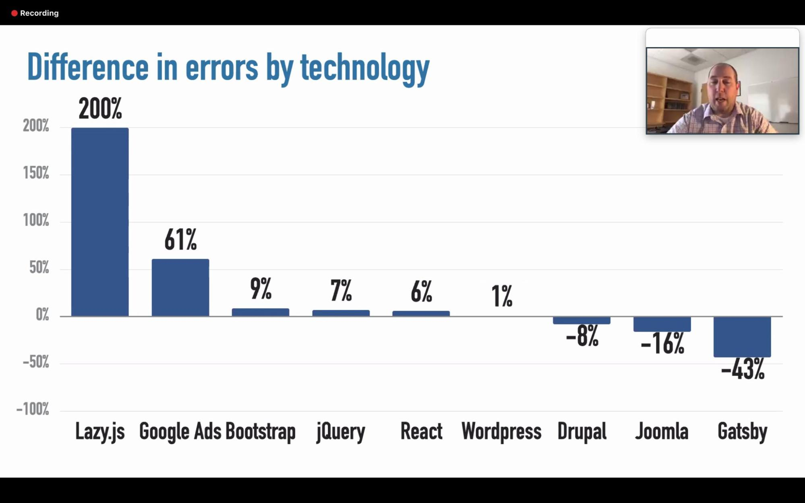

The [WebAIM Million](https://webaim.org/projects/million/) is an annual accessibility analysis of the home pages for the top one million sites on the web. Each year, results reveal significant accessibility issues across the web — an average of 61 detectable accessibility errors per page, and a failure rate for the [Web Content Accessibility Guidelines](https://www.w3.org/TR/WCAG21/) of at least 98%.

The 2020 WebAIM Million collected data on up to 1200 different technologies used in home pages and examined the results to see if common accessibility errors corresponded with usage of different technologies. As WebAIM team members analyzed these various technologies, one repeatedly stood out as aligning with significantly fewer accessibility issues: Gatsby. Home pages built with Gatsby had 34.3 detectable errors on average — 44% fewer than the average, though we still strive for better. That said, according to WebAIM:

> Gatsby corresponded with the fewest detectable errors of any common technology or page characteristic analyzed! In fact, Gatsby home pages had about half as many detectable errors as home pages built with React alone.

Jared Smith, Associate Director of WebAIM, noted, “It's clear that Gatsby has made a commitment to accessibility and has nurtured a culture that supports inclusion. We believe that Gatsby can serve as a model for other frameworks, libraries, and technologies to follow in prioritizing accessibility. When technologies, like Gatsby, embrace accessibility, the broad impact on the lives of users with disabilities is tremendous.”

**At Gatsby, we strive to make sites accessible and performant by default.** Our community has largely joined us in customizing their Gatsby sites to optimize accessibility, and we’re thrilled to share this recognition from WebAIM with them.

What are some of the things we have done that contributed to these results? We’ve made improvements to our [official starters](https://www.gatsbyjs.org/docs/starters/#official-starters) and [themes](https://www.gatsbyjs.org/blog/2019-07-03-customizing-styles-in-gatsby-themes-with-theme-ui/#say-hello-to-our-official-gatsby-themes). We have worked continuously to [research client-side routing](https://www.gatsbyjs.org/blog/2019-07-11-user-testing-accessible-client-routing/) and [improve it](https://www.gatsbyjs.org/blog/2020-02-10-accessible-client-side-routing-improvements/).

Furthermore, since automated results can only identify and alert developers to 30-50% of accessibility issues by volume, continuing education around accessible web development is crucial. So, in addition to [content in our official docs](https://www.gatsbyjs.org/docs/making-your-site-accessible/), we’ve offered accessibility [live streams](https://www.youtube.com/watch?v=qmcclQ7UPLk), [workshops](https://smashingconf.com/online-workshops/workshops/marcy-sutton), and talks at our [Gatsby Days conferences](https://www.youtube.com/playlist?list=PLCU2qJekvcN1ypIXMWs2WQMKrW3GMAthe).

Because of the impact technology can have on people with disabilities, we believe it’s critical for UI libraries and frameworks to make [public commitments to accessibility](https://www.gatsbyjs.org/blog/2019-04-18-gatsby-commitment-to-accessibility/) -- and commit to ongoing improvements as code and docs evolve. Even so, projects like the WebAIM Million can show our industry how much work there is still to do in accessibility.

We’re up to the challenge, and we hope you’ll join us. 💜

_Note: the number of Gatsby sites detected overall fell under the .5% threshold for reporting, so WebAIM reported this information directly to us and in their recent workshops._
