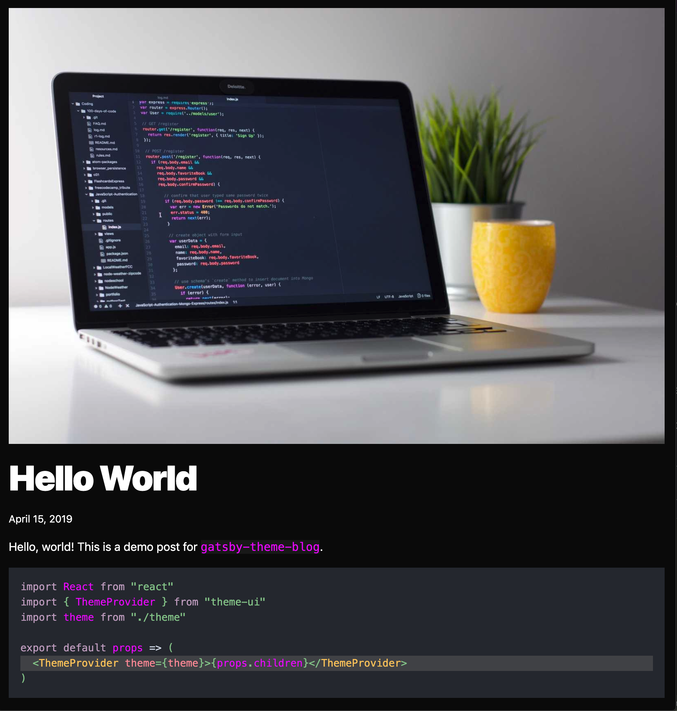
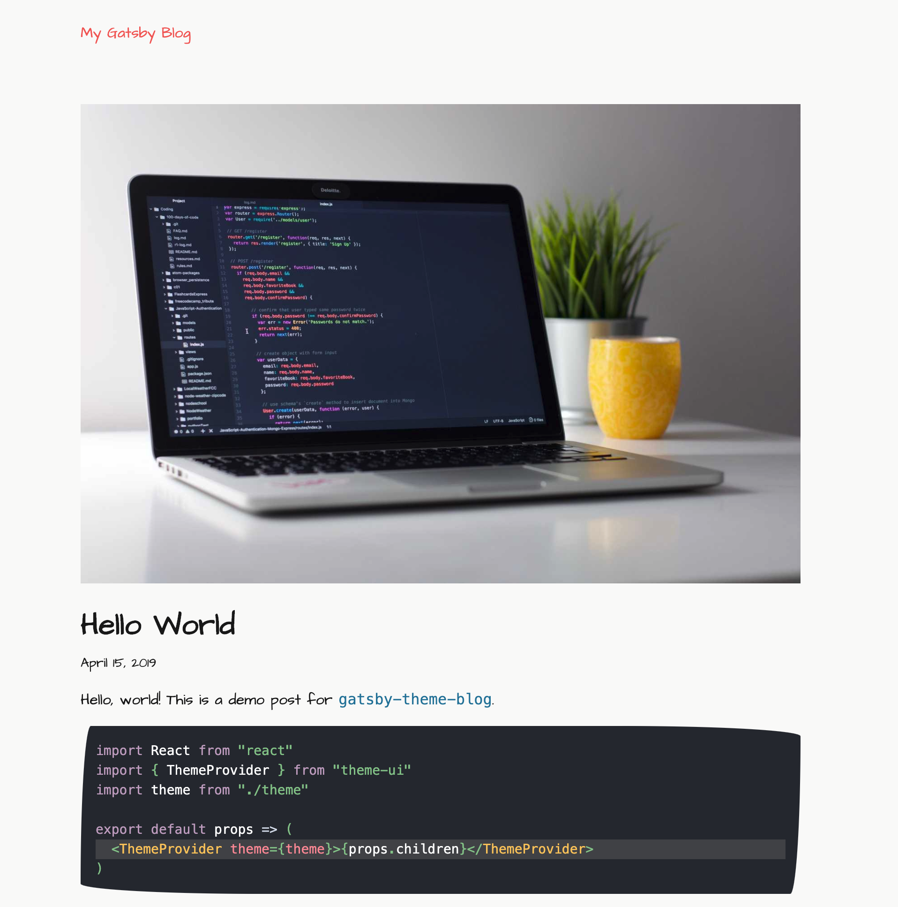

Today I'm excited to share with you a release we've been working on for the past few months. When we first released Gatsby themes we had ideas of what the community might build, but in the time since then you've really blown away our expectations.

Over the past year we've watched patterns emerge, accepted practices, and come to understand how people develop and use themes. As a result, we're excited about this opportunity to introduce an update to our most popular theme, [`gatsby-theme-blog`](https://github.com/gatsbyjs/themes/tree/master/packages/gatsby-theme-blog).

With new features and even more options to customize your theme, you can completely change the look of your site with only a few options!

|                        Preset 1                        |                           Preset 2                            |
| :----------------------------------------------------: | :-----------------------------------------------------------: |
|  |  |

All by changing the options you pass into your theme.

```javascript:title=gatsby-config.js
module.exports = {
  plugins: [
    {
      resolve: `gatsby-theme-blog`,
      options: {
        // highlight-start
        preset: `theme-ui-sketchy-preset`,
        prismPreset: `oceanic-next`,
        webfontURL:
          "https://fonts.googleapis.com/css?family=Architects+Daughter",
        // highlight-end
      },
    },
  ],
}
```

> [Sketchy Preset](https://github.com/beerose/theme-ui-sketchy) is the incredible work of [@beerose](https://github.com/beerose)

## New features

So let's unpack all the great new things in Blog Theme 2.0.

### Image support

With MDX you've always been able to add inline images in your posts, but now you can make use of featured images as well! Add `image` to your frontmatter and don't forget an `imageAlt`!

What's even better is that images can be relative paths to files in your project, or an external URL. And either way, you only need to remember one frontmatter key, `image`. The theme processes the rest for you.

### Improved SEO

And what about getting that amazing social sharing image to make your post pop on Twitter or LinkedIn? You're good to go! Your featured image is automatically used for social sharing. And if you'd rather use a different image, for dimension reasons or otherwise, `socialImage` is available in your frontmatter as well.

Don't have an image for this post? That's ok! The theme will revert to a social sharing card that doesn't leave a big file avatar.

### Webfont configuration

Another great feature is out of the box support for webfonts. You can include the webfont URL of your choosing and pass it into the theme options as `webfontURL`. It will automatically get included with `react-helmet` and your site will use it.

### Line highlighting in code snippets

The included `@theme-ui/prism` package now comes with support for line highlighting in your MDX code snippets! Using `// highlight-line` or a combination of `// highlight-start` and `// highlight-end` will trigger the highlighting styles available on each of the prism themes in Theme UI. If you're interested in changing or overriding it locally you can add styles to `.highlight` in your `gatsby-plugin-theme-ui` shadowed files.

## Changing the look is easier than ever before

Being able to shadow styles has always been a great way to get granular with your Theme UI theme, but not everyone wants to do that! I'm not much of a designer myself and I wanted to change the look of my site without having to pick out every color.

### Presets

In Blog Theme 2.0 you can pass in a Theme UI preset to style your site. The default is `gatsby-theme-ui-preset` which looks and feels much like the existing blog theme styles, but there are a number of others open to you!

You can make use of those [provided by Theme UI](https://theme-ui.com/packages/presets), or try out something from the larger community, like [sketchy-preset](https://github.com/beerose/theme-ui-sketchy).

All of these presets act as base styles and your local shadowed styles are automatically deep merged with them, with local styles taking precedent.

If you'd rather not use any preset and set everything locally yourself, you can set `preset` to `false`.

### Prism

Another option for presets are prism highlighting. Theme UI comes with a number of built-in [prism presets](https://theme-ui.com/packages/prism#syntax-themes) that you can reference directly by name and the theme will do the rest for you.

```javascript:title=gatsby-config.js
module.exports = {
  plugins: [
    {
      resolve: `gatsby-theme-blog`,
      options: {
        prismPreset: `prism-okaidia`, // highlight-line
      },
    },
  ],
}
```

All prism presets take precedence over styles in your `preset` theme, but are less specific than local shadowing.

## The new `gatsby-theme-blog-core`

In addition to all the changes above, we've also made some adjustments to the architecture in `gatsby-theme-blog-core`. It now comes with built-in components for displaying an individual blog post or a blog post listing. These components are completely unstyled but elements within them have `classNames` so you can change their look without any shadowing at all.

This gives you more tools than ever before to use this theme as an add-on for site functionality.

## `gatsby-theme-blog-darkmode`

Another change is the dark mode toggle that's long been a staple of the blog theme. In order to make styling a bit more fun and remove the need for a dark mode out of the box, this is now a separate theme!

Use it in combination with `gatsby-theme-blog` and take advantage of the same functionality you've come to expect!

## Next Steps

As you get started working with the new releases be sure to check out the updated [docs](/docs/themes/shadowing/) including a reworked [tutorial](/tutorial/using-a-theme/).

We're so excited to see you make use of these updated themes and can't wait to see what the community builds. As always, we'd love for you to share it with us on [Twitter](https://twitter.com/GatsbyJS)!
