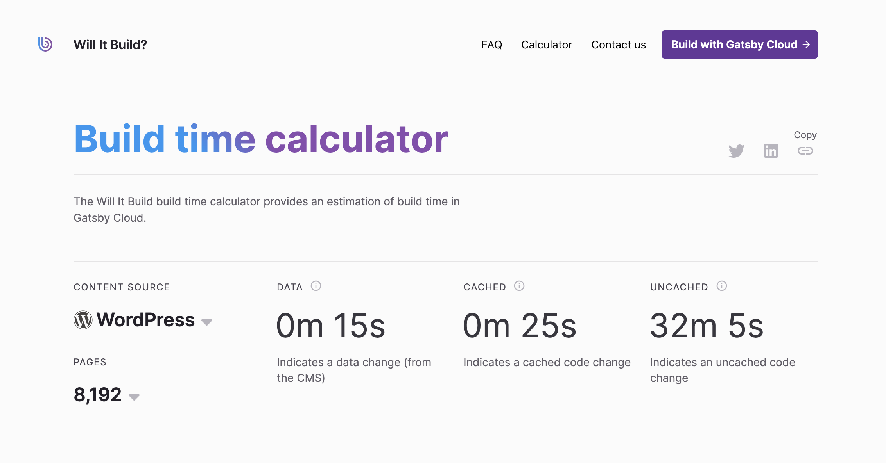

I am a firm believer that static sites are awesome: they're faster, more resilient, and easier to scale than traditional server-rendered sites. A complex app can be baked into a bunch of HTML and JSON files, served via CDN.

But certain things become more challenging when you try to go all-static. For example, how would you build a dynamic, interactive filter like this?


In a typical web app, you'd make a `fetch` request to the API whenever the input changes value. We can't do that in a static site, though, because we don't want to depend on a runtime API.

We ran into this problem at Gatsby on a recent project, and I'm really pleased with the solution we came up with! It looks and feels just like any other database-driven web application, but with a couple of extra surprise benefits.

In this blog post, we'll see how we did it, by using the world’s sneakiest route change 🕵🏻‍♂️

## But first, some context

A few weeks ago, my team at Gatsby launched [Will it Build](https://willit.build/), a benchmarking service that shows how long it takes to build Gatsby sites.


We built this site to answer a question we get a lot at Gatsby:

> I have a [WordPress] site with [8000] pages; how long would it take to build with Gatsby?

The details vary, but the story is the same: developers are worried that their build times will balloon if they have to build every page at compile-time.

It's a reasonable concern; historically, build times have been a sort of “Achilles Heel” for Gatsby, and static sites more broadly. Very large sites can take upwards of 60 minutes to build.

Thankfully, the picture has changed quite a bit over the last year. The Gatsby core / cloud teams have invested a ton of time and energy improving build performance; with [incremental builds](https://www.gatsbyjs.org/blog/2020-04-22-announcing-incremental-builds/), even very large sites can build in less than a minute (with a warm cache).



Will it Build runs dozens of benchmarks a day, ranging from 512 pages to over 32,000 pages, across 8 different content sources (including WordPress, Drupal, Markdown/MDX, Contentful, and Sanity). You can play with this data yourself, using its [GraphQL API](https://willit.build/api-playground).

The frontend of the Will it Build site is, naturally, built with Gatsby. And I'm pleased to say that it's _completely static_—it only fetches data from the API when we build the site.

The problem we had to solve was the one shown in the GIF above. Our site features inputs that let users tweak the parameters, to adjust the type and size of the benchmark:


How do we do that with a static site?

## Page Navigation

The URL structure for Will it Build is:

> /source/:source/page-count/:numOfPages

We generate a distinct page for every combination of `source` and `numOfPages`.

So really, we want to navigate the user from one page to another when they change one of those parameters. In its simplest form, it looks like this:

```jsx
<select
  onChange={ev => {
    const newPath = `/source/${ev.target.value}/page-count/8192`

    window.location = newPath
  }}
>
  {/* options omitted */}
</select>
```

If we were to do this, though, it wouldn't be the best user experience:

- We'd show the user a blank white screen while fetching the new HTML document
- The user's scroll position would be lost
- Focus would be reset
- It clutters the user's history

Let's fix each of these in turn.

### Client-side navigation

Instead of doing `window.location`, we can use Gatsby's built-in router, [Reach Router](https://reach.tech/router/), to transition using client-side navigation:

```jsx
import { navigate } from "gatsby"
;<select
  onChange={ev => {
    const newPath = `/source/${ev.target.value}/page-count/8192`

    navigate(newPath)
  }}
>
  {/* options omitted */}
</select>
```

With this change, our transition is much snappier, and doesn't suffer from the "flash of white" that typically comes with a change in URL.

In addition to generating a static site, Gatsby also functions as a SPA (Single Page Application). We can hop from page to page using client-side routing.

When we call `navigate` (or use a `<Link />`), we aren't loading an entirely new HTML file; we're pulling the new props that we need for our page component from a JSON file.

### Preserving scroll position

In general, when we navigate from one page to another, we want the scroll position to be reset to the top. This is how browsers work by default, and Reach Router mimics this behavior.

This case is a peculiar exception; we want to keep the user right where they are, since it would be disorienting for the scroll position to change.

Happily, Gatsby gives us an escape hatch we can use. Let's start by adding some location state to our `navigate` call:

```js
navigate(newPath, {
  state: {
    disableScrollUpdate: true,
  },
})
```

Location state is similar in concept to query parameters, except it doesn't show up in the URL. On its own, this doesn't have any effect, but we can access this state in a special Gatsby browser API:

```js
// gatsby-browser.js
export const shouldUpdateScroll = ({ routerProps }) => {
  const { disableScrollUpdate } = routerProps.location.state

  return !disableScrollUpdate
}
```

[`shouldUpdateScroll`](https://www.gatsbyjs.org/docs/browser-apis/#shouldUpdateScroll) fires on every route change, and it expects us to return a boolean: `true` if we should scroll to top, `false` if we should maintain the current scroll position. By default, this always returns `true`.

We use location state to allow specific route changes to override this behavior, and keep the user right where they are on the page.

### Focus management

In general, when the user follows a link to a new page, focus should move to the `body` element. This is imperative for people who navigate with devices other than a mouse (like a keyboard).

In this case, we want to preserve focus on the dropdown element. It would be surprising and disorienting if the focus was reset after interacting with a form control.

To manage this, we will use another Gatsby browser API, [`onRouteUpdate`](https://www.gatsbyjs.org/docs/browser-apis/#onRouteUpdate):

```js
// gatsby-browser.js
export const onRouteUpdate = loc => {
  const { state } = loc.location

  if (state && state.refocusId) {
    const elem = document.getElementById(state.refocusId)

    if (elem) {
      elem.focus()
    }
  }
}
```

The `onRouteUpdate` method is called whenever the route changes, and allows us to add some side effects. We'll use location state again to pass along a specific element ID. If an ID is provided, we'll find that element and focus it.

This requires that every `select` has a unique ID:

```js
<select
  id="some-unique-id"
  onChange={(ev, newPath) => {
    const newPath = /* ✂️ */

    navigate(newPath, {
      state: {
        refocusId: ev.target.id,
        disableScrollUpdate: true,
      },
    })
  }}
>
```

## Cluttering history

Every time the user tweaks a parameter, it pushes a new entry onto the history stack. When they click the back button, it'll take them to the previous setting, not the previous page. That's not ideal.

Thankfully, Reach Router's `navigate` function has an option for this:

```js
navigate(newPath, {
  replace: true,
  state: {
    refocusId: ev.target.id,
    disableScrollUpdate: true,
  },
})
```

Instead of adding a new entry to the history stack, we'll replace the current entry. This is consistent with what people would expect.

## Results

With these concerned tackled, we've successfully created a route change that doesn't feel like a route change 🎉

It's generally bad to abuse built-in mechanics like this; semantically, this isn't really a route change. But I believe the benefits outweigh that drawback.

Because we're changing routes, the URL updates with every parameter tweak. This is pretty cool! The user can copy the link to share a specific configuration.

Also, the performance is 🔥🔥🔥. We're not waiting on any database calls in a far-away server. The data has already been compiled into a JSON file, collocated on a CDN edge near you. We could do something similar with caching, but this feels simpler to me.

### Possibly a better approach?

When we perform a route change, Gatsby fetches the data that we need from a JSON file under the hood. Presumably, we could request that data ourselves. Instead of fetching from our API, we'd be fetching from our CDN.

Honestly, this idea hadn't occurred to me until we had already completed our current approach 😅.

I'm not sure that one approach is better than the other, though. The trade-offs are different:

- **Pro:** We wouldn't be violating semantics by sneaking in a route change.
- **Con:** The `page-data.js` file that Gatsby produces is an implementation detail, and may change without warning in a future version. The framework doesn't really expect us to do this.
- **Pro:** We wouldn't need to worry about scroll position and focus management. We'd be less likely to accidentally make the experience worse for some folks.
- **Con:** The URL wouldn't update when the user tweaks a parameter, making it harder to share specific results.

## Emerging Patterns

As static sites become more and more popular, I suspect we'll see more innovation in this area. It's exciting! As it becomes feasible to do more and more things statically, our apps will get quicker, and our jobs will get easier.

Watch this space.
