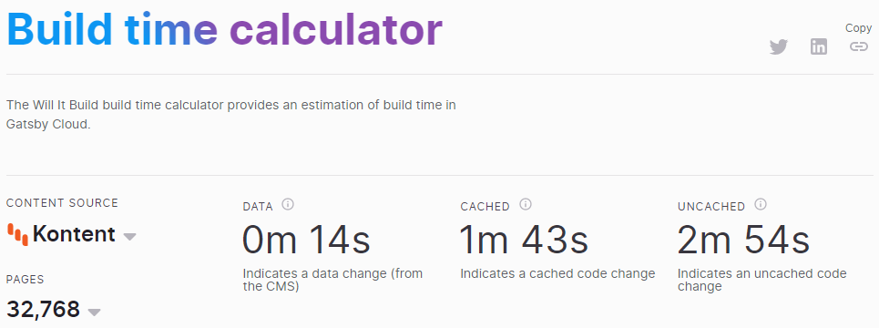

It all started back in 2018 when we, [DevRel team at Kentico Kontent](https://kentico.github.io/), started working on a source plugin for Gatsby, the rising star among static site generators. Developers already loved how fast their sites were when they used Gatsby, the community was expanding quickly, and our clients had started asking about bringing their content to Gatsby.

During the fall of 2018, the plugin was already released, and we used Gatsby to rebuild one of our company websites—[Kentico Advantage](https://advantage.kentico.com). Since then, the source plugin has been greatly improved to support many use cases of our clients. Just a few weeks ago, the plugin was used by hundreds of websites, and we were seeing over 10% monthly increase in projects using Gatsby.

So what was the "problem"?

## Gatsby introduced new features

Over time, many Jamstack developers complained about their builds taking too long. Combined with automatic builds after content and code changes, this often meant there was almost always a build in progress. And also frequent deployments.

Editors were unhappy too. Their changes triggered new builds, which took tens of minutes, so they had to wait a long time before their changes were visible on the live/preview sites.

Gatsby solved these issues with a new offering called [Gatsby Cloud](https://www.gatsbyjs.com/). Its main benefits are incremental builds and fast previews. A great improvement. But it also came with its cost. To allow clients to leverage these benefits, any headless CMS needed to comply with a few hard requirements on what it must provide:

- Source plugin exposing data via Gatsbyʼs GraphQL schema
- Sending prompt webhook notifications whenever thereʼs a content change
- Integrating Gatsby Preview capability into its UI
- Having a robust and easy-to-use documentation

They call this the “[first-class integration](https://www.gatsbyjs.com/docs/integration-guide/#how-to-create-a-first-class-source-plugin-for-gatsby-preview).” You can imagine these points mean significant development effort and some product changes too. In other words, not something that one person could do over the weekend.

## New is always better

So we started implementing improvements on multiple fronts.

Ondrej, our developer advocate, used his _innovation time_ to build a completely new Gatsby source plugin with one key aspect in mind. Performance. He was very strict with the new aspects of the plugin:

- Avoiding as many dependencies as possible
- Using the simplest data contract when getting data from the CMS to Gatsby
- Using Typescript to ensure type safety
- Defining GraphQL schema to allow lazy loading of calculated fields
- Using yarn workspaces to make it easier to create packages
- Making it future-proof and ready for multi-project sourcing features

Did he succeed?

The **test build with 30k Gatsby nodes** took a little over 38 minutes with the old plugin. Now it **finishes after 7 minutes**. Thatʼs 18% of the original time. And you know you only get 300 free minutes from Netlify, right? :-)

On the product side, Gatsby requested to be notified about each content change. This meant that we had to implement webhook notifications that would fire every time an editor touches any content item. We bribed the product developers with few beers to squeeze this feature into their sprint. Donʼt tell their product managers. A few weeks later, the preview webhooks were released.

## The fastest Gatsby integration in the world

After implementing these improvements, we were proud to get listed on the [Willit.build site](https://willit.build/details/type/blog/source/kentico/page-count/512). The site displays build times of Gatsby projects using data from various CMSs on Gatsby Cloud. Check out for yourself in the [calculator](https://willit.build/calculator) how fast a headless CMS can get when you innovate.

At Kentico Kontent, we allocate one day each week for _“mandatory”_ innovation time. Sometimes we use it to play with gadgets like VR goggles or Raspberry PIs, but this time Ondrejʼs initiative led us to become the most performant source of data for Gatsby. And we know you can use the saved time.

Of course, we will crack the bottles of champagne open only after we migrate all our clients to the new version of the source plugin :-).

If you havenʼt tried Kentico Kontent yet, [take a look here](https://bit.ly/2XjTnxa) or check out the [source plugin repository on GitHub](https://github.com/Kentico/kontent-gatsby-packages/tree/master/packages/gatsby-source-kontent#readme).
