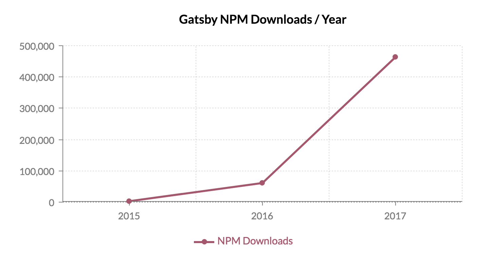
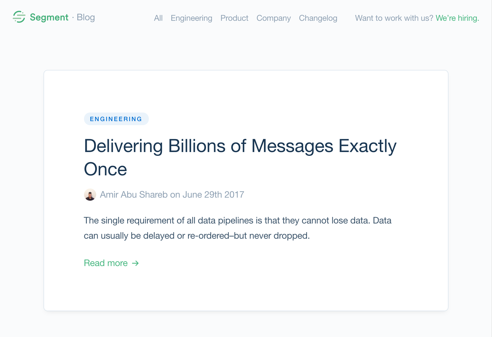
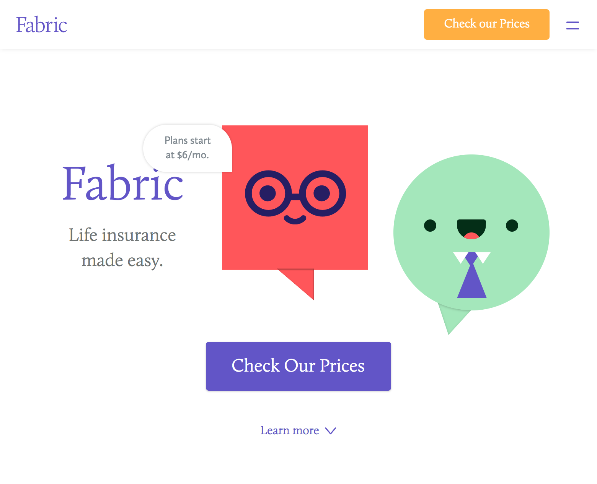

Gatsby is your friendly, blazing fast static site generator for React. And after nearly a year of research, prototyping, and testing, Gatsby v1 is ready for action.

But Gatsby isn't your typical static site generator.

Like all static site generators, Gatsby offers *better performance, higher security, lower cost of scaling, and a better developer experience* than traditional dynamic website frameworks. But Gatsby goes far far beyond the typical markdown content setup.

I'm especially excited to launch as part of v1, Gatsby's *innovative plugin-driven data layer* which for the first time makes possible *rich integrations between a static site generator and CMSs like Contentful, Wordpress, and Drupal* (and many other data sources).

Developers get no build configuration support for modern data tools, JavaScript, and CSS while content creators and editors get a delightful content creation experience. No more compromising between developers and authors.

*Gatsby v1 heads out to sea delivering components to ports far and wide*

## Gatsby is growing like crazy

Some recent milestones we've reached:

* 160 code contributors on Github (with many more helping in our chat room on Discord).
* 10,000 stars on Github
* 1000 followers on Twitter
* 500,000 NPM downloads (100,000 in the last month!!)



It's been really exciting and fulfilling to see the many new faces contributing on Github.

## Sites built with Gatsby v1

I've been really pleased to see some really fantastic sites launch already on Gatsby v1.

### [Segment relaunched their blog on Gatsby](https://segment.com/blog/)



### [The life insurance startup Fabric built their marketing site *and* web app using Gatsby](https://meetfabric.com/)


### [Thijs Koerselman contributing to Gatsby v1 while rebuilding his portfolio site](https://www.vauxlab.com/)


And you're on of course a Gatsby 1.0 website 😛

## The three questions that spawned Gatsby

Gatsby started, like all the best projects do, as a spark of curiosity — "I wonder if I could create a tool for building static websites with React?".

I'd been using React to build web apps for 1.5 years at that point and loved how easy React's component model made it to build complex apps and wanted that same model for building websites.

In a week of intense coding, I prototyped the first version of Gatsby ([see my talk at React conf to hear more of the story](https://www.youtube.com/watch?v=RFkNRKL6ZoE)) and open sourced this 2 years ago.

1000s of sites and 10,000 stars later, it seems clear that tools for building static React sites are useful.

But while building sites with React v0 and helping/watching others do the same, two more questions kept coming to mind.

1. How could I *query* data from *anywhere* and have that data show up in my pages **without** any custom scripting?
2. How should a website framework work for an *internet dominated by smartphones on unreliable networks* — an internet vastly different and larger than the one frameworks were designed for a decade ago?

## Plugin system

The first block for building answers to these questions was a plugin system.

Wordpress & Jekyll are both great examples of open source communities
with robust plugins ecosystems.

Plugins help accelerate developing websites as you can build on what
others have done and help collaborate with others on basic building
blocks

Gatsby's plugin system lets you hook into Gatsby's lifecycle APIs everywhere from
events during the bootstrap and build processes and in the browser.

There are already many [official Gatsby plugins](/docs/plugins/)
built—all distributed as individual NPM packages. It is easy to create
your own plugins for internal projects and for contributing back to Gatsby.

Plugins can:

* add support for webpack loaders such as Sass, Less
* add drop-in support for lightweight React-compatible frameworks
[Preact](https://preactjs.com/) and [Inferno](https://infernojs.org/)
* add a sitemap or RSS feed
* add [Google Analytics](/docs/packages/gatsby-plugin-google-analytics/)
* ...and much more!

## GraphQL-based data processing layer

Plugins also drive the new GraphQL data processing layer.

In Gatsby v0, (like pretty much every static site generator) data
was processed then *pushed* into templates to be rendered into HTML. This
is a simple pattern and works great for many use cases. But when you
start working on more complex sites, you really start to miss the
flexibility of building a database-driven site. With a database, all
your data is available to query against in any fashion you'd like.
Whatever bits of data you need to assemble a page, you can *pull* in.
You want to create author pages showing their bio and last 5 posts? It's
just a query away.

I wanted this same flexibility for Gatsby. So for 1.0, I've built a new data
processing layer which converts your data (whether from local files or remote
sources) into a *GraphQL schema* which you can query against like a database.

Every Gatsby page can have a GraphQL query which tells
Gatsby what data is required for that page. The data layer runs the
GraphQL queries during development and at build time and writes out a
JSON file with the result of the query. This JSON file is then injected
into the React component as props.

Because we know at build-time what data is needed for every page, we can
easily pre-fetch page data meaning even very complex, data-heavy pages
load almost instantly.

This pattern of *colocating* your queries next to your views is copied
from the [Relay data framework from
Facebook](https://facebook.github.io/relay/). Colocaton makes it easy to
fully understand your views as everything necessary for that view
is fully described there.

A simple example of how this works in practice.

Say we had a markdown file that looked like:

```markdown
---
title: A sweet post
date: "2017-02-23"
---

This is my sweet blog post. **Cool!**
```

In our site, we would write a React component which acts as a template
for all the blog posts. Included with the component is an exported
`pageQuery`.

```jsx
// A simple React component for rendering a blog page.
import React from "react"

class BlogPostTemplate extends React.Component {
  render () {
    <div>
      <h1>{this.props.data.markdownRemark.frontmatter.title}</h1>
      <small>{this.props.data.markdownRemark.frontmatter.date}</small>
      <div
        dangerouslySetInnerHTML={{
          __html: this.props.data.markdownRemark.html,
        }}
      />
    </div>
  }
}

export default BlogPostTemplate

export const pageQuery = graphql`
  query BlogPost($slug: String!) {
    markdownRemark(slug: { eq: $slug }) {
      # Get the markdown body compiled to HTML.
      html
      frontmatter {
        title
        # Transform the date at build time!
        date(formatString: "MMM D, YYYY")
      }
    }
  }
`

```

All data sourcing and transforming is plugin-driven. So in time, any
imaginable data source and potential ways of transforming its
data will be an `npm install` away.

For the markdown ecosystem there's already a robust set of plugins including [adding syntax highlighting
with PrismJS](/docs/packages/gatsby-remark-prismjs/) and
[resizing images referenced in markdown
files](/docs/packages/gatsby-remark-images/) so
they're mobile ready).

There's also source plugins written for Contentful, Wordpress, Drupal, Hacker News (really 😛), and more as well as transformer plugins for markdown, JSON, YAML, JSDoc, and images. We're collecting a list of additional source/transformer plugins that'd be useful to have over at https://github.com/gatsbyjs/gatsby/issues/1199

These plugins are easy to write (somewhat similar to webpack loaders) so
I expect to see the list of plugins grow rapidly.

## Gatsby is built for the next billion internet users

As [Benedict Evans has
noted](http://ben-evans.com/benedictevans/2015/5/13/the-smartphone-and-the-sun),
the next billion people poised to come online will be using the internet
almost exclusively through smartphones.

Smartphones with decent specs (as good or better than the Moto G4), a
great browser, but *without* a reliable internet connection.

Gatsby uses modern web performance ideas (e.g. the
[PRPL Pattern](/docs/prpl-pattern/))
developed by the Google Chrome Developer Relations team and others to
help websites work well on modern browsers with unreliable networks.

Sites built with Gatsby run as much as possible in the client so
regardless of the network conditions—good, bad, or
nonexistent—things will keep working. When a page loads, Gatsby immediately starts prefetching resources for pages nearby so that when a user clicks on a link, the new page loads instantly.

Many of the top e-commerce websites in areas where people are coming
online for the first time are developing their websites using these
techniques.

Read Google's case studies on:

* [Flipkart
(India)](https://developers.google.com/web/showcase/2016/flipkart)
* [Konga
(Nigeria)](https://developers.google.com/web/showcase/2016/konga)
* [Housing.com
(India)](https://developers.google.com/web/showcase/2016/housing)

## Add service worker and offline support

Service workers are perhaps the most exciting technology that's come to
the web in the past several years. It makes possible (finally!)
sophisticated client caching plus true offline support. I've added
excellent on-by-default support to Gatsby for Service Workers and a
great offline experience. If you're using Chrome or Firefox, this site
loads and works offline! *Service workers make your site much more resilient
against bad networks*. If someone loads your site on a train and goes
through a tunnel, you won't lose them as they'll still be able to keep
clicking around.

## Route-based code splitting

Many sites generate one JavaScript bundle for the *entire* site. Which
means someone loading your frontpage loads far more code than is
necessary.

Gatsby 1.0 only loads the scripts necessary for the page you're on. As you
navigate around, Gatsby loads the JavaScript needed for each route.

This means that one page with heavy imports:

```javascript
import d3 from "d3"
import threejs from "react-threejs"
```

...won't affect the performance of the rest of the site.

This is particularly helpful for teams of people collaborating on a site
with pages with very different technical and business requirements.
Different parts of the site can evolve independently of each other.

One client I'm working with on Gatsby 1.0 (a stealth startup in San
Francisco) is using Gatsby to build both their marketing site *and* SaaS
app within the *same Gatsby codebase*.

The marketing pages of their site are built using markdown and React
components along with a modern css-in-js library
[Glamor](https://github.com/threepointone/glamor) for styling.
The SaaS portion uses [Redux](http://redux.js.org/) to communicate with
their Django API.

The marketing portion of the site loads quickly with minimal JavaScript.
When a potential customer goes to sign-up for the app, there's no
*awkward jump from the marketing website to the web app*—just a simple
page change which seamlessly loads in the needed JavaScript. The *team
is sharing components and styles across the site* without stepping on
each others shoes as they rapidly iterate on features.
