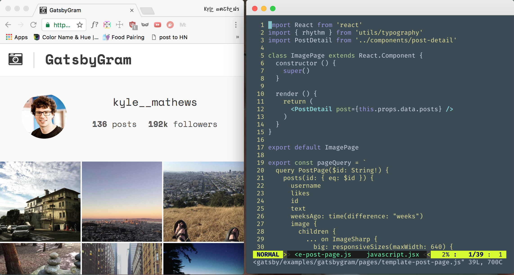

[Gatsbygram](https://gatsbygram.gatsbyjs.org) is a clone of Instagram
built with Gatsby 1.0.0-alpha12 and is being continually updated as we
make our way towards our 1.0 release.

The [source code for
Gatsbygram](https://github.com/gatsbyjs/gatsby/tree/1.0/examples/gatsbygram)
lives in the Gatsby monorepo. See the instructions at the end for how to
start playing with the code!

<div>
<video controls="controls" autoplay="true" loop="true">
  <source type="video/mp4" src="/gatsbygram.mp4"></source>
  <p>Your browser does not support the video element.</p>
</video>
</div>

## What is Gatsby

Gatsby is a JavaScript web framework that let's you build fast,
dynamic, mobile-ready websites *without* an advanced degree in
JavaScript wizardry.

It combines the fast performance of static websites with the powerful
abstractions, tools, and client capabilities of the React.js world.

### Gatsby is fast

[Gatsby automatically optimizes your site for the modern
web](/docs/prpl-pattern/). You provide pages and Gatsby stitches them
together so they load as fast as possible.

As proof of this, Gatsbygram loads *2-3x faster* than the real Instagram site.

I tested Gatsbygram and Instagram on
[webpagetest.org](https://www.webpagetest.org/) using a simulated 3G
network and a Moto G4 smartphone—a budget Android typical of many
lower-end phones used today. The median [speed
index](https://sites.google.com/a/webpagetest.org/docs/using-webpagetest/metrics/speed-index)
score for
[Gatsbygram](http://www.webpagetest.org/result/170310_XP_11AS/) was 3151
vs. 8251 for
[Instagram](http://www.webpagetest.org/result/170310_PC_11AZ/).

*Filmstrip of Gatsbygram (top)
and Instagram (bottom) loading on webpagetest.org*

The second repeat view is even faster for Gatsbygram as it now loads
from its service worker. It has *pixels on the screen in under a 1/2
second on a budget Android device*! And for both the initial and repeat
view, Gatsbygram  *finishes* loading a full second before Instagram gets
started.

*Filmstrip of a repeat view
of Gatsbygram (top) and Instagram (bottom) loading on webpagetest.org*

The difference in Time to Interactivity (TTI) (measure of how long
before the user can actually interact with the page e.g. click on a
link) between the sites is just as dramatic. Gatsbygram's TTI is 6.1s vs
14.1s for Instagram.

* [Gatsbygram's webpagetest
results](http://www.webpagetest.org/result/170310_XP_11AS/)
* [Instagram's webpagetest
results](http://www.webpagetest.org/result/170310_PC_11AZ/)

### Gatsby is built for the next billion internet users

As [Benedict Evans has
noted](http://ben-evans.com/benedictevans/2015/5/13/the-smartphone-and-the-sun),
the next billion people poised to come online will be using the internet
almost exclusively through smartphones.

Smartphones with decent specs (as good or better than the Moto G4), a
great browser, but *without* a reliable internet connection.

Gatsby uses modern web performance ideas (e.g.
[PRPL](https://developers.google.com/web/fundamentals/performance/prpl-pattern/))
developed by the Google Chrome Developer Relations team and others to
help websites work well on modern browsers with unreliable networks.

Sites built with Gatsby run as much as possible in the client so
regardless of the network conditions—good, bad, or
nonexistent—things will keep working.

Many of the top e-commerce websites in areas where people are coming
online for the first time are developing their websites using these
techniques.

Read Google's case studies on:

* [Flipkart
(India)](https://developers.google.com/web/showcase/2016/flipkart)
* [Konga
(Nigeria)](https://developers.google.com/web/showcase/2016/konga)
* [Housing.com
(India)](https://developers.google.com/web/showcase/2016/housing)

### Gatsby is simple

Modern JavaScript websites are too complex to rely on developers always
configuring things correctly. Gatsby simplifies website development by
extracting configuration out of your site and moving it into the
framework and community plugins.

You give Gatsby React.js components, data, and styles and Gatsby gives you
back an optimized website.

Gatsbygram is a completely vanilla Gatsby site. Its optimizations are
from the framework.

Gatsby includes a full modern JavaScript toolchain
(Babel/webpack/Uglify) with optimized production builds and
an innovative *declarative* asset pipeline.

For Gatsbygram, Gatsby generates over *1000* image thumbnails for
responsive images without *any* custom scripting by leveraging the
Gatsby image processing plugin
[gatsby-transformer-sharp](/docs/packages/gatsby-transformer-sharp/).

Stop wasting time and build something!

## App structure

All static site generators create a set of files that determine the
routing in your site. Typically, you define the output file structure
(and thus URL structure) of your site by way of the input structure. For
example the input structure:

```
my-site/
  index.md
  blogs/
    blog1.md
```

...would be transformed to:

```
my-site/
  index.html
  blogs/
    blog1.html
```

This is fine at first, but can be limiting. For example, in Gatsbygram,
we have a JSON data blob scraped from an Instagram user profile. From
this we want to generate a page for each image. We couldn't do this with
a typical static site generator, but Gatsby lets you define routes
programmatically through the `createPages` API using any data you have
available.

Here is how we define pages from our JSON data for Gatsbygram at build time in
the site's [`gatsby-node.js`
file](https://github.com/gatsbyjs/gatsby/blob/1.0/examples/gatsbygram/gatsby-node.js):

```javascript
const _ = require(`lodash`)
const Promise = require(`bluebird`)
const path = require(`path`)
const slug = require(`slug`)
const slash = require(`slash`)

// Implement the Gatsby API “createPages”. This is
// called after the Gatsby bootstrap is finished so you have
// access to any information necessary to programatically
// create pages.
exports.createPages = ({ graphql, boundActionCreators }) => {
  const { upsertPage } = boundActionCreators

  return new Promise((resolve, reject) => {
    // The “graphql” function allows us to run arbitrary
    // queries against this Gatsbygram's graphql schema. Think of
    // it like Gatsbygram has a built-in database constructed
    // from static data that you can run queries against.
    //
    // Post is a data node type derived from data/posts.json
    // which is created when scrapping Instagram. “allPostsJson”
    // is a "connection" (a GraphQL convention for accessing
    // a list of nodes) gives us an easy way to query all
    // Post nodes.
    resolve(
      graphql(
        `
      {
        allPostsJson(limit: 1000) {
          edges {
            node {
              id
            }
          }
        }
      }
    `
      ).then(result => {
        if (result.errors) {
          reject(new Error(result.errors))
        }

        // Create image post pages.
        const postTemplate = path.resolve(`src/templates/post-page.js`)
        // We want to create a detailed page for each
        // Instagram post. Since the scrapped Instagram data
        // already includes an ID field, we just use that for
        // each page's path.
        _.each(result.data.allPostsJson.edges, edge => {
          // Gatsby uses Redux to manage its internal state.
          // Plugins and sites can use functions like "upsertPage"
          // to interact with Gatsby.
          upsertPage({
            // Each page is required to have a `path` as well
            // as a template component. The `context` is
            // optional but is often necessary so the template
            // can query data specific to each page.
            path: `/${slug(edge.node.id)}/`,
            component: slash(postTemplate),
            context: {
              id: edge.node.id,
            },
          })
        })

        return
      })
    )
  })
}
```

## Using templates

Gatsby uses standard React.js components to render pages. When you
define a page in the `createPages` API, you specify its component.
Those components, usually called templates, get reused with
page-specific data to generate the different pages.

As you can see above, when defining a page, we can set "context" data, which is
passed as a `prop` to the component and as a [GraphQL
variable](http://graphql.org/learn/queries/#variables) in our `GraphQL` query.
For the "[post
template](https://github.com/gatsbyjs/gatsby/blob/1.0/examples/gatsbygram/src/templates/post-page.js)",
we pass the id to the post. Below we use that id to query our `GraphQL` schema
and return a fully formed page:

```jsx
import React from "react"
import PostDetail from "../components/post-detail"

class PostTemplate extends React.Component {
  render() {
    return (
      // PostDetail is used for this detail page and
      // also in the modal.
      <PostDetail post={this.props.data.posts} />
    )
  }
}

export default PostTemplate

// The post template's GraphQL query. Notice the “id”
// variable which is passed in. We set this on the page
// context in gatsby-node.js.
//
// All GraphQL queries in Gatsby are run at build-time and
// loaded as plain JSON files so have minimal client cost.
export const pageQuery = `
  query PostPage($id: String!) {
    # Select the post which equals this id.
    posts(id: { eq: $id }) {
      # Specify the fields from the post we need.
      username
      avatar
      likes
      id
      text
      # Date fields have special arguments. This one computes
      # how many weeks have passed since the post was created.
      # All calculations like this (like all GraphQL query
      # activity) happens at build-time! So has minimal cost
      # for the client.
      weeksAgo: time(difference: "weeks")
      image {
        children {
          ... on ImageSharp {
            # Here we query for *multiple* image thumbnails to be
            # created. So with no effort on our part, 100s of
            # thumbnails are created. This makes iterating on
            # designs effortless as we simply change the args
            # for the query and we get new thumbnails.
            big: responsiveSizes(maxWidth: 640) {
              src
              srcSet
            }
          }
        }
      }
    }
  }
`
```

## Creating React.js component pages

In addition to creating pages for our Instagram photos, we want to make
an index page for browsing all photos. To build this index page, Gatsby
lets us create pages using simple React.js components.

```
pages/
  index.js
  about.js
```

These React component pages can query the Gatsbygram GraphQL schema for
data and are automatically converted into their own pages at
`gatsbygram.gatsbyjs.org/` and `gatsbygram.gatsbyjs.org/about/`.

Gatsbygram's `about.js` is a simple React component with no query.
`index.js` is more complex. It queries for thumbnails for all images and
has an infinite scroll implementation to lazy load in image thumbnails.

[Read pages/index.js on
Github](https://github.com/gatsbyjs/gatsby/blob/1.0/examples/gatsbygram/src/pages/index.js)  
[Read pages/about.js on
Github](https://github.com/gatsbyjs/gatsby/blob/1.0/examples/gatsbygram/src/pages/about.js)

## The Layout Component

Each Gatsby site has a top-level layout component at
`layouts/default.js`. This layout component is used on every page of
your site so can contain things like your header, footer, and default
page structure. It is also used as the "[app
shell](https://developers.google.com/web/updates/2015/11/app-shell)"
when loading your site from a service worker.

A simple layout component might look something like this.

```jsx
import React from "react"
import Link from "gatsby-link"

class Layout extends React.Component {
  render () {
    return (
      <div>
        <Link
          to="/"
        >
          Home
        </Link>
        <br />
        {/* Render children pages */}
        {this.props.children}
      </div>
    )
  }
}

export default Layout
```

Every page will be rendered as children of the `Layout` component:
```jsx
<Layout>
  <Page />
</Layout>
```

Gatsbygram's layout component is somewhat more complicated than most
sites as it has logic to show clicked images in either a modal on larger
screens or on their own page on smaller screens.

[Read Gatsbygram's Layout component on
Github](https://github.com/gatsbyjs/gatsby/blob/1.0/examples/gatsbygram/src/layouts/default.js).

## Client routing and pre-caching

Gatsby loads first a static server-rendered HTML page and then the
JavasScript to convert the site into a web application. Which means that
clicking around the site doesn't require a page reload.  Gatsby
*pre-caches* code and data needed for other pages so that clicking on a
link loads the next page instantly.

All the setup for this is handled behind the scenes. Gatsby uses [React
Router](https://github.com/ReactTraining/react-router) under the hood
but generates all the configuration for you.

Normally page resources are pre-cached with a service worker. But as
several browsers (Safari/Microsoft Edge) still don't support Service
Workers, the [Gatsby `<Link>` component](/docs/packages/gatsby-link/)
pre-caches resources for pages it links to by loading them into memory.

## Plugins

Gatsby has always had a rich set of lifecycle APIs to allow you to hook
into various events during development, building, and in the client.

Gatsby 1.0 adds new APIs and also adds a [new plugin
architecture](/docs/plugins/). So functionality can now be extracted from sites
and made reusable. Most of the new functionality in Gatsby 1.0 is
powered by plugins.

Plugins are added to a site in its `gatsby-config.js`. Here's what
Gatsbygram's config file looks like:

```javascript
module.exports = {
  siteMetadata: {
    title: `Gatsbygram`,
  },
  plugins: [
    /*
     * Gatsby's data processing layer begins with “source”
     * plugins.  You can source data nodes from anywhere but
     * most sites, like Gatsbygram, will include data from
     * the filesystem so we start here with
     * “gatsby-source-filesystem”.
     *
     * A site can have as many instances of
     * gatsby-source-filesystem as you need.  Each plugin
     * instance is configured with a root path where it then
     * recursively reads in files and adds them to the data
     * tree.
     */
    {
      resolve: `gatsby-source-filesystem`,
      options: {
        name: `data`,
        path: `${__dirname}/data`,
      },
    },
    // This plugin exposes helper functions for processing
    // images with the NPM package “sharp”. It's used by
    // several other plugins.
    `gatsby-plugin-sharp`,
    // This plugin identifies file nodes that are images and
    // transforms these to create new “ImageSharp” nodes.
    // With them you can resize images and
    // generate responsive image thumbnails.
    `gatsby-transformer-sharp`,
    // This plugin transforms JSON file nodes.
    `gatsby-transformer-json`,
    // This plugin sets up the popular css-in-js library
    // Glamor. It handles adding a Babel plugin and webpack
    // configuration as well as setting up optimized server
    // rendering and client re-hydration.
    `gatsby-plugin-glamor`,
    // This plugin takes your configuration and generates a
    // web manifest file so Gatsbygram can be added to your
    // homescreen on Android.
    {
      resolve: `gatsby-plugin-manifest`,
      options: {
        name: `Gatsbygram`,
        short_name: `Gatsbygram`,
        start_url: `/`,
        background_color: `#f7f7f7`,
        theme_color: `#191919`,
        display: `minimal-ui`,
      },
    },
    // This plugin generates a service worker and AppShell
    // html file so the site works offline and is otherwise
    // resistant to bad networks. Works with almost any
    // site!
    `gatsby-plugin-offline`,
    // This plugin sets up Google Analytics for you.
    {
      resolve: `gatsby-plugin-google-analytics`,
      options: {
        trackingId: `UA-91652198-1`,
      },
    },
  ],
}
```

## Styles

Gatsbygram uses two popular and complementary css-in-js libraries,
[Typography.js](https://github.com/KyleAMathews/typography.js) and
[Glamor](https://github.com/threepointone/glamor).

Typography.js is a powerful toolkit for building websites with beautiful
design.

Gatsbygram uses Typography.js to generate the *global* styles for the
site helping set the overall feel of the design.

Glamor lets you write *real CSS* in JavaScript inline in your React.js
components. It is used for *component* styles.

Typography.js exposes two helper JavaScript functions, `rhythm` and
`scale` to help keep your design in sync as you make changes. Instead of
using hard-coded spacing values (which break as soon as you change your
global theme), you use the Typography.js helper functions e.g.

```jsx
import React from "react";
import { rhythm, scale } from "../utils/typography";

class SampleComponent extends React {
  render () {
    return (
      <div
        {/* The “css” prop works the same as the built-in “style” prop */}
        css={{
          // 1 rhythm is equal to the height of the line-height of
          // normal body text.
          padding: rhythm(1),
        }}
      >
        <h1
          css={{
            // Make this h1 slightly larger than normal.
            // By default, h1 is set to a scale value of 1.
            ...scale(6/5),
          }}
        >
          My sweet title
        </h1>
        <p>Hello friends</p>
      </div>
    )
  }
}
```

Together they allow you to quickly iterate on designs.

They also contribute to Gatsbygram's excellent loading speed. The holy
grail of CSS performance is *inlined critical CSS*. Meaning a) only ship
a page with the CSS necessary to render that page and b) inline it in
the `<head>` instead of putting it in a separate file. There are various
tools to make this happen but they tend to involve extensive
configuration and heavy post-processing.

But with Typography.js and Glamor you get optimized CSS with no
tedious, error-prone bookkeeping. Typography.js (by definition)
generates only global styles so its styles are included on every page.
Glamor includes some [clever server-rendering
optimizations](https://github.com/threepointone/glamor/blob/master/docs/server.md)
which I've implemented in the [Gatsby Glamor
plugin](/docs/packages/gatsby-plugin-glamor/) where it automatically
extracts out the CSS used *in components on the page being server
rendered* and automatically inlines those styles in the generated HTML
page.

Super fast CSS by default. 👏👏👏

## Creating your own Gatsbygram

It's easy to create your own "Gatsbygram" site from an Instagram
account.

### Instructions on setting up your own Gatsbygram site.

```bash
# Clone the Gatsby repo.
git clone -b 1.0 git@github.com:gatsbyjs/gatsby.git
cd gatsby/examples/gatsbygram
npm install

# Remove the committed scrapped Instagram data
rm -r data

# Scrape a new account
node scrape.js INSTAGRAM_USERNAME

# Wait for pictures to download...

# Start the Gatsby development server. The initial
# run will take extra time as it processes
# images the first time.
gatsby develop
```

While writing this post I scrapped a few accounts and published their
resulting "Gatsbygram" sites:

* https://iceland-gatsbygram.netlify.com
* https://tinyhouses-gatsbygram.netlify.com

*With thanks to Sam Bhagwatt, Sunil Pai, Nolan Lawson, Nik Graf,
Jeff Posnick, and Addy Osmani for their reviews.*

*And a special thanks to Kristo Jorgenson for his [refactor of the “App
structure” section](https://github.com/gatsbyjs/gatsby/pull/708).*
