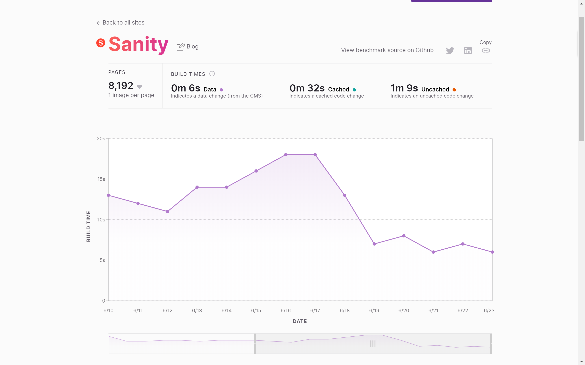

In June Gatsby decided to be intentional and quieter in our social media channels to make room for conversations around systemic racism.

During that period Gatsby [matched donations](https://www.gatsbyjs.com/donation-matching/) to organizations that specialize in criminal justice reform, like the NAACP Legal Defense Fund and the ACLU. We also [launched Gatsby Voices](https://www.gatsbyjs.com/gatsby-voices/), a content series where members of the Gatsby community can share the story of their experiences in tech. (Please apply - those who are selected will be compensated \$500 USD for their work.). And we renewed our commitment to our core value of "You Belong Here", and we're taking internal action to expand our organizational identity, reevaluate our hiring and career advancement policies, bring in expert consultation, [and other steps](https://www.gatsbyjs.org/blog/2020-06-11-you-belong-here-commitment/).

The efforts above are just the beginning of the work were doing to ensure Black lives matter in our world, our industry, and our company.

## 🚀 New in Gatsby and Gatsby Cloud!

### 3 new CMS's (plus 1) in Gatsby Cloud

We've made it easier to use [Gatsby Cloud](https://gatsbyjs.com) with three amazing CMS's - [Kentico Kontent](https://www.gatsbyjs.com/guides/kentico-kontent/), [Flotiq](https://www.gatsbyjs.com/guides/flotiq/), [AgilityCMS](https://www.gatsbyjs.com/guides/agility-cms/). Gatsby Cloud also has [an improved Drupal integration](https://youtu.be/Mm6wrDr2DBE) (Check it out [here](https://www.drupal.org/project/gatsby) 🎉.

So, which [headless CMS](/docs/glossary/headless-cms/) should you choose? Why not try all three? With Gatsby you can swap the data provider for your project and build each site with the same Gatsby account. Then you can compare the developer experience, content editing experience, and build times for each platform.

And speaking of comparing build times…

### New Build Benchmarks in "Will It Build"

Thank you to the team at Sanity for adding their CMS to Will It Build, Gatsby benchmarking site. Sanity has one of the fastest _uncached code change_ build times of any CMS we track. But get this - in June their team also released an update to their source plugin that cut _data / content_ build times [in half](https://willit.build/details/type/blog/source/sanity/page-count/8192)!

### Configure Your Gatsby Site Without Code

Gatsby Admin launched an alpha! This early release includes plugin and theme management, as well as a theme file shadowing interface. [Register here](https://www.gatsbyjs.com/admin-alpha/) to try out Gatsby Admin for your own project.

### Partner with Gatsby

If you have an agency that wants to specialize on Gatsby, or you are building tools for the Gatsby ecosystem, then we now have [an official way to work with you](/blog/2020-06-22-Announcing-Gatsby-Partner-Program/)! Partners will be able to beta test new products, access training and sales materials, and will have a direct connection to the Gatsby team. [Apply to be a partner](https://www.gatsbyjs.com/partner).

## 👩🏽‍🚀 New from the Gatsby Team

**Kyle Mathews** sat with Shardul Sha of Index Ventures and talked about how Gatsby came to be.
https://youtu.be/pzyX9cH0yHM

**Laurie Barth** was interviewed on the OpenHive.JS podcast, and talked about her work maintaining Gatsby https://anchor.fm/openhivejs/episodes/Laurie-Barth-on-Maintaining-Gatsby-ef6p8i/a-a2e0v24

**Obinna Ekwuno** produced an Egghead lesson on setting up a [Gatsby site for Incremental Builds with Contentful](https://egghead.io/lessons/gatsby-set-up-a-gatsby-site-for-incremental-builds-with-contentful-cms-on-gatsby-cloud). Obinna also appeared on the [My Life As A Software Engineer](https://anchor.fm/mylifeasasoftwareengineer/episodes/EP-12-Learning-about-Gatsby-with-Obinna-Ekwuno-edt2tk) podcast to talk about, well I’m sure you can guess 🙂.

## 🌍 New from the Gatsby Community

Thank you, Kristen Kwong for redesigning your personal website using Gatsby! We love the creative drag-and-drop elements of your homepage. https://twitter.com/kristenkwng/status/1274769842717900801

Thank you Monica Powell for your article that explores [art direction with gatsby-mage](https://www.aboutmonica.com/blog/2020-06-24-exploring-art-direction-in-gatsby).

## 🪐 New from the Gatsby Ecosystem

Reflex - https://reflexjs.org/ - A collection of themes and plugins to help you build Gatsby sites faster.

Snipcart - https://snipcart.com/blog/gatsby-recipes-ecommerce "Gatsby E-Commerce Recipe: Integrate a Cart in a Few Steps"

## 💫 Next from Gatsby

Be on the lookout for [gatsby-theme-blog 2.0](https://github.com/gatsbyjs/gatsby/issues/23910), a [new routing API](https://www.youtube.com/watch?v=tAcAkqOcs3c) and best practices, and updates to how [headless WordPress]() projects can work with Gatsby Cloud.

Want to help us build this stuff? Apply to our new position for [Senior Product Manager](https://www.gatsbyjs.com/careers/senior-product-manager--marketing---content-collaboration--4027422003) Or drop your resume in our evergreen ["Dream Job" posting](https://www.gatsbyjs.com/careers/dream-job-4011361003).

Read more about our exciting in-flight work on the [Gatsby Days mega-roundup](/blog/2020-06-23-Reconfiguring-Gatsby-Days/#coming-soon). And signup for our newsletter below so you don’t miss a thing.
