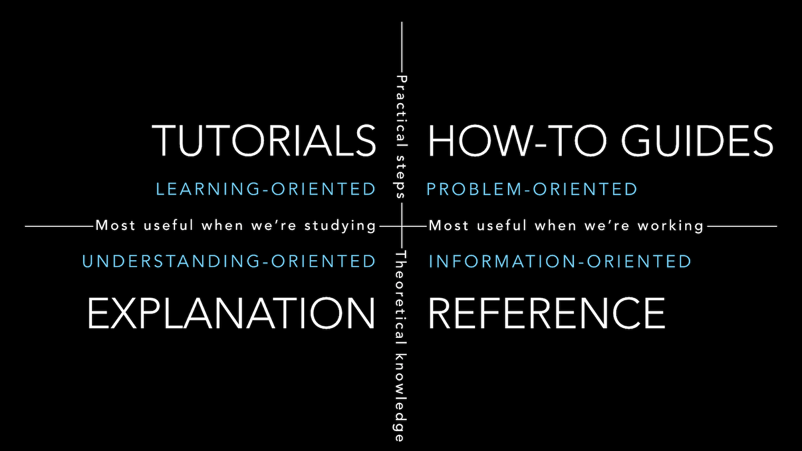

## Introduction

The goal of this document is to explain:

- The four main types of documentation Gatsby provides
- How to choose which type of document

## Documentation Types

The Gatsby documentation includes four different types of materials. Each one is tailored to meet a specific user need.

- [**How-To Guides**](/contributing/docs-contributions/how-to-write-a-how-to-guide/) are practical step-by-step guides to help readers achieve a specific goal. These are most useful when readers are trying to get something done.
- [**Reference Guides**](/contributing/docs-contributions/how-to-write-a-reference-guide/) are nitty-gritty technical descriptions of how Gatsby works. These are most useful when readers need detailed information about Gatsby's APIs.
- [**Conceptual Guides**](/contributing/docs-contributions/how-to-write-a-conceptual-guide/) are big-picture explanations of higher-level Gatsby concepts. These are most useful when readers want to deepen their understanding of a particular topic.
- [The **Tutorial**](/contributing/docs-contributions/how-to-write-a-tutorial) is a self-contained introduction that guides readers step-by-step through creating their first Gatsby site. This is most useful when readers are first getting started with Gatsby.

This documentation structure is based on the [Divio documentation system](documentation.divio.com/) created by Daniele Procida.

Often, a single concept will require some combination of these documentation types. For example, the `gatsby-plugin-image` documentation includes the following pieces:

- A Reference Guide to explain the plugin API and all its options.
- A How-To Guide to show practical examples of how to use the plugin.

## Why use templates?

Follow the how-to templates (models) listed here when contributing to Gatsby docs to ensure that the docs accomplish their purpose. If you have a good reason to deviate from the following template structures, mention those reasons in an issue so others can give proper feedback on your idea.
