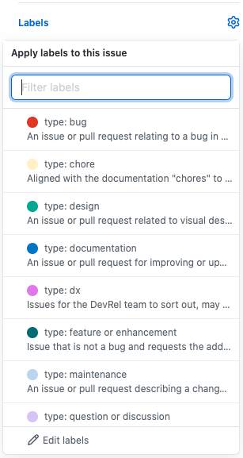
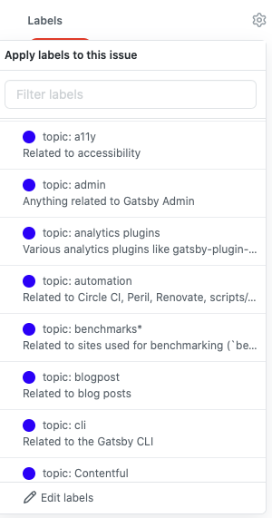

## What are issue labels?

Issue labels are a tool in GitHub that are used to group issues into one or more categories.

[Check out Gatsby's labels (and their descriptions)](https://github.com/gatsbyjs/gatsby/issues/labels)

## Why label issues?

Gatsby is a very active project with many new issues opened each day. Labeling issues helps by identifying:

- good issues for new contributors to work on
- reported and confirmed bugs
- feature requests
- duplicate issues
- issues that are stalled or blocked
- the status of an open issue
- the topic or subject matter of the issue

## Who can label issues?

Anyone who's a member of the [Gatsby Maintainers team](https://github.com/orgs/gatsbyjs/teams/maintainers) can label issues.

You can get an invite to the team by having a Pull Request merged into the Gatsby project. Check out the list of [`help wanted`](https://github.com/gatsbyjs/gatsby/labels/help%20wanted) issues and the [How To Contribute Guide](/contributing/how-to-contribute/) to get started.

**NOTE:** If you’ve already had a pull request merged and you have _not_ been invited to the maintainers team, please go to [the dashboard](https://store.gatsbyjs.org/) and request a discount code. You should get an invite to the team — _and you get free Gatsby swag!_ If that doesn’t work, please email team@gatsbyjs.com and we'll get you invited.

## How to label an issue

When a new issue is filed, our Gatsbot applies a `status: triage needed` label to it. Triage is undertaken every workday by Gatsby Core Team members.

Triaging new issues involves identifying each issue's type (such as feature request or bug report), topic (such as GraphQL or Gatsby Recipes), and status. These labels are then part of a broader issue management workflow undertaken by the rest of the Gatsby team.

Before continuing, get familiar with [Gatsby's issue labels and their descriptions](https://github.com/gatsbyjs/gatsby/issues/labels), particularly the `type:`, `topic:`, and `status:` labels.

The general steps to triaging an issue are:

- Read an issue
- Choose the labels that apply to that issue
- Include any helpful comments that guide the author toward the next steps they need to take
- That's it - sit back and relax, maybe take a few moments to enjoy the satisfaction of a job well done

The rest of this document will describe how to choose the right labels for an issue.

### Find an issue that you're interested in

Start with [Gatsby's issues list](https://github.com/gatsbyjs/gatsby/issues), specifically the [list of untriaged issues](https://github.com/gatsbyjs/gatsby/issues?q=is%3Aopen+is%3Aissue+label%3A%22status%3A+triage+needed%22).

### Read the issue

Read the issue and any comments to understand what the issue is about.

### Choose one `type:` label

Choose a type label from the _labels_ dropdown to the right-hand side of the issue.

You can check through the [label descriptions](https://github.com/gatsbyjs/gatsby/issues/labels) for more information on each one.

One of the most common types of issue is `type: question or discussion`. Typically you can apply this to issues that are open-ended or have no clear next step.

It's OK to change the type of an issue as more information becomes available. What starts as `type: question or discussion`, might later need to be changed to `type: bug`.

Changing labels is quick and easily reversible, so don't worry too much about applying a "wrong" label.

Choose an appropriate `type:` label and you're ready to move on to the next step.

### Choose a `topic:` label

We use `topic:` labels to help group issues by subject matter, and to make sure that the correct team members within Gatsby are aware of them.

We have `topic:` labels for product areas, data sources, plugins, and more. Each issue should be assigned at least one `topic:` label, and possibly two or three.

There are a few `topic:` labels that signal "off ramps" from the Gatsby Core team's workflow to workflows of other teams within Gatsby, like the Themes, Developer Relations, and Product Marketing teams. These are:

- `topic: admin` - Issues related to the Gatsby Admin feature
- `topic: recipes` - Issues related to the Gatsby Recipes feature
- `topic: MDX` - Issues related to the MDX plugin
- `topic: themes` - Issues related to the `themes-ui` plugin
- `topic: blogpost` - Issues about the Gatsby blog or a specific blog post
- `topic: website` - Issues related to gatsbyjs.com
- `topic: showcase` - Issues related to the [Site Showcase](/showcase)

If you apply one of these off-ramp `topic:` labels, there is no need to apply any further labels - your work is done!

However, if the issue is not covered by one of the `topic:` labels above, consult the [list of topic labels](https://github.com/gatsbyjs/gatsby/issues/labels) and add the one that best applies to the issue.

### Choose a `status:` label (optional)

Check through the [`status:` labels (and their descriptions)](https://github.com/gatsbyjs/gatsby/issues/labels), if any apply to this issue add them as necessary.

Examples of applying `status:` labels might be:

- An issue that depends on an external dependency being changed could be labelled with `status: blocked`

- An issue that's missing information required to help the author could be labelled with `status: needs more info`

- An issue describing a bug without clear steps to reproduce could be labelled with `status: needs reproduction`

- An issue describing a bug where there are steps to reproduce the bug _and_ you've run the code locally and seen the error yourself can be labelled `status: confirmed`

> If you add the `status: needs more info` or `status: needs reproduction` labels, please also add a friendly comment for the author so they know what kind of additional elements they should include in their issue.

### Choose any other labels

There are a few other labels that can sometimes be applied to an issue. Here are some more examples of when to use them:

- `good first issue` can be used when an issue is a small, clearly defined piece of work that could be completed by someone without in-depth knowledge of Gatsby and how it works. These issues are particularly suitable for people making their first open source contributions.

- `stale?` can be used on an issue where the author has not replied to requests for further information in at least 20 days.

### Finish

And you're done! You can call it a day or go back to the first step to label another issue.

## Conclusion

Labeling issues is a great way to help out on the Gatsby project regardless of your experience level.
