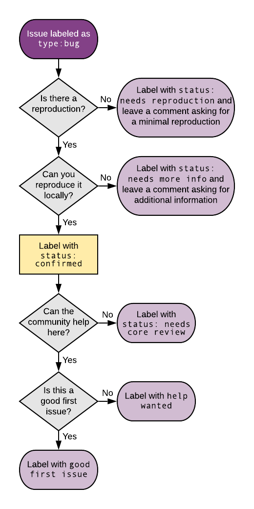
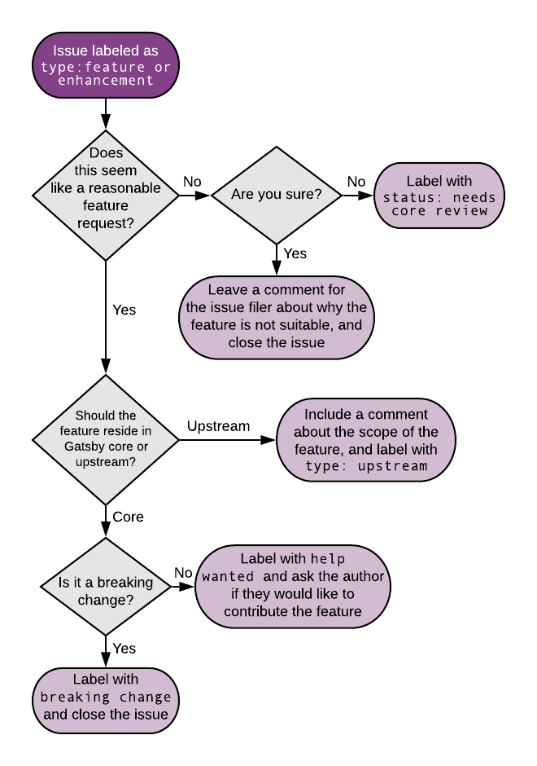

## What is the aim of this document?

On the Gatsby core team, we've found patterns that help us effectively triage incoming GitHub issues, provide answers to the community's questions, identify bugs, and provide contribution opportunities.

In this document we’ll answer common questions, explain guidelines and illustrate a decision tree.

## First touch maintenance

For Gatsby the first line of communication between a user and the team is the issue tracker on GitHub. Typically, every day 20-30 issues are opened -- that's one every hour!

An opened issue could be:

- [a question that can be answered immediately](#questions-with-immediate-answers)
- a bug report
- a request for a feature
- or a discussion on a complicated use case

On the core team, we regularly designate someone to be a first touch maintainer. That person might sift through, triage, communicate and manage this first line of communication.

First touch maintainers will typically:

- [answer questions by pointing to documentation](#questions-with-immediate-answers)
- test and reproduce possible bug reports and label them appropriately
- communicate feature requests to the rest of the team and ensure a valid response
- enable discussions on complicated use cases, whether themselves or via the rest of team

## Why do we do first touch maintenance?

We do first touch maintenance so that:

- Questions are answered swiftly and correctly, therefore making users happy
- Bug reports are reproducible and the most relevant data is collected before someone jumps in with a fix
- Unrelated issues are resolved promptly so we don't spend too much time on them

## What is unique to Gatsby?

Gatsby is unique among most open source projects because:

- Gatsby integrates with many third party tools (WordPress, Drupal, Contentful etc) via source plugins and hence the typical scope of issues is widened significantly
- Gatsby aims to be really beginner friendly (we want to be the new way someone gets started with web development) and this means that we need to accommodate a wide range of skill levels

## How do we do first touch maintenance?

### General guidelines

- **Be empathetic.** The author of an issue might be asking something that’s obvious to us but that doesn’t mean it’s obvious to them - it's important to consider the issue from the author’s viewpoint. People often remember how we make them feel, not what we told them.
- **Add context.** When answering an issue, it can be useful to link to existing documentation, issues, PRs, or provide related context. This means the issue can serve as a reference to future readers.
- **Encourage community contributions.** Getting people involved makes a huge impact. We often spend the time to write up a task as a `good first issue` instead of fixing the issue ourselves. This can provide a low friction way for someone to get more involved in open source!
- **Give issue authors time to close their own issues.** Sometimes, it might feel like an issue is resolved but the author could have follow up questions. It's usually best to give them a day or two to close the issue themselves.

### Labeling

Labeling helps group issues into manageable sets and also improves searchability and scannability. We have a set of labels that we use to group issues based on their type, topic, and status.

It's nice to update labels as the state of an issue changes or if the type of an issue changes, for example if a question becomes a feature request. This means labels are transient in nature and subject to being updated as progress is made on addressing issues.

Check out [the docs on issue labeling for more info](/contributing/how-to-label-an-issue/)

### Resolution flowchart

Issues are categorized into one of five types: question or discussion, bug report, feature request, documentation, or maintenance.

#### Questions with immediate answers

- Point to existing documentation to answer the question
- If insufficient, do the following:
  1. Provide an answer
  2. Label the issue with `type: documentation`
  3. Keep it open until a PR has added the answer to the documentation, and the issue includes a link to said documentation

If an issue comes in as a question with a known, but undocumented, answer it can be tempting to answer it and close the issue. However, the consequence of this approach is that the answer to a question others may have is now buried in a closed issue and may be hard to surface. The preferred solution is to get that answer documented in the main Gatsby documentation and connect the issue to an answer by including a docs link.

#### Bug Report

Bug Reports are issues that identify functionality in Gatsby that should work but does not in a given scenario. If an issue is a Bug Report, it should include steps to reproduce the problem. If it doesn't, ask the issue filer for those steps and label the issue with `status: needs reproduction`.

Attempt to reproduce the bug using the steps given. If that's not possible, ask for more information and label the issue as `status: needs more info`.

If the reproduction is successful, label the issue with `status: confirmed` and determine who is best suited to implement a fix. If it's approachable for the community, consider the `help wanted` or `good first issue` labels. Otherwise, label with `status: needs core review` so it can be picked up by a Gatsby team member.

#### Feature Request

Feature Requests are issues that request support for additional functionality not currently covered in the existing codebase. The first step in triaging a feature request is to determine if it's a reasonable request; this is a challenge and is usually the responsibility of a Gatsby team member to make. If it's clear that this isn't a feature it makes sense for Gatsby to implement, provide a comment explaining the decision making and close the issue. Review the [saved replies](#saved-replies) to see if there is an appropriate response already available. If you have any doubt about whether a feature request should be incorporated into Gatsby, label it with `status: needs core review` and leave the issue open.

If it's determined to be a worthwhile feature, the next decision point is whether the feature should be added to core or upstream. Upstream issues are those that are outside of Gatsby's control and caused by dependencies. Upstream features should be labeled with `type: upstream` and include comments about the scope.

If it's a core change, is it a breaking change? Breaking changes should be labeled with `breaking change` and typically closed. Note that they may sometimes be left open with the note that the functionality can only be added in a major release.

Non-breaking changes can be labeled as `help wanted` and it is often best to ask the creator of the issue if they'd be interested in helping develop the PR.

#### Documentation

Issues can be filed requesting documentation on a particular topic. Sometimes the documentation already exists, so you can link to it and close the issue.

Alternatively, the issue may be something the team is unable to address. Consider using a [saved reply](#saved-replies) in that circumstance.

Otherwise, label the issue with `type: documentation` and ask the issue filer if they'd like to help with a PR.

#### Maintenance

Maintenance issues are things like bumping a package version. These issues should be labeled with `type: maintenance`.

### Saved replies

Gatsby team members have saved certain [common form responses](https://github.com/orgs/gatsbyjs/teams/admin/discussions/3) to help accelerate issue triage.

## Bot

We have a bot that helps us automate some aspects:

- Issues with a question mark in their title or starting with "how" are automatically labeled as questions
- Issues with an empty body are closed
- Issues with no activity are marked stale after 20 days. They are then closed after another 10 days unless there are additional comments or the `not stale` label is applied

## Frequently asked questions

> When do you do a demo for an issue?

When a feature or pattern is not documented, it may be nice to make a demo to add clarity for the author and help future readers as well.

> How do you reproduce a bug?

Every bug report should provide details on how to reproduce the bug. This is so important that there's [dedicated documentation on how to create good bug reproductions](/contributing/how-to-make-a-reproducible-test-case/). We encourage issue authors to describe exactly how to reproduce a bug.

> How much time do you spend on an issue?

Some issues might need more time than others and there isn’t any hard and fast rule. However, we find it's best to spend time on an issue after the relevant info and reproduction is available.

> Do you look at Discord?

Some of us are active on Discord and you can be too if you like.

> Do you use the same issue to track documentation additions or open a new one?

If the issue describes the context well enough, then we'll sometimes update its title and use the same issue to track the addition of relevant documentation.

> When do you follow up on an issue?

If an author hasn’t responded to a comment for a week or two, we think it's nice to follow up and ask if there’s anything else we can do to help. If the issue goes stale after that, our bot should be able to clean it up.

> What do you do if an issue relates to something upstream?

It’s a good practice to open an issue in the upstream repository in cases like this but isn’t strictly necessary. "Upstream" in this case refers to repositories that house dependencies for Gatsby.

> How long should you leave an issue open when awaiting more information from the issue filer?

If a request is made of the issue filer for a reproduction or more information, and eight or more business days passes without a response, the issue should be closed. We typically leave a polite message that indicates the issue is being closed until there is an actionable response, and that it will be re-opened if said information is supplied.
