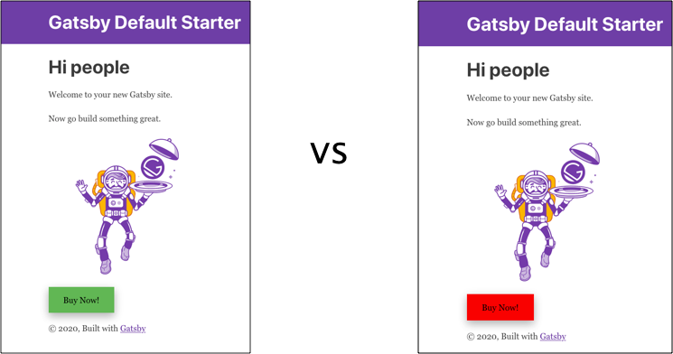

A/B or split testing is when you make test changes to a website. Suppose you have two buttons: a green “Buy Now!” button and a red “Buy Now!” button. You want to figure out which button will receive the most clicks. An A/B test would be an ideal way to measure engagement.

A/B testing is a data-driven way to figure out what works on your website, and it is a great way to determine how to make impactful improvements. A/B testing has been around for decades and it is an essential tool for web developers, designers and product managers.

That being said, A/B testing software can be prohibitively expensive. Some platforms can run into the thousands per month. The main advantages of conducting A/B tests with Gatsby are performance and price. If you are leveraging Netlify and Google Analytics, you’re able to set up an A/B test with Gatsby for free! When you’re testing different variations of your website, you are not forced to load heavy and inefficient third party scripts.

<GuideList slug={props.slug} />
