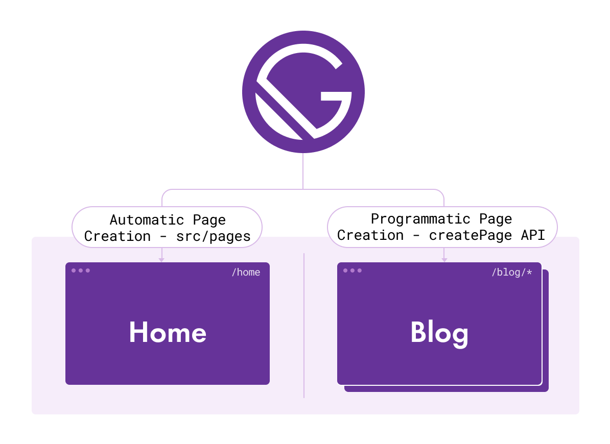
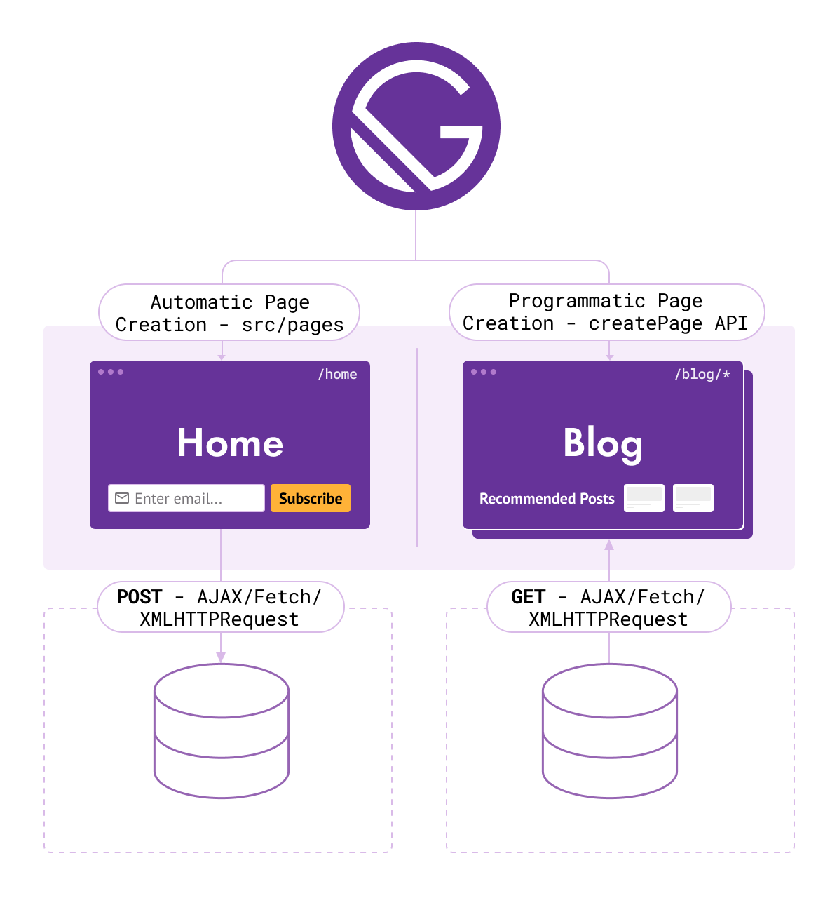
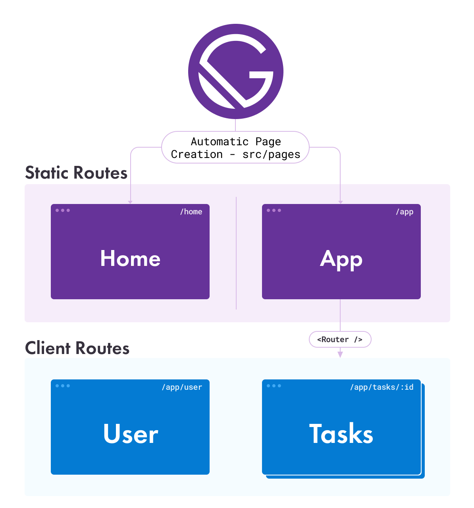

Gatsby empowers developers and creators to make many different types of websites. One may wish to add additional functionality to their site such as search, authentication, forms, comments, and plenty of others.

The distinction between apps and websites is blurry, the way Dustin Schau puts it in a [blog post](/blog/2018-10-15-beyond-static-intro/):

<Pullquote citation="Dustin Schau" narrow={true}>
  I contend that the line between these two concepts is extremely blurry. There
  isn’t some magic percentage threshold that, when crossed, indicates that a
  static site is now an application. Nor is the inverse true, that an “app” is
  somehow static because some percentage of its content never or rarely changes.
</Pullquote>

Gatsby allows you to orchestrate data fetching, transforming, and usage in pages, but it also allows you to make the call about how, when, and where, that happens. It allows you to make a site as feature-less or feature-rich as you want, you aren't restricted to just static sites.

## How hydration makes apps possible

Even though Gatsby generates static files, Gatsby apps [rehydrate](/docs/glossary#hydration) from static HTML rendered by ReactDOM APIs into an app running client-side JavaScript. The general approach as outlined in the [React Hydration guide](/docs/conceptual/react-hydration) is as follows:

1. Build and render static HTML, creating content and pages with data injected at build time
2. Invoke `ReactDOMClient.hydrateRoot()` method to pick up where the static HTML was left
3. Transfer rendering to the React reconciler

It's this last phase that bridges the gap between static sites and full-fledged applications. In this phase you can make calls for [dynamic data](/docs/client-data-fetching/), [authenticate users](/docs/how-to/adding-common-features/building-a-site-with-authentication/), and perform all the app-like functionality you desire because the page is running a React application.

## Common patterns for Gatsby apps

There are different options for organizing how your pages are created and what they will be responsible for. These patterns can be combined and tweaked for specific use cases such as pulling in data at [build time](/docs/glossary#build) for great performance, or calling for data at [runtime](/docs/glossary#runtime) for a more dynamic experience.

Because all Gatsby pages are hydrated into React, **any of the following patterns are capable of app-like behavior**. This section is to help explain some higher level patterns for thinking about Gatsby.

### Static pages

Static files are output by running `gatsby build` from exported components in your `src/pages` folder or from pages created using the [`createPage` API](/docs/reference/config-files/gatsby-node/#createPages), as shown in this diagram:

The diagram illustrates the 2 main methods for creating pages in your site:

1. Automatically through `src/pages`
2. Programmatically with the `createPage` API

_**Note**: plugins and themes can also implement the `createPage` API and create pages on your behalf_

When you export a React component from a file in the `src/pages` directory (in this case `src/pages/home.js` for `/home`) Gatsby will automatically create a static page. By looping through Markdown files in your filesystem you can create pages for all blog posts programmatically. The docs have more information about [creating and modifying pages](/docs/creating-and-modifying-pages/).

These created pages _could_ run JavaScript once React hydrates them, but they don't need to.

### Hybrid app pages

Your created pages can make calls to external services and APIs in order to allow more interactive and dynamic behavior. These are sometimes referred to as hybrid app pages because they share a combination of static features that Gatsby creates to help load your site quickly and performantly as well as traditional web app features.

The following diagram shows a similar site to the one in the previous example, but with a subscription form added to the home page that makes client-side `POST`'s to a database somewhere, as well as blog posts that `GET` recommendations from a database or other API endpoint.

Following a pattern like this means you are relying on a [backend](/docs/glossary#backend) to remain operational for features like email signups and blog recommendations, but because the static assets created aren't generated by the server on demand, the content on your site (like your blog posts or home page) will never go down or become unavailable.

### Client only routes

Using a React-based client-side router is also supported by Gatsby. This pattern is often referred to as client only routes, which are routes not reflected in your statically rendered files. Gatsby ships with `@reach/router`, so it is a great option to keep your site from having to ship additional JavaScript with another routing library.

With Gatsby, you can import a router and set up routes for navigation the same way you would in traditional React apps. The only difference is Gatsby doesn't build those routes into individual pages in the `/public` folder. As a result, in order to allow users to access that URL directly, you can use a plugin to create those pages. This is covered in the [Client Only Routes](/docs/how-to/routing/client-only-routes-and-user-authentication/) guide.

The following diagram shows how a `<Router />` component can be mounted on a page. In this example, `src/pages/app` references `<Route />`s.

In this illustration, a client-rendered user page could display specific information about the logged-in user, and dynamic client-side routes at `/app/tasks/:id` could display specific information for a task of a given ID.

## Differences between Gatsby and other React apps

There is a bit of a paradigm shift to overcome in understanding how a Gatsby app is different from an app created with a tool like Create React App.

> _A site built with Create React App can actually be [ported to Gatsby](/docs/porting-from-create-react-app-to-gatsby/)._

### The global `App.js` component

One main distinction explained in the diagrams in the section on [common patterns for Gatsby apps](#common-patterns-for-gatsby-apps) is the combination of hybrid and static pages that Gatsby offers vs one global `App.js` component. An app from Create React App will have exclusively client routes set up on one `App.js` component rendered at the root, which isn't unmounted. The `App.js` component is often the place in a React app where Theme Providers and Context are wrapped around the entire app so some data can be provided to all components or preserved between route changes. Gatsby has a root element that can be wrapped to preserve state or data between page navigation as well, but it is accessed through the [`wrapRootElement` API](/docs/reference/config-files/gatsby-browser/#wrapRootElement) instead of being in a file in your `src` folder. Persistent UI elements can be wrapped around pages with the [`wrapPageElement` API](/docs/reference/config-files/gatsby-browser/#wrapPageElement).

### Page and route creation

In a React app, creating pages requires setting up a router. Gatsby instead handles some pieces of routing on your behalf; you can create a page by putting an exported component inside the pages directory. Gatsby will generate a page with a fixed URL based on the filename of the component. You can still import a router and set up routes yourself though.

> _To compare Gatsby with other Jamstack tools like Next.js and Jekyll, check out the [feature comparison](/features/jamstack/) page._

---

Generating performant sites with statically rendered assets is a core focus of Gatsby, but it's only one side of the coin. In this section of the docs, you will find a showcase of guides and concepts on how to level up your site to include all the app-like features on top of the static base.

<GuideList slug={props.slug} />
