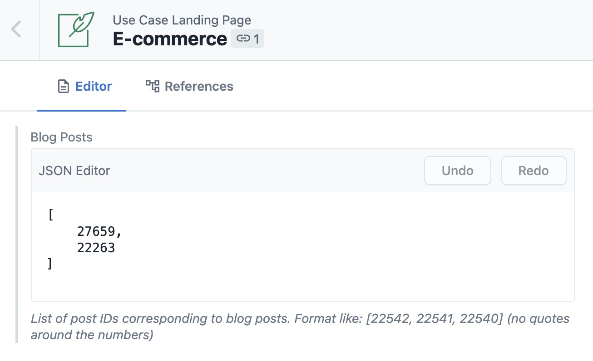

At their core, most medium-sized and large Gatsby websites are backed by a so-called "headless CMS". Headless CMSs excel at allowing content editors to flexibly create a content schema of interrelated content models.

One of the key questions people ask when building a Gatsby site is "which CMS should I use?"

## Choosing a Headless CMS

If you're looking for a primary CMS (general-purpose, flexible content modelling) to power your website, there are three main factors you can use to narrow your search:

- Popular CMS with first-class Gatsby integrations
- Price point
- Specialized requirements

### Popular CMS with first-class Gatsby integrations

Focus on top-flight general-purpose CMSs with first-class Gatsby integrations and popularity among Gatsby users.

A ["first-class integration"](https://support.gatsbyjs.com/hc/en-us/articles/360052503494-Developing-a-first-class-CMS-integration-for-Gatsby-Cloud) means it supports the main Cloud functionality of Gatsby — previews and incremental builds and is known to the Gatsby team to be high-quality. For popularity, you can see [top integrations listed by monthly downloads](/plugins?=gatsby-source).

Eight CMSs with first-class integrations used by over 1% of Gatsby users (November 2021):

- **Headless CMSs**: Contentful, DatoCMS, Prismic, Contentstack, Sanity and Strapi
- **Full-stack CMSs**: Drupal and WordPress
- **E-commerce platform**: Shopify

### Consider the price point given your budget

- "Personal" project or prototype (generous free tier): Contentful, DatoCMS, Prismic, Sanity, Strapi.
- "Team", "Pro" or "Business": (e.g. 50-250 $/month): Contentful, DatoCMS, Prismic, Sanity, Strapi, Drupal and WordPress.
- "Enterprise" project (>= 1000 $/month): Contentful, Contentstack, Sanity, and Strapi.

### Specialized requirements

Other project requirements and team preferences will play a role.

**Contentful** is the most common headless CMS used with Gatsby. Early player with a fairly mature product in terms of features and revenue. Sometimes seen as the "default" choice.

Users choosing other CMSs typically have a specific reason for their choice. Some trends we've noticed include:

- **Contentstack** if they like the editing UI and have an enterprise budget
- **DatoCMS** if they will run into Contentful's model limits and want a lower-priced alternative
- **Drupal** if open-source, configurability, or custom code are important.
- **Prismic** if they like the content editing UI
- **Sanity** or **Strapi** for the developer-friendliness or if they need something on-premise. In addition, Sanity tends to have significantly better build times, which can be a key usability consideration, especially for larger sites.
- **WordPress** when the client or content team is already familiar with the WordPress UI

## Using multiple CMS systems together

There are instances where using only one CMS would feel awkward; for example, if a particular CMS works well for one section of the site but is less good for the rest of the site.

Gatsby makes it easy to use different CMSs for different parts of the website, what is known as a ["content mesh" approach](/blog/2018-10-04-journey-to-the-content-mesh/).

Typically, teams that use multiple CMSs use a specialized CMS for part of the website and a general-purpose CMS for the rest of the website. The two most common examples are:

- **Using Shopify as an e-commerce system.**
  - Shopify has best-in-class e-commerce functionality, but the rest of their interface (for example, their blogs feature) is often seen as subpar compared to other systems.
  - As a result, many e-commerce sites use Shopify as the backend for the store, with a general-purpose CMS like Contentful as the backend for the rest of the site.
- **Using WordPress as a blogging tool.**
  - WordPress is very familiar to content authors and has a best-in-class content composition experience
  - As a result, some teams move the blog portion of the website with Gatsby, and use a flexible content modelling CMS for the rest of the website.
  - Apollo does this (source: [tweet from Apollo](https://twitter.com/apollographql/status/1250479066605662210)), as does the [Gatsby blog](/blog/).

### Considerations when using multiple CMSs

One of the key considerations when using content in multiple systems is that - at some point - one content system often needs to "know about" another system. For example, a landing page with content in Contentful may need to embed information about a specific product SKU from Shopify or blog post in WordPress.

The easiest way to create relationship references across CMSs is through one CMS storing unique IDs of content living in another CMS.

In this case, you'd store an array of WordPress blog post IDs as a field of the relevant model in Contentful, then pull in the correct data via the appropriate queries in `gatsby-node.js.`

To make that a bit more concrete, here's a screenshot of what this looks like currently (January 2020) in the Gatsbyjs.com Contentful setup for the [e-commerce use case page](/use-cases/e-commerce/); the model is called `Use Case Landing Page`, the field is called `Blog Posts`, and the items in the array are unique blog post IDs from WordPress:

## Other non-CMS options

Finally, there are several options for content composition and management that work well as non-CMS choices.

- **Markdown** and **MDX** are common choices for documentation and small developer sites, since they are natural composition formats for developers and allow embedding components within your content. There are several guides in our [Routing and Pages documentation](https://www.gatsbyjs.com/docs/how-to/routing/) on using Markdown and MDX. You may also want to consider a git-based CMS like Forestry.io or NetlifyCMS to provide a UI for this workflow.

- **JSON** or **YAML** is a common choice for hierarchical data (for example, a site navigation tree), especially when the underlying content is stored in Markdown.

- **Web-based spreadsheets**, like **Airtable** or **Google Sheets**, are common use cases for tabular data. [Impossible Foods used Airtable to power their store locator](/blog/2020-05-07-gatsby-delivers-impossible-burgers-map/), and [ProPublica used Google sheets as a database](/blog/2019-03-29-interview-with-david-eads/) for interactive data journalism graphics.

- Other domain-specific solutions for specific parts of the website (e.g., having a Careers page pull data from Greenhouse or Lever).
