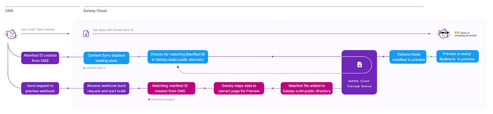

## Try Content Sync with Contentful on Gatsby Cloud

To get setup quickly with a new site and have Gatsby Cloud do the heavy lifting, [deploy a new Gatsby Contentful site with just a few clicks on gatsbyjs.com](https://www.gatsbyjs.com/dashboard/deploynow?url=https://github.com/contentful/starter-gatsby-blog).

## What is Content Sync?

Content Sync is a Gatsby Cloud feature for improving the Preview experience for content creators.

When content authors press "Open Preview" in their CMS, Content Sync routes content editors to the correct URL. It helps them understand the status of previews, so they know when their content is ready to view and otherwise if there were any build errors. It does this by displaying a loading state while the content preview builds. Once the build is complete, the editor is redirected to the correct page on the frontend of the Gatsby Preview site automatically.

Content Sync will route users to the correct page even when pressing "Open Preview" from within a nested node which has no associated top-level page.

If the build for the preview fails or if no page is created that contains the content being previewed, Content Sync UI will display an error message.

## Finding the right page for Content Previews

In the case that your content lives on multiple pages, for example a blog post page and a blog listing page, and you find you're being routed to the page you don't want to view your preview on, you can specify which node owns which page using the [`ownerNodeId` setting in the `createPage` api][createpage]. Set the `ownerNodeId` to the Gatsby node ID of the node you want to preview for the page.

You will not need to do this if you're building pages using the [Filesystem Route API][fsroutesapi], or if your page context includes a matching "id" property. See the next section for more info on this.

## Node to Page Mapping Hierarchy

Content Sync uses the [`unstable_createNodeManifest`][createnodemanifest] API via source plugins to allow source plugins to tell Gatsby which nodes are being previewed. When this public action is called, Gatsby uses an internal hierarchy to determine which page the content author intends to preview.

The hierarchy is as follows, from most specific to least specific:

1. [The`ownerNodeId` property in the `createPage` action][createpage]. (This is set manually by the Gatsby site developer)
2. Nodes associated with pages created from the [Filesystem route API][fsroutesapi]. (automatic)
3. An `id` property in the [page `context` passed to the `createPage` API][createpage] with a node id which matches the previewed node id. (automatic)
4. The first matching node id found in Gatsby's [GraphQL query tracking][querytracking] which maps node id's to pages that query them. This allows nodes which have no direct top-level page correlated with them to be previewed throughout the site. (automatic)

## Diagram

[createnodemanifest]: https://www.gatsbyjs.com/docs/reference/config-files/actions/#unstable_createNodeManifest
[createpage]: https://www.gatsbyjs.com/docs/reference/config-files/actions/#createPage
[querytracking]: https://www.gatsbyjs.com/docs/page-node-dependencies/
[fsroutesapi]: https://www.gatsbyjs.com/docs/reference/routing/file-system-route-api/
