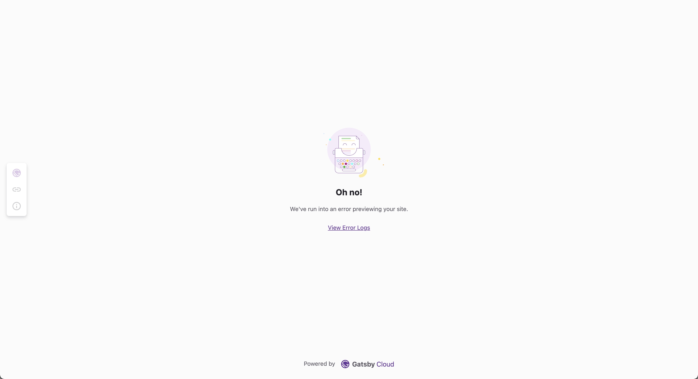

## Try Content Sync with Contentful on Gatsby Cloud

To get setup quickly with a new site and have Gatsby Cloud do the heavy lifting, [deploy a new Gatsby Contentful site with just a few clicks on gatsbyjs.com](https://www.gatsbyjs.com/dashboard/deploynow?url=https://github.com/contentful/starter-gatsby-blog).

## What is Content Sync?

Content Sync is a Gatsby Cloud feature for improving the Preview experience for content authors.

When content authors press "Open Preview" in their CMS, Content Sync routes them to the correct URL. It helps them understand the status of previews, so they know when their content is ready to view and otherwise if there were any build errors. It does this by redirecting to a "waiting room" page which displays a loading state while the content preview builds. Once the build is complete, the author is redirected to the correct page on the frontend of the Gatsby Preview site automatically.

Content Sync will route users to the correct page even when pressing "Open Preview" from within a nested node which has no associated top-level page.

If the build for the preview fails or if no page is created that contains the content being previewed, Content Sync UI will display an error message.

## Finding the right page for Content Previews

In the case that your content lives on multiple pages, for example a blog post page and a blog listing page, and you find you're being routed to the page you don't want to view your preview on, you can specify which node owns which page using the [`ownerNodeId` setting in the `createPage` API][createpage]. Set the `ownerNodeId` to the Gatsby `node.id` of the node you want to preview for the page. Note that the `ownerNodeId` must correspond to the `node.id` of a node which is queried on that page via a GraphQL query.

You will not need to do this if you're building pages using the [File System Route API][fsroutesapi], or if your page context includes a matching `id` property. See the next section for more info on this.

## Node to Page Mapping Hierarchy

Content Sync uses the [`unstable_createNodeManifest`][createnodemanifest] API via source plugins to allow source plugins to tell Gatsby which nodes are being previewed. When this public action is called, Gatsby uses an internal hierarchy to determine which page the content author intends to preview.

The hierarchy is as follows, from most specific to least specific:

1. [The`ownerNodeId` property in the `createPage` action][createpage]. (This is set manually by the Gatsby site developer)
2. Nodes associated with pages created from the [File System Route API][fsroutesapi]. (automatic)
3. An `id` property in the [page `context` passed to the `createPage` API][createpage] with a node id which matches the previewed node id. (automatic)
4. The first matching node id found in Gatsby's [GraphQL query tracking][querytracking] which maps node id's to pages that query them. This allows nodes which have no direct top-level page correlated with them to be previewed throughout the site. (automatic)

## Source Plugin Authors

If you're a source plugin author, you can find instructions on adding Content Sync support to your source plugin and CMS extension in the [source plugin author docs](https://www.gatsbyjs.com/docs/how-to/plugins-and-themes/creating-a-source-plugin/).

## Diagram

![Diagram of Content Sync on Gatsby Cloud. When a user clicks "Open Preview" the manifest id is created from the CMS and sent to Gatsby Cloud. The Content Sync UI then displays a loading state while it checks for a matching manifest id in Gatsby build public directory. At the same time a request is send to the preview webhook and Gatsby Cloud starts a build. If it finds a matching manifest id created from the CMS Gatsby maps data to correct page for preview and adds the manifest file to the build public directory. Now the Gatsby Cloud Preview Runner detects a node manifest to preview and redirects to the preview itself.](../images/content-sync-diagram.png)

[authordocs]: /docs/how-to/plugins-and-themes/creating-a-source-plugin/#enabling-content-sync
[createnodemanifest]: /docs/reference/config-files/actions#unstable_createNodeManifest
[createpage]: /docs/reference/config-files/actions#createPage
[querytracking]: /docs/page-node-dependencies/
[fsroutesapi]: /docs/reference/routing/file-system-route-api/
