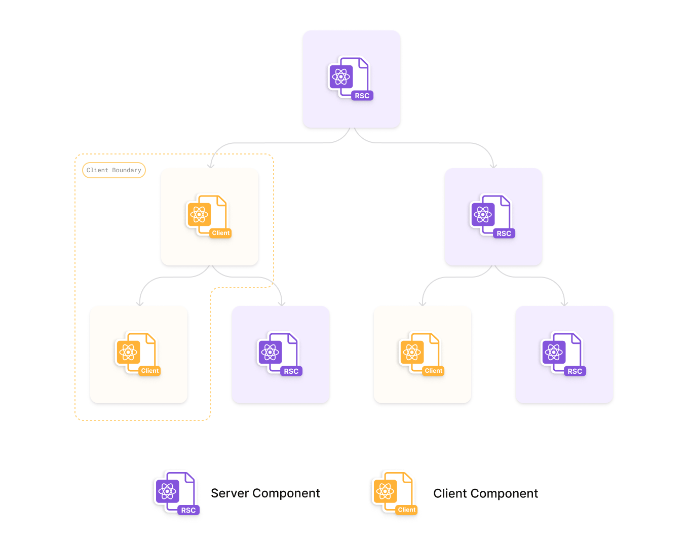

Partial Hydration enables you to selectively add interactivity to your otherwise completely static app. This results in improved frontend performance while keeping the benefits of client-side apps. Gatsby uses [React server components](https://github.com/reactjs/rfcs/blob/main/text/0188-server-components.md) to achieve this.

## Overview

[Hydration](/docs/conceptual/react-hydration/) (or often referred to as re-hydration) is the process of using client-side JavaScript to add application state and interactivity to server-rendered HTML. Since the initial release of Gatsby apps built with Gatsby were always fully hydrated on the client. With Gatsby 5 you now can also use Partial Hydration inside Gatsby.

In recent years the idea of "island architecture" (e.g. [post by Jason Miller](https://jasonformat.com/islands-architecture/)) was created and heavily pushed forward by [Astro](https://docs.astro.build/en/concepts/islands/). The simple idea is to create islands of interactivity that can be hydrated independently, leaving out the rest of the page as it can stay purely static HTML. So is Partial Hydration an implementation of the "island architecture" then? Not really. As [Ryan Carniato points out](https://dev.to/this-is-learning/is-0kb-of-javascript-in-your-future-48og) the end result (islands of interactivity) is the same, but how you get there is different between e.g. Astro's Islands and Gatsby's Partial Hydration. You can read more about this in the [Why React Server Components?](#why-react-server-components) section.

To further visualize what was just said, take a look at the diagram below. By having to hydrate the complete page – even if most of it is static (e.g. header or footer) – you're sending JavaScript to the client for parts of the site that don't need any interactivity really. In addition, React also needs to create VDOM nodes and evaluate the code. With Partial Hydration you're only sending JavaScript for the interactive parts and only tell React to hydrate those pieces.

You could see this as a super-powered way of doing code-splitting on your components. You're using a heavy library that is only used during the SSR phase? Then you don't need to ship it to the client!

The result of shipping less and less JavaScript to the client will directly impact your performance scores, most notably the "Time to Interactive" measurement. It'll also make your users happy as they are not stuck in the "uncanny valley", explained in [patterns.dev Progressive Hydration](https://www.patterns.dev/posts/progressive-hydration/):

> Although server rendering provides a faster First Contentful Paint, it doesn't always provide a faster Time To Interactive. The necessary JavaScript in order to be able to interact with our website hasn't been loaded yet. Buttons may look interactive, but they aren't interactive (yet). \[...\] The time that the user sees non-interactive UI on the screen is also referred to as the uncanny valley: although users may think that they can interact with the website, there are no handlers attached to the components yet. This can be a frustrating experience for the user, as the UI may look like it's frozen!

By using Partial Hydration you can shorten that time or completely remove the uncanny valley.

## How Partial Hydration works in Gatsby

As mentioned, Gatsby's Partial hydration feature is built upon React server components so the detailed design can be read in the [server components RFC](https://github.com/reactjs/rfcs/blob/main/text/0188-server-components.md).

By default, Gatsby marks all components as server components starting from the top level pages (e.g. `src/pages`). Unless specified otherwise (with the ["use client" directive](https://github.com/reactjs/rfcs/blob/main/text/0227-server-module-conventions.md)) Gatsby generates RSC files for each page. Instead of fetching page component JavaScript files in the browser now, `page-data-rsc.json` files are requested. The JSON file is a description of the UI and client components are included as a bundle reference (to get the actual code of the component). This is also why props you pass around need to be serializable, as they are written into a JSON file.

You can use server components and client components throughout your app together. React will behind the scenes merge them together.

During Gatsby's build process all components are looked at and a manifest is created that maps all client components and their individual chunks. With the help of that manifest the RSC output can then be generated.

## Why React Server Components?

If you don't know what React server components are or need a refresher, we recommend watching [the talk introducing Server Components](https://www.youtube.com/watch?v=TQQPAU21ZUw) or reading the [Server Components RFC](https://github.com/reactjs/rfcs/blob/main/text/0188-server-components.md).

So why is Gatsby using React server components to achieve Partial Hydration and didn't shift to the island architecture? In a nutshell: To allow you to (mostly) keep writing your apps as you're used to.

In island architecture world you're authoring individual island layers that each have their own context and React tree. This means that you can't _just_ share context or bubble up/down of React events, you have to implement custom logic to connect those islands. You need to think differently when creating your app. Islands also don't work for SPAs as they can't render the complete page, leading to more sluggish navigation between pages. With React server components you can keep writing your app like you're used to, for the most part. There are of course constraints you have to follow with them but it's not a complete paradigm shift.

### Benefits

Some of the benefits of React server components are:

- Zero impact on bundle-size
- Server components integrate seamlessly with client components
- Subtree and component-level updates that preserve client state

## Further reading

- [Partial Hydration How-To Guide](/docs/how-to/performance/partial-hydration)
- [RFC: React Server Components](https://github.com/reactjs/rfcs/blob/main/text/0188-server-components.md)
