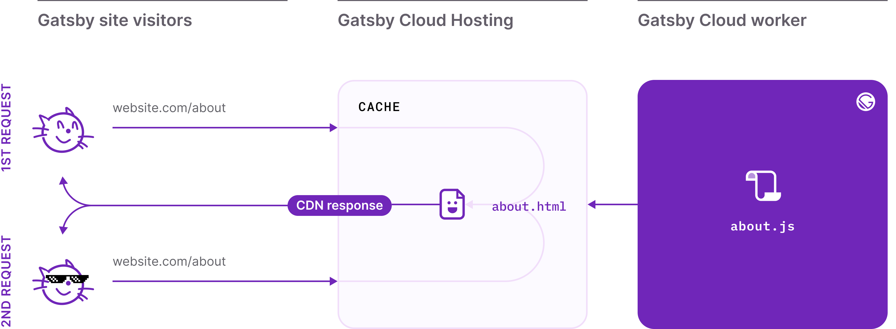
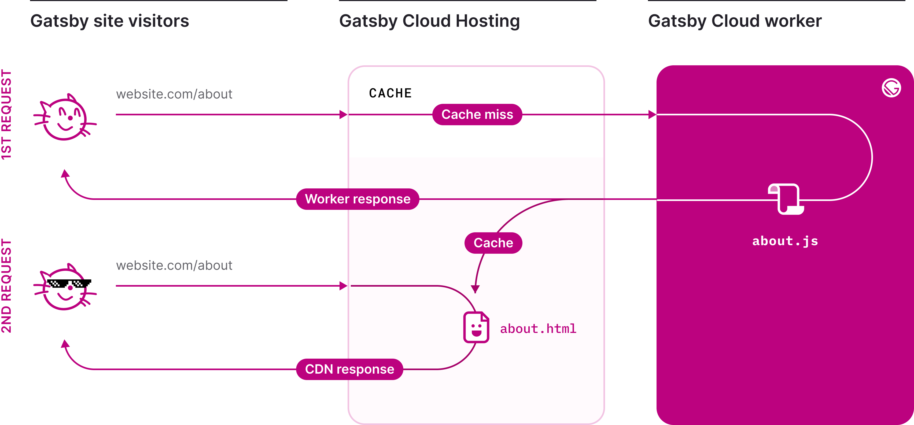
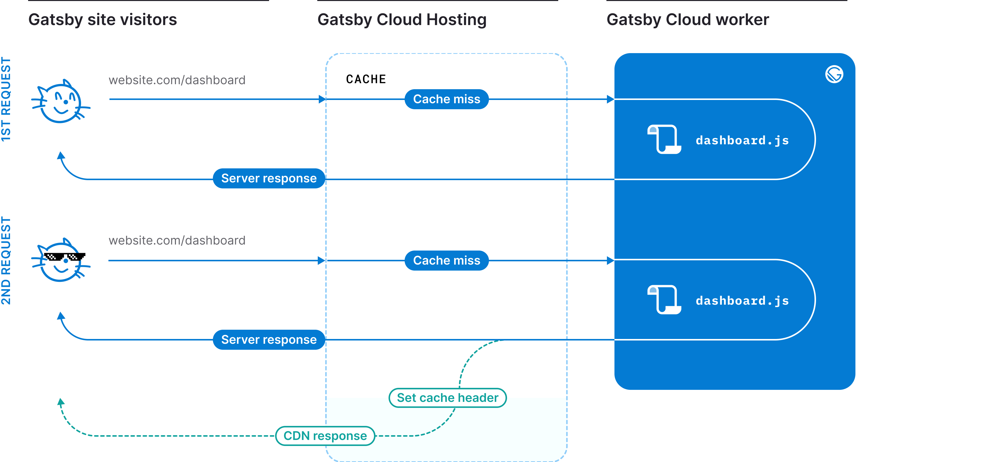

When you visit a website, there a few different methods of generating and then rendering that website's content. Gatsby covers all of them, giving the choice of how to render the content to the developer - on a per page basis. This type of granular control allows development to optimize for performance and productivity without sacrficing one for the other. 

## Static Site Generation (SSG)

Static-site generation is the default rendering method in the Gatsby Framework. While the word has static in it, it doesn't at all mean boring or lifeless. It simply means the entire site is generated into bite-sized, pre-rendered HTML, CSS, and Javascript and served as a static-asset to the browser. Because all of that HTML, CSS, and JS is preprocessed and rendered at build-time, Static-Site Generation serves websites to users in the fastest possible way - it's ready to go before the visitor even visits the site. 

- [What is Static Site Generation?]()
- [Why are static-sites so fast? ]()

## Deferred Static Generation (DSG)
Deferred Static Generation is an innovative feature available in Gatsby Cloud that enables scaling of static-site generation to the largest websites without increasing build times. Deferred Static Generation lets the developer choose what pages should be built immediately, and which ones to defer until a user requests it, giving them greater control over performance.

- [What is Deferred Static Generation?]()
- [Launching Deferred Static Generation]()
- [What is the difference between DSG and SSG]()
- [How to enable DSG?]()

## Server-side Rendering (SSR)
Server-Side Rendering is a method of content rendering in which each web page is served to a site visitor at runtime, meaning that a portion of the build process happens on each page request. Because the content is rendering during run-time, visitors will always get the latest version of content directly from the server - though they may have to wait a few seconds for it display. 

- [What is Server-side Rendering?]()
- [How to enable SSR?]()

