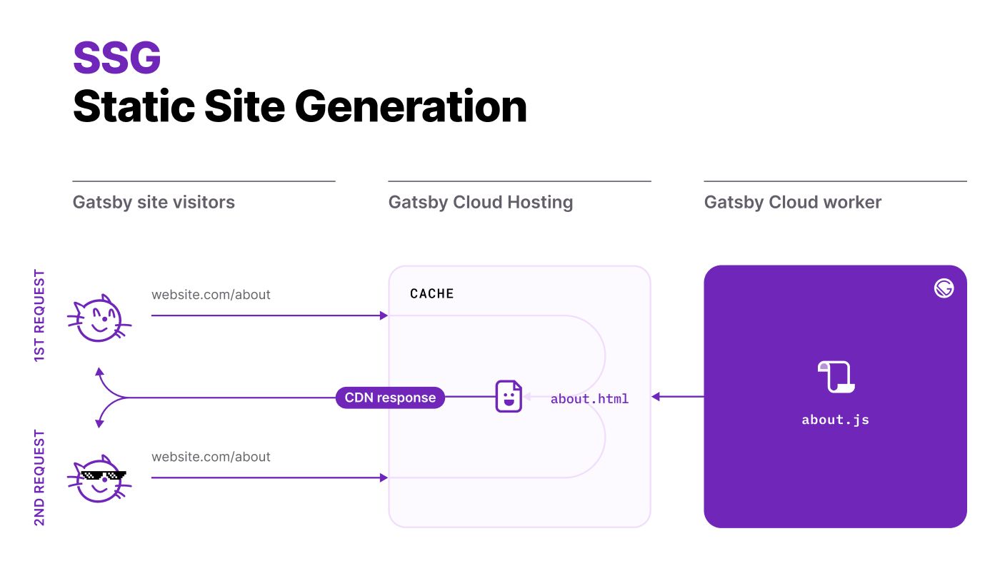
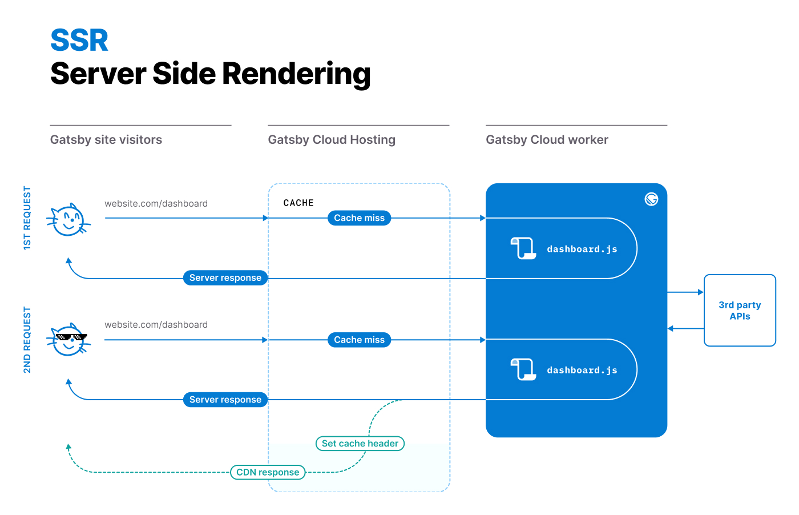

Gatsby is historically known as a static site generator enhanced with [React Hydration][1].
But starting with Gatsby 4, you can choose alternative rendering options in addition to static site generation (SSG) — on a per-page basis.
This type of granular control allows you to optimize for performance and productivity without sacrificing one for the other.

## What is a rendering option?

A rendering option defines the stage at which your page's user-facing HTML is generated. It can happen at build time
(SSG or pre-rendering), during HTTP request (server-side rendering) or locally in the browser
with Javascript (client-side rendering).

<Announcement>

For an in-depth explanation of each of those approaches and their trade-offs we
highly recommend the ["Rendering on the Web"][3] article from the Chrome team.

</Announcement>

As already mentioned, Gatsby always supported SSG and [client-side rendering][4]. Now, two other rendering options are available: Deferred Static Generation (DSG) and Server-Side rendering (SSR).
This guide dives into the what each of those modes means and when you might choose one over another.

## Static Site Generation (SSG)

SSG is the default rendering mode in Gatsby. While the name has the word "static" in it, it doesn't at all mean boring or lifeless. It simply means the entire site is pre-rendered into HTML, CSS, and JavaScript at build time, which then get served as static assets to the browser. Because all of that HTML, CSS, and JS is preprocessed and rendered at build time, Static Site Generation serves websites to users in the fastest possible way—your content is ready to go before the visitor even visits the site.

How does SSG work?

1. First, Gatsby generates all assets and HTML for all SSG pages at build time on a build server (this could be your laptop, any build service, or Gatsby Cloud worker if you use [Gatsby Cloud][6]).
2. Then, the produced static files are uploaded to the content delivery network (CDN) provider of choice and served to end users. The build server is not needed after the build step and could even be turned off.

This mode provides the most pleasant user experience, the highest level of security, and run-time scalability for your site.

<Announcement>

**Note:** SSG doesn't mean your site is not dynamic. You can still use JavaScript to communicate with any APIs,
add private sections of your site for authorized users via [client-side rendering][4] and
have any features that single-page applications (SPAs) can have.

</Announcement>

Here is how SSG works in Gatsby Cloud (although the principle remains the same with any build and CDN provider):

One downside of SSG is longer build times. As the number of pages of your site grows, so does the build time.
Gatsby supports [incremental builds][5] to make sure the 2nd and subsequent builds only rebuild the parts of your site that changed,
but for the initial build (the build without the cache), build times may become an issue. That's where
Deferred Static Generation could be beneficial.

## Deferred Static Generation (DSG)

As the title suggests, Deferred Static Generation is conceptually very similar to SSG. The only difference with Deferred Static Generation is developers can choose to defer building certain pages until the first time a user requests it. Deferred Static Generation gives developers greater control over their site's build times.

For example, imagine you have an archive of old articles that no longer receive significant traffic. There is
no practical reason to generate them on each build (and thus delay the delivery of fresh articles). In this case, you may choose to defer the generation of old pages, and Gatsby will skip them during the build step.

Subsequent requests to pages using DSG will hit the CDN cache the same way as with SSG.

- [How-To Guide: Using Deferred Static Generation][7]

Unlike SSG, Deferred Static Generation requires you to keep the build server running after the initial build (using the `gatsby serve` command).
It implies a different deployment model and requires backend infrastructure. But don't worry: [Gatsby Cloud][6] supports it out-of-the-box.

## Server-Side Rendering (SSR)

SSG, DSG, and client-side rendering can handle a vast majority of use cases in web development. But there is a small niche when you may still need to generate HTML on-the-fly. That's when you'll need Server-Side Rendering.

Server-Side Rendering is a method of content rendering in which each web page is served to a site visitor at runtime, meaning that a portion of the build process happens on each page request. Because the content is rendering during runtime, visitors will always get the latest version of content directly from the server—though they may have to wait a few seconds for it to display.

For example, imagine you are building a site with user reviews. You want those reviews to be immediately indexed by search engines as soon as they are posted, so client-side rendering is not an option.

In this case, you may choose server-side rendering for pages with user reviews. Any time someone
requests this page, Gatsby will call the `getServerData` function defined in the page component.
That's where you can request any data from 3rd-party APIs. Gatsby passes the returned result as a `serverData`
prop to your page component.

You can also return HTTP headers along with data to control the page-caching strategy in your CDN.

- [How to use server-side rendering][8]

[1]: /docs/conceptual/react-hydration/
[2]: /docs/adding-app-and-website-functionality/
[3]: https://developers.google.com/web/updates/2019/02/rendering-on-the-web
[4]: /docs/how-to/routing/client-only-routes-and-user-authentication
[5]: /docs/reference/release-notes/v3.0#incremental-builds-in-oss
[6]: /products/cloud/
[7]: /docs/how-to/rendering-options/using-deferred-static-generation
[8]: /docs/how-to/rendering-options/using-server-side-rendering
