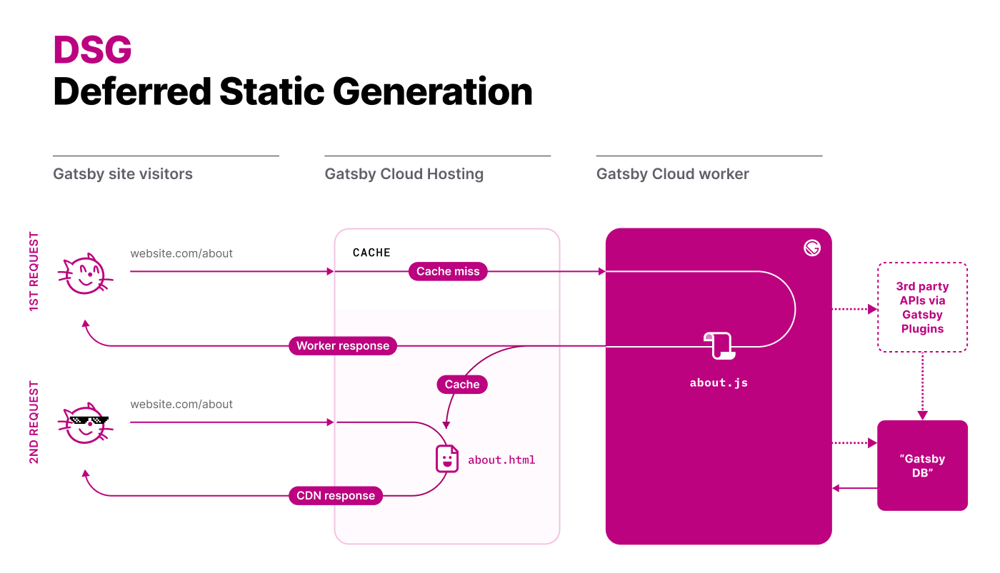

Gatsby is historically known as a static site generator enhanced with [React Hydration][1].
But starting with Gatsby 4, you can choose alternative rendering modes in addition to static site generation (SSG).
Now Gatsby covers all possible use-cases you may face as a web developer.

### What is a rendering mode?

Rendering mode defines at what stage the user-facing HTML is generated. It can happen at build time
(SSG or pre-rendering), during HTTP request (server-side rendering) or locally in the browser
with Javascript (client-side rendering).

> For an in-depth explanation of each of those approaches and their trade-offs we
> highly recommend the ["Rendering on the Web"][3] article from the Chrome team.

As already mentioned, Gatsby always supported SSG and [client-side rendering][4], and now the two
other rendering options are available: Deferred Static Generation (DSG) and Server-side rendering (SSR).
Let's dive into what each of those modes mean.

## Static Site Generation (SSG)

SSG is the default rendering mode in Gatsby. Gatsby generates all assets and HTML for all pages at build time on a
build server (this could be your laptop, any build service, or Gatsby Cloud worker if you use [Gatsby Cloud][6]).

Then, the produced static files are uploaded to the CDN provider of choice and served to end-users.
The build server is not needed after the build step and could even be turned off.

This mode provides the most pleasant user experience, the highest level of security, and run-time scalability for your site.

> **Note:** SSG doesn't mean your site is not dynamic. You can still use JavaScript to communicate with any APIs,
> add private sections of your site for authorized users via [client-side rendering][4] and
> have any features SPA can have

Here is how SSG works in Gatsby Cloud (the principle remains the same with any build and CDN provider):

One downside of SSG is building time. As the number of pages of your site grows, so does the build time.
Gatsby supports [incremental builds][5] to make sure the 2nd and subsequent builds only rebuild what was changed
but for the initial build (the build without the cache), build times may become an issue. That's where the
Deferred Static Generation could be beneficial.

## Deferred Static Generation (DSG)

As the title suggests, Deferred Static Generation is conceptually very similar to SSG. The only difference is that some
pages are not generated at build time and instead generated during the first HTTP request to this page.

The subsequent requests will hit the CDN cache the same way as with SSG.

For example: maybe you have an archive of old articles that no longer receive significant traffic. There is
no practical reason to generate them on each build and thus delay the delivery of fresh articles.

In this case, you may choose to defer the generation of old pages, and Gatsby will skip them during the build step.

- [How to use deferred static generation][7]

Unlike SSG, deferred static generation requires you to keep the build server running after the initial build.
It implies a different deployment model and requires backend infrastructure.

But don't worry, [Gatsby Cloud][6] supports it out-of-the-box.

## Server-side Rendering (SSR)

SSG, DSG, and client-side rendering can handle a vast majority of use-cases in web development.

But there is a small niche when you may still need to generate HTML on-the-fly.

For example: maybe you are building a site with user reviews and want those reviews to be
immediately indexed by search engines as soon as they are posted. So the client-side rendering is not an option.

In this case, you may choose server-side rendering for pages with user reviews. Any time someone
requests this page, Gatsby will call `getServerData` function defined in the page component.
That's where you can request any data from 3rd-party APIs. Gatsby passes the returned result as `serverData`
prop to your page component.

You can also return HTTP headers along with data to control page caching strategy in CDN.

- [How to use server-side rendering][8]

[1]: /docs/conceptual/react-hydration/
[2]: /docs/adding-app-and-website-functionality/
[3]: https://developers.google.com/web/updates/2019/02/rendering-on-the-web
[4]: /docs/how-to/routing/client-only-routes-and-user-authentication
[5]: /docs/reference/release-notes/v3.0#incremental-builds-in-oss
[6]: /products/cloud/
[7]: /docs/how-to/rendering-options/using-deferred-static-generation
[8]: /docs/how-to/rendering-options/using-server-side-rendering
