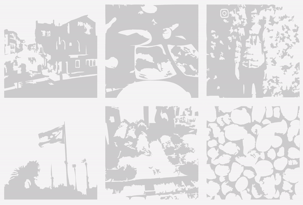

The web has come a long way since 1995, when `` syntax was invented. Our visual standards for what we've come to expect have risen -- a lot.

When visiting new pages, users expect pages to load near-instantly, with a smooth experience. A delay of 100ms is associated with a 3% increased bounce rate.

One important part of overall page loading experience is image loading. There are three basic principles of delivering an optimal image loading experience:

- **Fetch "above the fold" images immediately; delay other work**. This means doing the work necessary for showing users the images they'll see on page load -- and _only_ that work, to avoid resource congestion.

- **Provide a placeholder during image fetch**. "Progressive images" are image placeholders -- previews of a full image that hold its place during page load time.

- **Minimize image file size to reduce request roundtrip time.** There are a number of ways, from cropping overly large images, to using newer file types, to reduce image file size.

We built Gatsby Image to provide these things -- a [higher-level building block](/docs/conceptual/gatsby-core-philosophy/#construct-new-higher-level-web-building-blocks) that has the richness users expect, with the API simplicity developers love (and without maintaining your own image processing pipeline!).

We provide a [detailed guide on using Gatsby Image](/docs/how-to/images-and-media/using-gatsby-plugin-image/) in the How To section of this documentation. Here, we walk through the question of why these benefits matter, from a user's perspective, and why providing them without Gatsby Image (or something similar) can be difficult.

## Fetch above-the-fold images immediately

### Avoid hydration lag for React apps

When you're building a website with React you face a bit of a catch-22 for optimizing image loads. If you send over React JavaScript files to be evaluated by the browser (client-side rendering), you can't start loading images until the browser evaluates all of the JavaScript to figure out what images you want to load. On the other hand, if you evaluate the JavaScript on the server and then send over the HTML (server-side rendering), then the initial request will take longer to load while it waits for this server-side evaluation.

Because Gatsby does server rendering during the build process _(rather than when a user is loading the page)_ a Gatsby site will return HTML immediately without waiting for server rendering, and then the client's browser can start loading images as soon as it receives the HTML. Depending on the size of the app, this could save anything from a few hundred milliseconds to a few seconds.

### Delay offscreen images

As important as loading critical images immediately is _not_ loading non-critical images. Loading images is a lot of work for browsers and eagerly loading offscreen images on initial page load [can slow down overall page interactivity](https://web.dev/offscreen-images/).

There are a couple of important pieces here.

First, automatically detect which images should be lazily loaded. While development teams _may_ do this manually, it may not even be in their control (for example, if content including images is coming from a CMS).

Second, actually implement lazy loading. This is supported natively for many browsers, but right now, [almost 30% of users are on browsers](https://caniuse.com/loading-lazy-attr) that don't support it.

Gatsby generates the native component for use in browsers that can use it, and creates the same effect manually for browsers that haven't yet implemented lazy loading through leveraging the IntersectionObserver API.

## Image placeholders

Studies have shown that progressive images cause users to perceive a faster page load. This is because they deliver a gentler, more gradual experience -- a gradual fade-in rather than a jarring frame-to-fame switch from empty background to present image.

### Hold position, prevent reflow

One of the challenges when images load alongside text is preventing what's known as "browser reflow". That is the jankiness that results when an image appears next to text, bumping the text to the right, or above text, bumping it below.

When a browser doesn't know how big an image is going to be, either because the width and height haven't been defined, or because it's variable due to responsive images, reflow can happen, which both impacts performance (by blocking the main thread of execution), and results in a jarring visual effect.

### Gradual color transition

In addition, when an image appears, it goes from blank background to fully there from one frame to another. This can also be visually jarring. Like CSS has a `transition` prop to help position shifts feel gradual, images feel more aesthetically pleasing when they have placeholders.

Gatsby Image's will hold the spot for your image automatically when you specify `width` prop, and depending on your preference, will provide a background -- blurred or a background color, while the image loads.

## Minimize image file size

There are a number of ways to minimize image file size. Below are three of the most common, roughly in order of increasing complexity.

### Cropping and compressing overly large images

A common problem in larger projects is that images are uploaded into a CMS by content operations personnel by teams that may be less aware of appropriate web image sizes and formats.

For example, a support staff member may take a 1600x2000 pixel screenshot, save it as a PNG, and upload it alongside a helpdesk article. While this is a quite reasonable action, it may degrade page performance significantly. If the article has a 800px maximum width, a 640 x 800 pixel JPG would have displayed at the same quality but a tenth of the size; the extra weight may delay page load by a second or two.

You can solve this on your own via creating and maintaining a custom image processing pipeline, perhaps during CI/CD, to resize. However, that requires writing, and then maintaining, custom code. Gatsby Image solves this out of the box; if you use the `width` prop, Gatsby Image will automatically resize larger underlying assets.

### Generating "responsive images" for different device sizes

Different devices have different screen sizes and resolutions, which means it may make sense to send smaller (or larger) objects.

Sending an image with a width of 800px to a mobile phone with a 400px wide screen means that you are sending unnecessary data over the wire that will, again, delay page load, cause visitors to bounce, and hurt conversions.

Conversely, some laptops, like Macbook Pros, have a higher pixel-to-density ratio, so need "2x"-size images.

In order to support responsive images, you need to do the image processing beforehand, as well as generate the markup necessary. Gatsby Image has a `fluid` option that will transform images with a relatively straightforward API.

### Better compression

The new [WebP image](https://developers.google.com/speed/webp) standard reduces image size by 25-35% for modern browsers. Additionally, [AVIF Images](https://netflixtechblog.com/avif-for-next-generation-image-coding-b1d75675fe4) are also supported. AVIF is a brand-new image format, which offers considerably better filesizes and quality than JPG and even WebP. It's possible to support these standards, but you also need to fall back for older browsers that don't support this, which without framework support adds additional complexity.

Gatsby supports WebP & AVIF out of the box as a setting on Gatsby Image.
