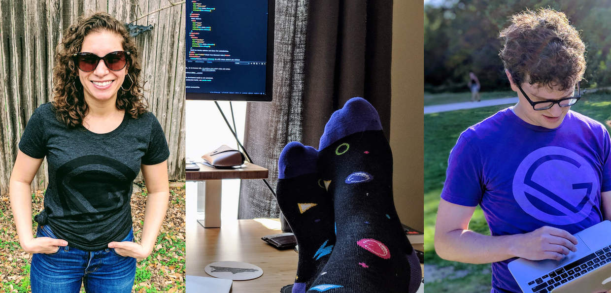

Gatsby relies on contributors from the open source community, and we want to make sure you know how much it means to us that you’re willing to put time and effort into [contributing to Gatsby](/docs/how-to-contribute/).

To show our appreciation, _**everyone who contributes to Gatsby is eligible to receive free swag!**_

### How to claim your free swag

If you contribute to the Gatsby org on GitHub, you can claim your swag by [logging into the Gatsby Maintainer Dashboard](https://store.gatsbyjs.org/login) and requesting a discount code.

If you’ve contributed in other ways, such as giving talks about Gatsby, teaching others to use it, writing Gatsby articles/tutorials, participating in a Gatsby research project, or any other way, please email <mailto:jason@gatsbyjs.com> or [tweet at Gatsby on Twitter](https://twitter.com/gatsbyjs) to claim your swag.

### Details about free swag

- We will send one item from our [swag store](https://store.gatsbyjs.org/) to each Gatsby contributor.
- Not all items are eligible due to high cost to create the swag. We’ll make it clear which items are not eligible.
- There’s a limit of one free swag item per contributor.
- Shipping is free worldwide.

> **NOTE:** Worldwide free shipping is a pilot program. If shipping costs get out of control, we may need to adjust this policy in the future.

### Not sure how to start contributing?
If you are worried or don’t know where to start, you can always reach out to Shannon Soper (@shannonb_ux) on Twitter or submit an issue and a maintainer can help give you guidance! 

Why not check out our list of things you can do to contribute(/docs/how-to-contribute/)?

Looking to speak about Gatsby? We’d love to review your talk abstract/CFP! You can email it to shannon [at] gatsbyjs [dot] com, and we can give pointers or tips!

