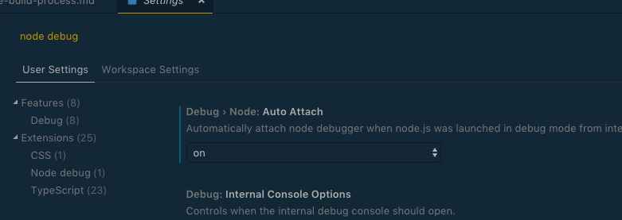
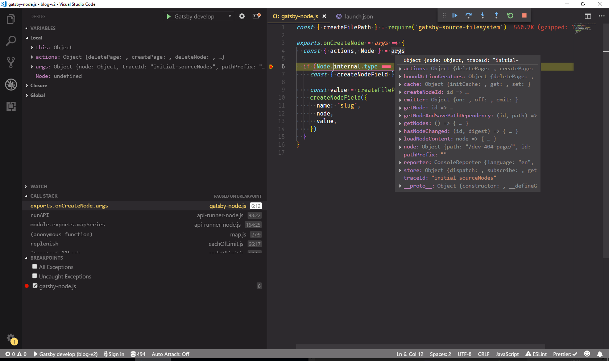
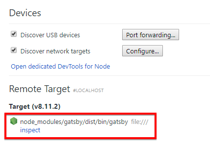
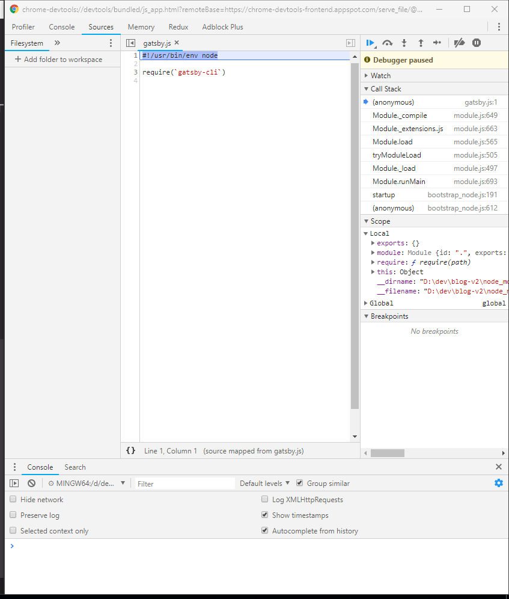
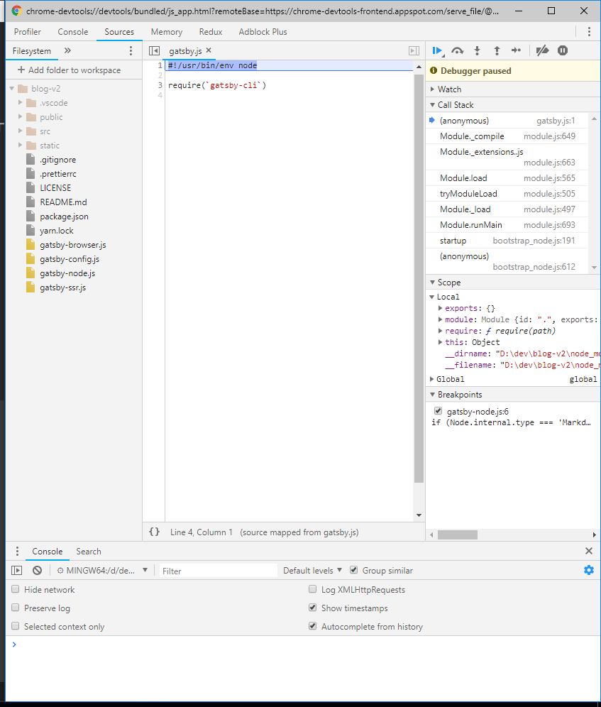
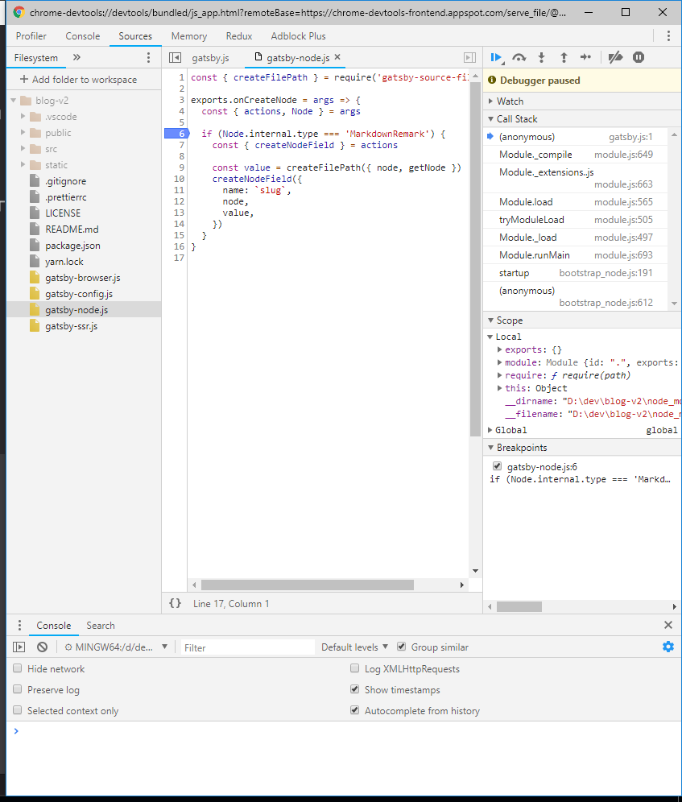
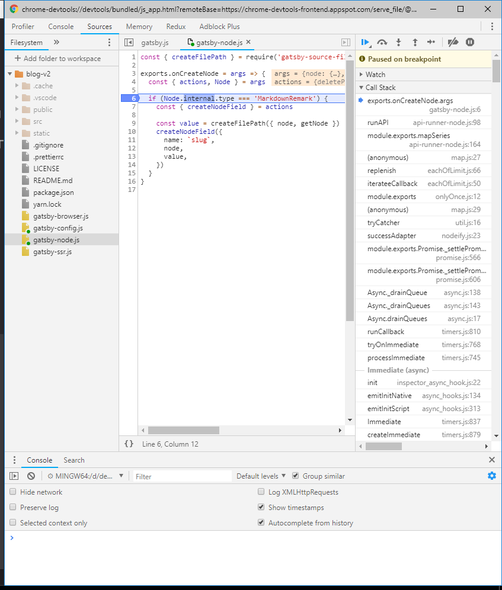
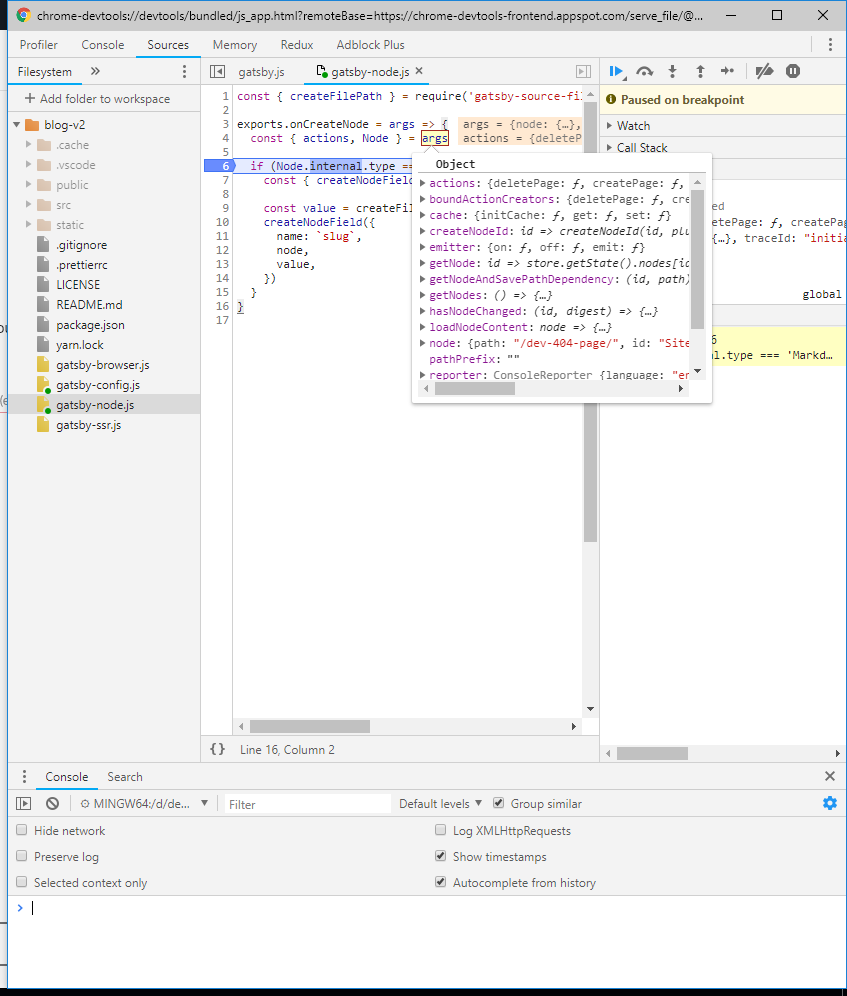

Gatsby's `build` and `develop` steps run as a Node.js application which you can debug using standard tools for Node.js applications.

In this guide you will learn how to debug some code using various techniques.

As an example consider the following code snippet in a `gatsby-node.js` file:

```js:title=gatsby-node.js
const { createFilePath } = require("gatsby-source-filesystem")

exports.onCreateNode = args => {
  const { actions, node } = args

  if (node.internal.type === "MarkdownRemark") {
    const { createNodeField } = actions

    const value = createFilePath({ node, getNode })
    createNodeField({
      name: `slug`,
      node,
      value,
    })
  }
}
```

There is a bug in this code and using it will produce the error below:

```shell
TypeError: Cannot read property 'internal' of undefined

  - gatsby-node.js:6 Object.exports.onCreateNode.args [as onCreateNode]
    D:/dev/blog-v2/gatsby-node.js:6:12
```

## Debugging with Node.js' built-in console

One of the fastest ways to gain insight into Gatsby's build process is using the `console` functionality [built into Node.js](https://nodejs.org/en/knowledge/getting-started/the-console-module/). This works similar to how you might be used to in the browser.

Adding a `console.log` statement in the sample from above will print the variable into your terminal. There you might notice that `args` contains a lower-cased node variable.

```js:title=gatsby-node.js
const { createFilePath } = require("gatsby-source-filesystem")

exports.onCreateNode = args => {
  console.log(args) // highlight-line
  const { actions, node } = args
  if (node.internal.type === "MarkdownRemark") {
    const { createNodeField } = actions

    const value = createFilePath({ node, getNode })
    createNodeField({
      name: `slug`,
      node,
      value,
    })
  }
}
```

To read more about Gatsby's build process, check out the differences between [build and runtime](/docs/conceptual/overview-of-the-gatsby-build-process#build-time-vs-runtime). Generally speaking, Node.js is responsible for building Gatsby pages and therefore its built-in objects like `console` can be used at build time. At client-side [runtime](/docs/glossary#runtime), the browser's `console.log` API will add messages to the developer tools console.

## VS Code Debugger (Auto-Config)

If you use VS Code and its integrated terminal, you can configure it to automatically create the debug config for you.

1. Press `Ctrl + ,` or `⌘ + ,` to open your preferences. Type `node debug` into the search bar. Make sure the `Auto Attach` option is set to `on`.
   

2. Using VS Code's integrated terminal run `node --nolazy node_modules/.bin/gatsby develop --inspect-brk` instead of `gatsby develop` or `node --nolazy --inspect-brk node_modules/.bin/gatsby build` instead of `gatsby build`

3. Set breakpoints and debug!

> **Note:** If the breakpoint is not being hit on `const value = createFilePath({ node, getNode })`
> try running `gatsby clean` to delete the `.cache` and `public` folder and try again.

## VS Code Debugger (Manual Config)

Using built-in debuggers in code editors is very convenient. You will be able to skip a lot of setup needed to use Chrome DevTools. You will also be able to put breakpoints in the same view you write your code.

We won't go in depth here about how to debug in VS Code - for that you can check the [excellent VS Code documentation](https://code.visualstudio.com/docs/editor/debugging). We will however share a launch configuration needed to run and debug Gatsby:

### Linux

```json:title=launch.json
{
  "version": "0.2.0",
  "configurations": [
    {
      "name": "Gatsby develop",
      "type": "pwa-node",
      "request": "launch",
      "program": "${workspaceRoot}/node_modules/.bin/gatsby",
      "args": ["develop"],
      "env": {
        "PARCEL_WORKERS": "0",
        "GATSBY_CPU_COUNT": "1",
      },
      "runtimeArgs": ["--nolazy"],
      "console": "integratedTerminal"
    },
    {
      "name": "Gatsby build",
      "type": "pwa-node",
      "request": "launch",
      "program": "${workspaceRoot}/node_modules/.bin/gatsby",
      "args": ["build"],
      "env": {
        "PARCEL_WORKERS": "0",
        "GATSBY_CPU_COUNT": "1",
      },
      "runtimeArgs": ["--nolazy"],
      "console": "integratedTerminal"
    }
  ]
}
```

### Windows

```json:title=launch.json
{
  "version": "0.2.0",
  "configurations": [
    {
      "name": "Gatsby develop",
      "type": "pwa-node",
      "request": "launch",
      "program": "${workspaceRoot}/node_modules/.bin/gatsby",
      "windows": {
        "program": "${workspaceRoot}/node_modules/gatsby/dist/bin/gatsby"
      },
      "args": ["develop"],
      "env": {
        "PARCEL_WORKERS": "0",
        "GATSBY_CPU_COUNT": "1",
      },
      "runtimeArgs": ["--nolazy"],
      "console": "integratedTerminal"
    },
    {
      "name": "Gatsby build",
      "type": "pwa-node",
      "request": "launch",
      "program": "${workspaceRoot}/node_modules/.bin/gatsby",
      "windows": {
        "program": "${workspaceRoot}/node_modules/gatsby/dist/bin/gatsby"
      },
      "args": ["build"],
      "env": {
        "PARCEL_WORKERS": "0",
        "GATSBY_CPU_COUNT": "1",
      },
      "runtimeArgs": ["--nolazy"],
      "console": "integratedTerminal"
    }
  ]
}
```

After putting a breakpoint in `gatsby-node.js` and using the `Start debugging` command from VS Code you can see the final result:



> **Note:** If the breakpoint is not being hit on `const value = createFilePath({ node, getNode })`
> try running `gatsby clean` to delete the `.cache` and `public` folder and try again.

## Chrome DevTools for Node

### Running Gatsby with the `inspect` flag

In your project directory with the global Gatsby CLI installed run the following command:

```shell
gatsby develop --inspect
```

### Connecting DevTools

Open `chrome://inspect` in Chrome browser and connect to a "Remote Target" by clicking the `inspect` link:



You should see Chrome DevTools start and that code execution is paused at the start of the `gatsby.js` entry file:



### Setting up `Sources`

Right now you can't see your files in Sources. You need to add those using the "Add folder to workspace" button and pick the directory with the code you want to debug. If you want to debug code in your `gatsby-node.js` or your local plugins, pick your project directory. If you want debug the `gatsby` package you will have to pick the `gatsby` directory inside `node_modules`.

This example has problematic code in your local `gatsby-node.js` file, so add the directory containing it to Sources. You should have a directory with your code in the left pane:



### Using DevTools

Go ahead and add a breakpoint just before the place that the error is thrown. To add a breakpoint navigate to `gatsby-node.js` and left-click on a line number:



Now you can resume code execution by clicking the "resume" icon in the DevTools debug toolbar (or press F8 on your keyboard). Gatsby will start running and pause once it reaches a breakpoint, allowing you to inspect variables:



To inspect variables you can hover your mouse over them or go to the `Scope` section in the right-hand pane (either collapse the "Call Stack" section or scroll through it to the bottom).

In the example `Node` is `undefined` and to figure out why, hover over `args` where `Node` should be destructured from.



You can now see the problem - `args` doesn't contain `Node` - it contains `node`. So this small typographic mistake was causing your code to fail. Adjusting your code to use a lowercase `node` fixes the problem and you did that without adding tons of `console.log` output!

### Finishing thoughts on DevTools

You can successfully debug your code using Chrome DevTools but using it isn't really that convenient. There are a lot of steps you need to do manually every time you want to use the debugger. Thankfully there are other methods that make it simpler to start such as the ones outlined above.

- This was an introduction to Node.js debugging. Using information from this section you can set up debugging in your code editor or IDE of choice (if it supports Node.js debugging).
- You don't _need_ a code editor or IDE to debug Node.js applications. Using Chrome DevTools is usually a safe fallback.
- Debugging isn't the only thing you can do in Chrome DevTools. Once you connect to DevTools you can use CPU or memory profilers. Check the `Profiler` and `Memory` tabs in DevTools.

## Additional resources

- [Debugging - Getting Started | Node.js](https://nodejs.org/en/docs/guides/debugging-getting-started/)
- [Debugging with Node.js - Paul Irish talk at Node Summit 2017](https://www.youtube.com/watch?v=Xb_0awoShR8)
