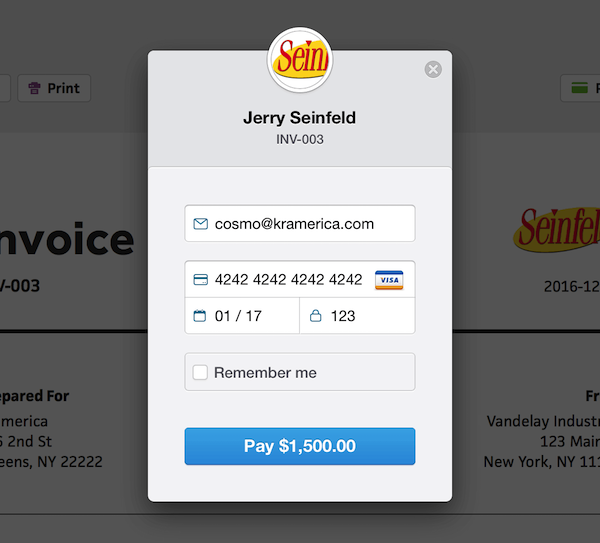
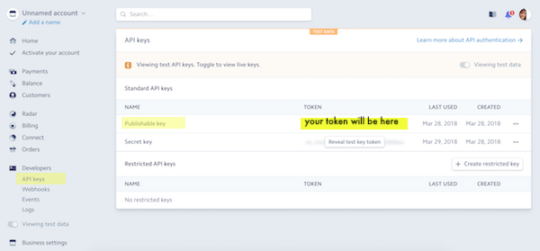

# Table of Contents
1. [What this tutorial includes](#what-this-tutorial-includes)
2. [Prerequisites](#prerequisites)
3. [How does Gatsby work with Stripe and AWS?](#how-does-gatsby-work-with-stripe-and-AWS)
4. [Setting up a Gatsby site](#setting-up-a-gatsby-site)
5. [Extending Gatsby through an e-commerce plugin](#extending-gatsby-through-an-ecommerce-plugin)
6. [See your site hot reload in the browser!](#see-your-site-hot-reload-in-the-browser)
7. [How does the plugin work?](#how-does-the-plugin-work)
8. [Sequence of events](#sequence-of-events)
9. [Creating a button](#creating-a-button)
10. [Get Your Stripe Test Keys](#get-your-stripe-test-keys)
11. [Configuring Stripe in Gatsby](#configuring-stripe-in-gatsby)
13. [Setting up a Serverless Function in AWS Lambda](#setting-up-a-serverless-function-in-aws-lambda)
14. [Setup a separate repo](#setup-a-separate-repo)
15. [Edit your new repo](#edit-your-new-repo)
16. [Push code to AWS](#push-code-to-AWS)
17. [Testing Payments](#testing-payments)


# What this tutorial includes

In this tutorial, you’ll learn how to use Gatsby to build the UI for a basic e-commerce site that can accept payments, with Stripe as the backend for processing payments. Benefits of using Gatsby for e-commerce sites include the following:
* Security inherent in static sites
* Blazing fast performance when your pages are converted from React into static files
* Easy to host

You can see the working demo hosted here: https://gatsby-ecommerce.netlify.com/

# Prerequisites

* Stripe account: [register for an account here](https://dashboard.stripe.com/register)
* AWS account (free tier that covers anywhere from several thousand to a million requests per month): [register for an account here](https://aws.amazon.com/free/?sc_channel=PS&sc_campaign=acquisition_US&sc_publisher=google&sc_medium=cloud_computing_b&sc_content=aws_account_e_control_q32016&sc_detail=create%20an%20aws%20account&sc_category=cloud_computing&sc_segment=102882721242&sc_matchtype=e&sc_country=US&s_kwcid=AL!4422!3!102882721242!e!!g!!create%20an%20aws%20account&ef_id=Wd_k7wAAAVgVBk9m:20180604172833:s)


# How does Gatsby work with Stripe and AWS?

Stripe is a payment processing service that allows you to securely collect and process payment information from your customers. To try out Stripe for yourself, go to [Stripe’s Quick Start Guide](https://stripe.com/docs/quickstart).

There are alternatives to Stripe, like Square and Braintree, and their setup is very similar to Stripe.

Stripe requires a server to process the information to make a charge, so you’ll need more than just static pages. Gatsby builds the pages for your front-end, but it won’t be able to handle the server logic that Stripe requires to process payments. That means you’ll need to set up a simple function that your Gatsby project can POST to in order to handle a payment.

That function can be set up a number of different ways. To set up that function from scratch, you could:
* Write your own simple server and deploy it somewhere, making it accessible via an endpoint
* Write and deploy a hosted serverless function through a service like AWS Lambda or Google Cloud


# Setting up a Gatsby site

Create a new Gatsby project by running the `gatsby new` command in the terminal and change directories into the new project you just started:

```shell
gatsby new ecommerce-gatsby-tutorial
cd ecommerce-gatsby-tutorial
```


# Extending Gatsby through an e-commerce plugin

You can extend the functionality of this default starter with plugins. One such plugin is `gatsby-plugin-stripe-checkout`, which you’ll install in this project:

```shell
npm install gatsby-plugin-stripe-checkout
```

Open the root site directory in a text editor and navigate to `gatsby-config.js` and add the Stripe Checkout plugin to `gatsby-config.js` in the plugins section. Your `gatsby-config.js` should look like the following code example:

```jsx
module.exports = {
 siteMetadata: {
   title: 'Gatsby Default Starter',
 },
 plugins: ['gatsby-plugin-react-helmet', 'gatsby-plugin-stripe-checkout'],
}
```


# See your site hot reload in the browser!

Run `gatsby develop` in the terminal, which starts a development server and reloads changes you make to your site so you can preview them in the browser. Open up your browser to [localhost:8000](localhost:8000) and you should see a default homepage.

> **NOTE**: If you have already started your gatsby development server using `gatsby develop`, you will need to restart the server by pressing CTRL + C in the terminal where the command was run and running `gatsby develop` again to see changes in your `gatsby-config.js` reflected on [localhost:8000](localhost:8000)


# How does the plugin work?

Stripe Checkout processes payments with information we send it, you can read more about how it works in Stripe’s docs. The Gatsby plugin, `gatsby-plugin-stripe-checkout`, will add this snippet:

```shell
<script src="https://checkout.stripe.com/checkout.js"></script>
```

to the end of the `<body>` tag across all of your pages in your Gatsby project, allowing you to call the Stripe checkout methods from Stripe’s API to create charges.

If you want to further customise the checkout process or pull Stripe data into your site, check out [Gatsby's plugin library for more Stripe plugins](https://www.gatsbyjs.org/plugins/?=stripe).


# Sequence of events

`configure()` sets up Stripe and automatically runs every time the page loads. Then you run `open()` when the buy button is clicked, which then triggers the Stripe payment overlay to open.

Essentially, this is the sequence of events:

- _page load_ -> `configure()`
- _some time passes..._
- _user clicks button_ -> `open()`

The next section describes how to setup these events.


# Creating a button

There is a default checkout modal that is available through the plugin we’re using, shown in the image below. When we call the `.open()` method through Stripe Checkout, the rest of the screen is darkened and a modal appears over the top, directing the user’s attention to the checkout form. You’ll need to create a button component that calls this method or triggers Stripe from your site.

> **NOTE**: If you’d like to customize the checkout modal, see the [Stripe Checkout Elements plugin](/packages/gatsby-plugin-stripe-elements/?=stripe)



> Notice the input fields for email and credit card information—this design is already made by Stripe for you to use without styling anything. 

In order to launch the Stripe Checkout modal (shown above), you need to call the `.configure()` method from Stripe Checkout in your Gatsby site. The only information you are required to provide is your publishable API key so that Stripe knows what account on their platform to send payments to. You can read about other recommended and optional configurations like currency or shipping information in the Stripe Checkout Reference. You are going to make a `checkout.js` file that handles this configuration.

Create a new file at `src/components/checkout.js`. Your `checkout.js` file should look like this:

```jsx
import React from 'react'

// hardcoded amount (in US cents) to charge users
// you could set this variable dynamically to charge different amounts
const amount = 2500
const cardStyles = {
 display: 'flex',
 flexDirection: 'column',
 justifyContent: 'space-around',
 alignItems: 'flex-start',
 padding: '3rem',
 boxShadow: '5px 5px 25px 0 rgba(46,61,73,.2)',
 backgroundColor: '#fff',
 borderRadius: '6px',
 maxWidth: '400px',
}
const buttonStyles = {
 fontSize: '13px',
 textAlign: 'center',
 color: '#fff',
 outline: 'none',
 padding: '12px 60px',
 boxShadow: '2px 5px 10px rgba(0,0,0,.1)',
 backgroundColor: 'rgb(255, 178, 56)',
 borderRadius: '6px',
 letterSpacing: '1.5px',
}

// Below is where the checkout component is defined. 
// It has several functions, and some default state variables.
const Checkout = class extends React.Component {
 state = {
   disabled: false,
   buttonText: 'BUY NOW',
   paymentMessage: '',
 }

 resetButton() {
   this.setState({ disabled: false, buttonText: 'BUY NOW' })
 }

 componentDidMount() {
   this.stripeHandler = StripeCheckout.configure({
     // You’ll need to add your own Stripe public key to the `checkout.js` file.
// key: 'pk_test_STRIPE_PUBLISHABLE_KEY',
     key: 'pk_test_kuhbxb0MMZsp6fj6aTNDnxUu',
     closed: () => {
       this.resetButton()
     },
   })
 }

 openStripeCheckout(event) {
   event.preventDefault()
   this.setState({ disabled: true, buttonText: 'WAITING...' })
   this.stripeHandler.open({
     name: 'Demo Product',
     amount: amount,
     description: 'A product well worth your time',
     token: token => {
       fetch(`AWS_LAMBDA_URL`, {
         method: 'POST',
         body: JSON.stringify({
           token,
           amount,
         }),
         headers: new Headers({
           'Content-Type': 'application/json',
         }),
       })
         .then(res => {
           console.log('Transaction processed successfully')
           this.resetButton()
           this.setState({ paymentMessage: 'Payment Successful!' })
           return res.json()
         })
         .catch(error => {
           console.error('Error:', error)
           this.setState({ paymentMessage: 'Payment Failed' })
         })
     },
   })
 }

 render() {
   return (
     <div style={cardStyles}>
       <h4>Spend your Money!</h4>
       <p>
         Use any email, 4242 4242 4242 4242 as the credit card number, any 3
         digit number, and any future date of expiration.
       </p>
       <button
         style={buttonStyles}
         onClick={event => this.openStripeCheckout(event)}
         disabled={this.state.disabled}
       >
         {this.state.buttonText}
       </button>
       {this.state.paymentMessage}
     </div>
   )
 }
}

export default Checkout
```

## What did you just do?

You imported React, set a default price for your product, added some styles, and introduced some React functions. The `componentDidMount()` and `openStripeCheckout()` functions are most important for the Stripe functionality. The `componentDidMount()` function is a React lifecycle method that launches when the component is first mounted to the DOM, making it a good place to configure the Stripe Checkout handler. It looks like this:

```js{39-46}
 componentDidMount() {
   this.stripeHandler = StripeCheckout.configure({
     key: 'pk_test_kuhbxb0MMZsp6fj6aTNDnxUu',
     closed: () => {
       this.resetButton()
     },
   })
 }
```

This gives Stripe our key, and tells Stripe to call the Checkout component’s resetButton() method when the Stripe modal is closed. 

The `openStripeCheckout()` function gives additional information to Stripe as a user launches the checkout modal, and will send the information they input to our serverless function once we create it.

The tags in the `render()` function define the structure of HTML elements that lay out how the component is structured.


# Import checkout component into homepage

Now go to your `src/pages/index.js` file. This is your homepage that shows at the root URL. Import your new checkout component in the file underneath the other two imports and replace the tags inside the first `<div>` tag with a `<Checkout />` tag. Your `index.js` file should now look like this: 

```
javascript{3,6-11}
import React from 'react'
import Link from 'gatsby-link'
import Checkout from '../components/checkout'

const IndexPage = () => (
 <div>
   <Checkout />
 </div>
)

export default IndexPage
```

If you go back to [localhost:8000](localhost:8000) in your browser and you have `gatsby develop` running, you should have a big, enticing button on a card where the filler text used to be.


# Get Your Stripe Test Keys

View your API credentials by logging into your Stripe account, and then going to Developers > API Keys. 



You have 2 keys in both test mode and production mode: 
* a publishable key
* a secret key

While testing, you can use the keys that begins with pk_test_ and sk_test_. For production code, you will want to use the keys that don’t say test. As the names imply, your publishable key may be included in code that you share publicly (for example, in GitHub), whereas your secret key should not be shared with anyone or committed to any public repo. It’s important to restrict access to this secret key because anyone who has it could potentially read or send requests from your Stripe account and see information about charges or purchases or even refund customers.


# Configuring Stripe in Gatsby

Add your Stripe publishable key to `src/components/checkout.js`.

Inside the `componentDidMount()` function, you are calling configure on `StripeCheckout`. Replace the text in the single quotes with your own public key. This tells Stripe to send any payments through to your account.

```
componentDidMount() {
   this.stripeHandler = StripeCheckout.configure({
     // You’ll need to add your own Stripe public test key here.
     // key: 'pk_test_YOUR_KEY_GOES_HERE',
     key: 'pk_test_kuhbxb0MMZsp6fj6aTNDnxUu',
     closed: () => {
       this.resetButton()
     },
   })
 }

```
After you replace `pk_test_YOUR_KEY_HERE` with your actual pk_test key and save the change, your button should launch the Stripe Checkout modal and allow you to enter in payment information. You can try and submit a payment, but it will fail because you haven’t set up your serverless function yet. Your Gatsby site is almost ready!


# Setting up a Serverless Function in AWS Lambda

Lambda is a service offered through Amazon Web Services that allows you to run code that would normally run on a server without having to provision or manage servers. For a simple function like a Stripe charge, Lambda will suit your use case nicely. AWS offers many options for configurations; you are going to use the Serverless Framework to help you minimize the steps to deployment, and also allow you to deploy to other cloud providers if needed.

> **NOTE**: You can follow an adaptation of these steps using this tutorial and Serverless’ docs as a reference if you want to deploy your serverless function to a different provider like Google Cloud or Azure.


# Setup a separate repo

You’ll be setting up a separate repo for the code that you’ll deploy to Lambda. To look through the example repo, [inspect the code in GitHub](https://github.com/gillkyle/gatsby-stripe-serverless-backend).

Clone the code to a new location on your computer and then change directories into this new folder: 

```shell
`git clone https://github.com/gillkyle/gatsby-stripe-serverless-backend.git`
`cd gatsby-stripe-serverless-backend`
```

Then you need to run `npm install` to install the dependencies in the `package.json` file, which in this case is just the Stripe library.

```shell
npm install
```


## What did you just do?

By running `npm install`, you’ve created a node_modules folder that you’ll upload to AWS along with your code to make a charge. All of the code in this file will be hosted online by Amazon, and you need to provide it with the libraries you utilize in your project. By making this repository separate from our Gatsby project, we can decouple it from our site making it easier to switch to a different cloud hosting provider, and greatly decreasing the size of the files we upload to Amazon’s servers.


# Edit your new repo

Open gatsby-stripe-serverless-backend in your code editor.

* Rename the `secrets.example.json` file to `secrets.json`.
* Replace the string that says "sk_test_STRIPE_SECRET_KEY" in `secrets.json` with your secret test key from your Stripe account, and keep the quotation marks around it (using the test keys allows orders to go through without needing real credit card details, which is useful for testing)

Your secret key can be included here if you don’t upload this file to a version control system. The .gitignore file in the project includes a line that will tell any git commands you run in this folder not to keep track of your secrets file as long as it is named `secrets.json`.


## How does the code work in this site?

You don’t need to change any code in the `checkout.js` (not to be confused with the `checkout.js` file we used to create our component in Gatsby), but go ahead and open it up to review what it’s doing.

The beginning of the file looks like this:

```
const stripe = require("stripe")(process.env.STRIPE_SECRET_KEY);

module.exports.handler = (event, context, callback) => {
.
.
.
```

Stripe is being initialized here, this time with your secret key. You’ll notice it is referencing the variable `STRIPE_SECRET_KEY` from `process.env`, because after you upload your code to AWS, your environment variables like API keys are available in that manner. 

The next line exports `handler`, a function that will handle your checkout logic.

The next snippet of code (shown below), pulls some of the information on the `event` object that this function receives and stores them in the variables `requestData`, `amount`, and `token`.

```
// Pull out the amount and id for the charge from the POST
 console.log(event);
 const requestData = JSON.parse(event.body);
 console.log(requestData);
 const amount = requestData.amount;
 const token = requestData.token.id;
```

The next 2 lines are to comply with web browser security standards. Because our Gatsby site will be at a different url than the function that we are going to upload to AWS, we have to include these headers in our response to say it’s okay to communicate with different URLs on the internet.

```
 // Headers to prevent CORS issues
 const headers = {
   "Access-Control-Allow-Origin": "*",
   "Access-Control-Allow-Headers": "Content-Type"
 };
```

The last section of code is where the actual Stripe charge is created, and then the information about whether that charge was successful or not is sent back as a response.

```
return stripe.charges
   .create({
     // Create Stripe charge with token
     amount,
     source: token,
     currency: "usd",
     description: "Serverless test Stripe charge"
   })
   .then(charge => {
     // Success response
     console.log(charge);
     const response = {
       headers,
       statusCode: 200,
       body: JSON.stringify({
         message: `Charge processed!`,
         charge
       })
     };
     callback(null, response);
   })
   .catch(err => {
     // Error response
     console.log(err);
     const response = {
       headers,
       statusCode: 500,
       body: JSON.stringify({
         error: err.message
       })
     };
     callback(null, response);
   });
```

A few things happen with `stripe.charges.create()`: it takes an object as an argument that tells the amount to charge, the unique token made by stripe that hides all the credit card information from us, as well as other information like currency to provide more information about the transaction. 

If the charge was successful, the code continues into the `then` block and prepares a successful response. If something went wrong, an error response is made and then that response (whether successful or not) is returned in the callback.


# Push code to AWS

Now you need to push your code up to AWS so we can hook it up to your Gatsby site.

Install the serverless framework globally on your computer with this command: `npm install -g serverless` (the -g stands for global and allows you to use serverless in other projects besides just this one)

Serverless is a CLI tool that helps speed up the development of serverless functions and connects the dots between writing the code and making the necessary configurations on different hosting providers.

You can read more about the configurations you’ll use in the `serverless.yml` file in the repo you just cloned or in the Serverless docs. 


## Configure serverless with your AWS credentials

Configure serverless with your AWS credentials so you can make updates on AWS through the serverless tools with this command: 

> **NOTE**: It’s helpful to edit this command somewhere other than the terminal as you replace the dummy keys with your real keys, or else it might run halfway through your editing process
 
```shell
serverless config credentials --provider aws --key AAAAAAAEXAMPLE --secret aaaaaaaa/BBBBBBB/CCCdddEXAMPLEKEY
```

Where `AAAAAAAEXAMPLE` is your key and `aaaaaaaa/BBBBBBB/CCCdddEXAMPLEKEY` your secret.

> **NOTE:** If you have trouble finding your way around AWS to get your keys, you can follow the [steps from the Serverless AWS Credentials docs](https://serverless.com/framework/docs/providers/aws/guide/credentials#creating-aws-access-keys).

In the gatsby-stripe-serverless-backend project, run `serverless deploy` and your function will be packaged up and uploaded to AWS.

The output of `serverless deploy` should look something like this in your terminal: 

```shell
Serverless: Packaging service...
Serverless: Excluding development dependencies...
Serverless: Creating Stack...
Serverless: Checking Stack create progress...
.....
Serverless: Stack create finished...
Serverless: Uploading CloudFormation file to S3...
Serverless: Uploading artifacts...
Serverless: Uploading service .zip file to S3 (143.3 KB)...
Serverless: Validating template...
Serverless: Updating Stack...
Serverless: Checking Stack update progress...
.................................
Serverless: Stack update finished...
Service Information
service: gatsby-serverless-stripe
stage: dev
region: us-east-1
stack: gatsby-serverless-stripe-dev
api keys:
  None
endpoints:
  POST - https://random-text.execute-api.aws-zone.amazonaws.com/dev/checkout
functions:
  checkout: gatsby-serverless-stripe-dev-checkout
```

Copy the URL after the “-” in the post endpoint section, and paste it into your ecommerce-gatsby-tutorial site in the src > components > checkout.js file where it says `AWS_LAMBDA_URL`

```js{9}
openStripeCheckout(event) {
   event.preventDefault()
   this.setState({ disabled: true, buttonText: 'WAITING...' })
   this.stripeHandler.open({
     name: 'Demo Product',
     amount: amount,
     description: 'A product well worth your time',
     token: token => {
       fetch(`AWS_LAMBDA_URL`, {
         method: 'POST',
         body: JSON.stringify({
           token,
           amount,
         }),
         headers: new Headers({
           'Content-Type': 'application/json',
         }),
       })
         .then(res => {
.
.
.
```
Now you have all the pieces in place!

# Testing Payments

You can test that your function is working by using this test credit card number offered by Stripe specifically for testing: 4242 4242 4242 4242, with any future date of expiration, any email, and any 3 digit CVC code.

Logs of the Stripe code can be viewed in the terminal. In your `gatsby-stripe-serverless-backend` project, run the command `serverless logs -f <function-name> -t` with the name of your function instead of <function-name>. If you didn’t change anything in the `serverless.yml` file your function should be called checkout, like so: `serverless logs -f checkout -t`.
