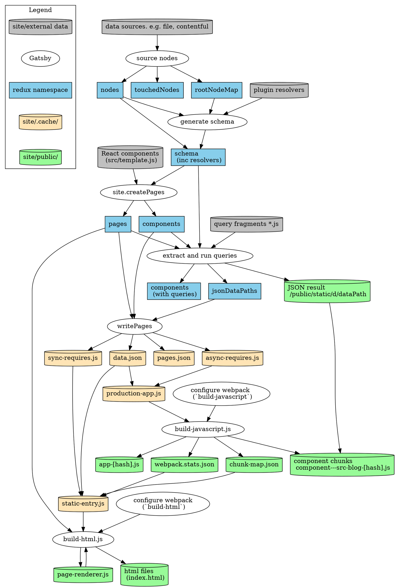

Curious how Gatsby works under the hood? The pages in this section describe how a Gatsby build works from an internal code/architecture point of view. It should be useful for anyone who needs to work on the internals of Gatsby, or for those who are simply curious how it all works, or perhaps you're a plugin author and need to understand how core works to track down a bug? Come one, come all!

If you're looking for information on how to _use_ Gatsby to write your own site, or create a plugin, check out the rest of the Gatsby docs. This section is quite low level.

These docs aren't supposed to be definitive, or tell you everything there is to know. But as you're exploring the Gatsby codebase, you might find yourself wondering what a concept means, or which part of the codebase implements a particular idea. These docs aim to answer those kinds of questions.

A few more things. These docs are mostly focused on the build lifecycle (`gatsby build`). Operations specific to the develop lifecycle (`gatsby develop`) are mostly ignored. Though this may change in the future. Also, they mostly focus on the happy path, rather than getting bogged down in details of error handling.

The graph below shows roughly how all the sub systems of Gatsby fit together and the input/output artifacts at different parts of the build. To find out how different parts work, click on the nodes in the graph, or use the menu on the left.

> Note: This diagram isn't up to date with the latest version of Gatsby. You can help by making a PR to [update this documentation](https://github.com/gatsbyjs/gatsby/issues/14228)

