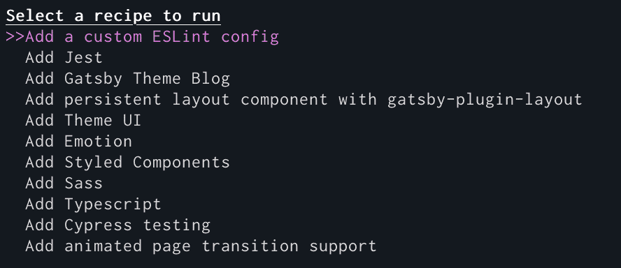

Learn what <q>Infrastructure as Code</q> means, and how you can use code to standardize and automate your Gatsby site.

## What is <q>Infrastructure as Code?</q>

_Infrastructure as Code_, or IaC, is the practice of managing your development, testing, and production environments using configuration files or scripts. Provisioning and configuring environments individually can introduce errors or inconsistencies. You may, for example, find yourself running different versions of Node.js on your laptop and your production servers. Infrastructure as Code minimizes this kind of drift and lets you automate the process of provisioning environments.

Your configuration file describes what resources your project requires. If you're building an API, for example, you might create a configuration file that says, "Please install Node.js 12.16.2, npm 6.14.4, Express 4.17.1, and PostgreSQL 12.2 for Ubuntu Linux." For a Gatsby project, your configuration file may add plugins and themes.

Configuration files, like other code files, are text. That means you can use version control software to store them and track changes to the environment. In short, IaC:

- Creates consistent environments.
- Saves time that would otherwise be spent setting up environments.
- Reduces the risk of errors caused by mismatched environments.
- Lays the groundwork for automation.

## Automating Gatsby site development with Gatsby Recipes

[Gatsby Recipes](/blog/2020-04-15-announcing-gatsby-recipes/) applies the infrastructure as code concept to front-end development. With Gatsby Recipes, you can automate common site building tasks, such as adding a plugin or test suite.

To get started with Gatsby Recipes, upgrade to the latest version of Gatsby and the Gatsby CLI.

```shell
npm install -g gatsby-cli@latest
npm install gatsby@latest
```

You can see the list of available recipes by using `gatsby recipes`. Use your up or down arrow keys to select a recipe, and press the _Enter_ or _Return_ key to run it.



Gatsby Recipes use [MDX](/docs/glossary/mdx/). They're a readable mix of Markdown and React. MDX is an extension of [Markdown](/docs/glossary/markdown/) that lets you use [JSX](/docs/glossary#jsx) in Markdown-formatted documents. As an example, check out the [Styled Components recipe](https://github.com/gatsbyjs/gatsby/blob/master/packages/gatsby-recipes/recipes/styled-components.mdx).

```mdx
# Setup Styled Components

[Styled Components](https://styled-components.com/) is visual primitives for the component age.
Use the best bits of ES6 and CSS to style your apps without stress 💅

---

Install necessary NPM packages

<NPMPackage name="gatsby-plugin-styled-components" />
<NPMPackage name="styled-components" />
<NPMPackage name="babel-plugin-styled-components" />

---

Install the Styled Components plugin in gatsby-config.js

<GatsbyPlugin name="gatsby-plugin-styled-components" />

---

Sweet, now it's ready to go.

Let's also write out an example page you can use to play
with Styled Components.

<File
  path="src/pages/styled-components-example.js"
  content="https://gist.githubusercontent.com/KyleAMathews/34541b87c4194ba2290eedbe8a0b1fe0/raw/dba4d3ffecb5f2a3a36e0e017387185a9835c685/styled-components-example.js"
/>

---

Read more about Styled Components on the official docs site:

https://styled-components.com/
```

You can also write and run your own recipes, or run recipes that were created by and shared with the community. Pass the path or URL of the recipe as an argument. For example, to run a local Gatsby recipe, use `gatsby recipes ./name-of-your-recipe.mdx`. To run a remote recipe, use `gatsby recipes https://example.com/community-made-recipe.mdx`.

Gatsby Recipes help you save time and reduce configuration errors by automating the set-up process.

## Learn more

- [Announcing Gatsby Recipes](/blog/2020-04-15-announcing-gatsby-recipes/)
- [Developing Recipes](https://github.com/gatsbyjs/gatsby/blob/master/packages/gatsby-recipes/README.md#developing-recipes) from the Gatsby repository
