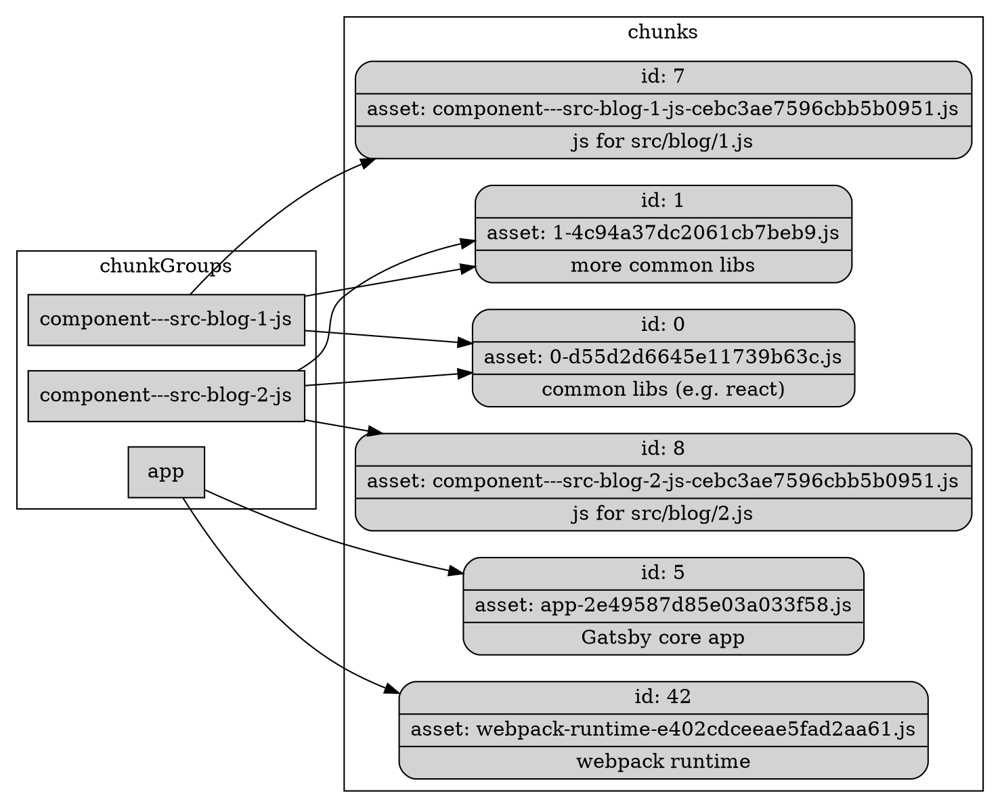

Code splitting in Gatsby occurs during webpack compilation via [Dynamic Splitting](https://webpack.js.org/guides/code-splitting/#dynamic-imports). During compilation, if webpack finds an `import` function invocation, it will split the imported file into a separate bundle. If modules are instead loaded with `require`, they are not code split and are instead included in the original bundle.

But how do you figure out what modules/files to split? Thankfully, there is a natural answer. Pages! When you load a page, there's no reason you need to also load the JavaScript/CSS for all the other pages on the site (except to prefetch them which we'll get to [later](/docs/how-code-splitting-works/#prefetching-chunks)). Gatsby's job is to do the heavy lifting of generating the right JavaScript in the form that webpack expects to perform this code splitting.

## .cache/async-requires.js

During the [Write Out Pages](/docs/write-pages/#async-requiresjs) bootstrap phase, you output `.cache/async-requires.js`. This file is key to code splitting. It exports a `components` object that maps [ComponentChunkNames](/docs/gatsby-internals-terminology/#componentchunkname) to functions that import the component's file on disk. E.g

```javascript
exports.components = {
  "component--src-blog-js": () =>
    import(
      "/home/site/src/blog.js" /* webpackChunkName: "component---src-blog-js" */
    ),
  // more components
}
```

The entry point to webpack (`production-app.js`) [references ./async-requires.js](https://github.com/gatsbyjs/gatsby/blob/master/packages/gatsby/cache-dir/production-app.js#L15). And therefore webpack will analyze it and find the object mapping components to functions that dynamically import page component files. According to dynamic splitting, webpack will then create separate chunks for each of those imported files.

`async-requires` also exports a `data` function that dynamically imports the [data.json](/docs/write-pages/#datajson) file so that it too is code split.

## Chunk bundle naming

Great! You've told webpack where you want to code split. But how will these be named on disk? webpack gives you the ability to customize this via the [chunkFilename](https://webpack.js.org/configuration/output/#output-chunkfilename) configuration in the [output](https://webpack.js.org/configuration/output/) section, which is set by Gatsby in [webpack.config.js](https://github.com/gatsbyjs/gatsby/blob/master/packages/gatsby/src/utils/webpack.config.js#L135) as:

```text
[name]-[contenthash].js
```

Content hash is a hash of the contents of the chunk that was code split. But what about `name`? You haven't told webpack the "name" of the chunk, other than the filename, which can't be a name since it has slashes in it. Normally, webpack would replace `[name]` with `[id]` (see [webpack docs](https://webpack.js.org/configuration/output/#output-chunkfilename)). But, it gives us the opportunity to specify the name instead as a comment in the `import block`. In the example above, that's what the `/* webpackChunkName: "component---src-blog-js" */` is doing.

## Primer on chunkGroups and chunks

Before we go on to show how Gatsby maps components to the generated bundle names, you should understand how webpack chunks work. A chunk group represents a logical code split, e.g. a Gatsby page, or the Gatsby core app. The chunk groups might share a bunch of code or libraries. webpack detects these and creates shared pieces of code. These are chunks, e.g. there might be a chunk for React and other libraries. Then there would be the leftover chunks of core Gatsby JS code for the particular chunk group. This is most easily explained by the below graph.



In the above graph, you can see 3 chunk groups: 2 pages and the core Gatsby app. The two pages share a bunch of libraries. webpack found these common dependencies and created chunks for them. These chunks are id 0 and 1. And you'll see that both page `chunkGroups` depend on them. Each page also depends on its own chunk which represents the page's core code (from its src code in the Gatsby site). These would be id 7 for `component---src-blog-1-js` and 8 for `component---src-blog-2-js`.

You can also see the chunk group for `app`. It turns out that this shares no dependencies with the pages. But it does include the webpack runtime whose name is declared in [webpack.config.js](https://github.com/gatsbyjs/gatsby/blob/master/packages/gatsby/src/utils/webpack.config.js#L390).

Remember that the chunk group name was assigned by the `/* webpackChunkName: .../*` in the previous section.

## Referencing chunks in build HTML

webpack can now split your code into different bundles, and you've named them appropriately. But those bundles will still be named with a content hash. E.g. for a component `component--src-blog-js`, the output chunk bundle might be named something like `component--src-blog-js-2e49587d85e03a033f58.js`. webpack will replace `import()` calls with links to the generated bundle filenames. This works great for your pure JavaScript bundles. But things get complicated when generating your page HTML files.

HTML file generation is covered under the [Page HTML Generation](/docs/html-generation/) docs. In summary, webpack builds `static-entry.js` which produces a `render-page.js` bundle. This is a function that accepts a page and renders its HTML. The HTML is enough to drive a site, and enhance SEO, but once the page is loaded, Gatsby also loads the JavaScript bundle so that page rendering occurs clientside from then on. This gives the advantage of fast initial page loads combined with client side rendering for future page clicks.

To do this, you need to be able to create `<link>` and `<script>` tags in the HTML the Gatsby runtime chunk, and the page chunk (e.g. index). But as mentioned above, only webpack knows the name of the generated filename for each chunk. All Gatsby knows is the `componentChunkName`.

### webpack.stats.json

It turns out that webpack provides a way to record the mapping. It provides a compilation hook called [done](https://webpack.js.org/api/compiler-hooks/#done) that you can register for. It provides a [stats](https://webpack.js.org/api/stats/) data structure that contains all the `chunkGroups` (remember that the chunk Group is the `componentChunkName`). Each chunk group contains a list of the chunks it depends on. Gatsby provides a custom webpack plugin called [GatsbyWebpackStatsExtractor](https://github.com/gatsbyjs/gatsby/blob/master/packages/gatsby/src/utils/gatsby-webpack-stats-extractor.ts) that implements this hook and writes the chunk information to `/public/webpack.stats.json` (under the `assetsByChunkName` key). E.g

```javascript
{
  "assetsByChunkName": {
    "app": [
      "webpack-runtime-e402cdceeae5fad2aa61.js",
      "app-2e49587d85e03a033f58.js"
    ],
    "component---src-blog-2-js": [
      "0.f8e7f9e53550f997bc53.css",
      "0-d55d2d6645e11739b63c.js",
      "1.93002d5bafe5ca491b1a.css",
      "1-4c94a37dc2061cb7beb9.js",
      "component---src-blog-2-js-cebc3ae7596cbb5b0951.js"
    ]
  }
}
```

#### chunk-map.json

`webpack.stats.json` maps chunk groups (componentChunkNames) to the chunk asset names they depend on. Your [Gatsby webpack compiler hook](https://github.com/gatsbyjs/gatsby/blob/master/packages/gatsby/src/utils/webpack.config.js#L234) also outputs `chunk-map.json` which is a mapping from chunkGroup to the core chunk for the component, as opposed to the shared chunks (id0 and id1 in [primer diagram](/docs/how-code-splitting-works/#primer-on-chunkgroups-and-chunks)). This will render a single component chunk for JavaScript and CSS within each chunk group. E.g

```javascript
{
  "app":["/app-2e49587d85e03a033f58.js"],
  "component---src-blog-2-js": [
    "/component---src-blog-2-js-cebc3ae7596cbb5b0951.css",
    "/component---src-blog-2-js-860f9fbc5c3881586b5d.js"
  ]
}
```

### Referencing Chunks

These two files are loaded by [static-entry.js](https://github.com/gatsbyjs/gatsby/blob/master/packages/gatsby/cache-dir/static-entry.js#L16) so that it can look up chunk assets for componentChunkNames. This occurs in two places.

#### Construct link and script tags for current page

As mentioned above, `static-entry.js` generates HTML, but also loads the Gatsby JavaScript runtime and the JavaScript for the page you're generating HTML for. These are added as a `link` tags in the `<head>` (see [link tag preloading](https://developer.mozilla.org/en-US/docs/Web/HTML/Preloading_content)), and then referenced at the bottom of the body in `script` tags.

The Gatsby runtime bundle is called `app` (output name from [webpack.config.js](https://github.com/gatsbyjs/gatsby/blob/master/packages/gatsby/src/utils/webpack.config.js#L169)). You [look up `assetsByChunkName`](https://github.com/gatsbyjs/gatsby/blob/master/packages/gatsby/cache-dir/static-entry.js#L204) by `app` to get its chunk asset files. Then you do the same for the component by looking up the same collection by `componentChunkName` (e.g. `component---src-blog-2-js`). These two chunk asset arrays are merged together. For each chunk in it, you create the following link and add it to the [headComponents](https://github.com/gatsbyjs/gatsby/blob/master/packages/gatsby/cache-dir/static-entry.js#L259).

```html
<link
  as="script"
  rel="preload"
  key="app-2e49587d85e03a033f58.js"
  href="/app-2e49587d85e03a033f58.js"
/>
```

`rel="preload"` tells the browser to start downloading this resource with a high priority as it will likely be referenced further down in the document. So hopefully by the time you get there, the resource will be returned from the server already.

Then, at the [end of the body](https://github.com/gatsbyjs/gatsby/blob/master/packages/gatsby/cache-dir/static-entry.js#L331), you include the actual script tag that references the preloaded asset.

```html
<script
  key="app-2e49587d85e03a033f58.js"
  src="app-2e49587d85e03a033f58.js"
  async
/>
```

If the asset is CSS, you [inject it inline in the head](https://github.com/gatsbyjs/gatsby/blob/master/packages/gatsby/cache-dir/static-entry.js#L311).

```html
<style
  data-href="/1.93002d5bafe5ca491b1a.css"
  dangerouslySetInnerHTML="...contents of public/1.93002d5bafe5ca491b1a.css"
/>
```

#### Prefetching chunks

As shown above, Gatsby uses "preload" to speed up loading of resources required by the page. These are its CSS and its core JavaScript needed to run the page. But if you stopped there, then when a user clicked a link to another page, they would have to wait for that pages resources to download before showing it. To speed this up, once the current page has loaded, Gatsby looks for all links on the page, and for each starts prefetching the page that the link points to.

It does this using the `<link rel="prefetch" href="..." />` parameter. When the browser sees this tag, it will start downloading the resource but at an extremely low priority and only when the resources for the current page have finished loading. Check out the [MDN prefetch docs](https://developer.mozilla.org/en-US/docs/Web/HTTP/Link_prefetching_FAQ) for more.

Here's how it works. All links on Gatsby sites use the [gatsby-link](https://github.com/gatsbyjs/gatsby/tree/master/packages/gatsby-link) plugin which provides a `GatsbyLink` component that uses reach router. The "to" attribute is the page the browser will navigate to if clicked. So once the Link [componentDidMount](https://github.com/gatsbyjs/gatsby/blob/master/packages/gatsby-link/src/index.js#L61) callback is invoked, we enqueue the "to" path into the [production-app loader](https://github.com/gatsbyjs/gatsby/blob/master/packages/gatsby/cache-dir/loader.js#L223) for prefetching.

At this stage, you know the page that you're navigating to, and can retrieve its `componentChunkName` and `jsonName`, but how do you figure out the generated chunkGroup for the component?

`static-entry.js` [requires `chunk-map.json`](https://github.com/gatsbyjs/gatsby/blob/master/packages/gatsby/cache-dir/static-entry.js#L20) and then [injects it into the CDATA](https://github.com/gatsbyjs/gatsby/blob/master/packages/gatsby/cache-dir/static-entry.js#L342) of the HTML as `window.___chunkMapping` so that it is available to all code in [production-app.js](/docs/production-app/). E.g:

```html
/*
<![
  CDATA[ */
    window.___chunkMapping={
      "app":[
        "/app-2e49587d85e03a033f58.js"
      ],
      "component---src-blog-2-js": [
        "/component---src-blog-2-js-cebc3ae7596cbb5b0951.css",
        "/component---src-blog-2-js-860f9fbc5c3881586b5d.js"
      ]
    }
  */ ]
]>
*/
```

Now the loader can create the full component asset path using [chunkMapping](https://github.com/gatsbyjs/gatsby/blob/master/packages/gatsby/cache-dir/loader.js#L69). It then dynamically constructs a `<link rel="prefetch" ... />` tag and adds it to the DOM (in [prefetch.js](https://github.com/gatsbyjs/gatsby/blob/master/packages/gatsby/cache-dir/prefetch.js)).

You may notice that prefetching doesn't prefetch the shared chunks (e.g. `id0` and `id1`). Why? This is a punt. We're guessing that shared chunks will have been loaded earlier for other pages. And if not, then the main page loading logic will download it. It just won't be prefetched.

One more thing, prefetching can be disabled by implementing the [disableCorePrefetching](/docs/reference/config-files/gatsby-browser/#disableCorePrefetching) browser API and returning true. This value is checked in [loader.enqueue](https://github.com/gatsbyjs/gatsby/blob/master/packages/gatsby/cache-dir/loader.js#L242). An example plugin that implements this is [gatsby-plugin-guess-js](https://github.com/gatsbyjs/gatsby/tree/master/deprecated-packages/gatsby-plugin-guess-js)(deprecated).
