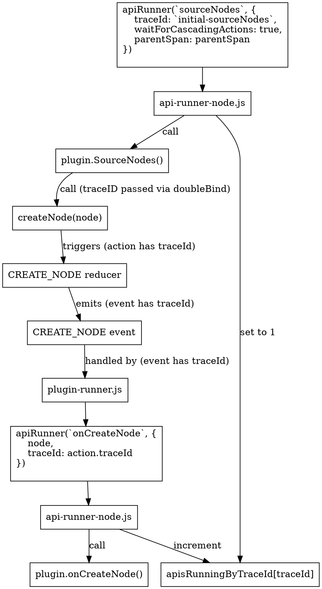

> This documentation isn't up to date with the latest version of Gatsby.
>
> - mention how multiple configurations are merged
> - the node creation flow in the diagram is no longer correct
> - `CREATE_NODE` and `onCreateNode` are handled differently than described
>
> You can help by making a PR to [update this documentation](https://github.com/gatsbyjs/gatsby/issues/14228).

For most sites, plugins take up the majority of the build time. So what's really happening when APIs are called?

_Note: this section only explains how `gatsby-node` plugins are run. Not browser or SSR plugins_

## Early in the build

Early in the bootstrap phase, you [load all the configured plugins](https://github.com/gatsbyjs/gatsby/blob/8029c6647ab38792bb0a7c135ab4b98ae70a2627/packages/gatsby/src/bootstrap/load-plugins/index.js#L40) (and internal plugins) for the site. These are saved into Redux under the `flattenedPlugins` namespace. Each plugin in Redux contains the following fields:

- **resolve**: absolute path to the plugin's directory
- **id**: String concatenation of 'Plugin ' and the name of the plugin. E.g. `Plugin query-runner`
- **name**: The name of the plugin. E.g. `query-runner`
- **version**: The version as per the package.json. Or if it is a site plugin, one is generated from the file's hash
- **pluginOptions**: Plugin options as specified in [gatsby-config.js](/docs/reference/config-files/gatsby-config/)
- **nodeAPIs**: A list of node APIs that this plugin implements. E.g. `[ 'sourceNodes', ...]`
- **browserAPIs**: List of browser APIs that this plugin implements
- **ssrAPIs**: List of SSR APIs that this plugin implements

In addition, you also create a lookup from API to the plugins that implement it and save this to Redux as `api-to-plugins`. This is implemented in [load-plugins/validate.js](https://github.com/gatsbyjs/gatsby/blob/8029c6647ab38792bb0a7c135ab4b98ae70a2627/packages/gatsby/src/bootstrap/load-plugins/validate.js#L106)

## apiRunInstance

Some API calls can take a while to finish. So every time an API is run, you create an object called [apiRunInstance](https://github.com/gatsbyjs/gatsby/blob/8029c6647ab38792bb0a7c135ab4b98ae70a2627/packages/gatsby/src/utils/api-runner-node.js#L179) to track it. It contains the following notable fields:

- **id**: Unique identifier generated based on type of API
- **api**: The API you're running. E.g. `onCreateNode`
- **args**: Any arguments passed to `api-runner-node`. E.g. a node object
- **pluginSource**: optional name of the plugin that initiated the original call
- **resolve**: promise resolve callback to be called when the API has finished running
- **startTime**: time that the API run was started
- **span**: opentracing span for tracing builds
- **traceId**: optional args.traceId provided if API will result in further API calls ([see below](#using-traceid-to-await-downstream-api-calls))

Immediately place this object into an `apisRunningById` Map, where you track its execution.

## Running each plugin

Next, filter all `flattenedPlugins` down to those that implement the API you're trying to run. For each plugin, you require its `gatsby-node.js` and call its exported API function. E.g. if API was `sourceNodes`, it would result in a call to `gatsbyNode['sourceNodes'](...apiCallargs)`.

## Injected arguments

API implementations are passed a variety of useful [actions](/docs/reference/config-files/actions/) and other interesting functions/objects. These arguments are [created](https://github.com/gatsbyjs/gatsby/blob/8029c6647ab38792bb0a7c135ab4b98ae70a2627/packages/gatsby/src/utils/api-runner-node.js#L94) each time a plugin is run for an API, which allows us to rebind actions with default information.

All actions take 3 arguments:

1. The core information required by the action. E.g. for [createNode](/docs/reference/config-files/actions/#createNode), you must pass a node
2. The plugin that is calling this action. E.g. `createNode` uses this to assign the owner of the new node
3. An object with misc action options:
   - `traceId`: [See below](#using-traceid-to-await-downstream-api-calls)
   - `parentSpan`: opentracing span (see [tracing docs](/docs/performance-tracing/))

Passing the plugin and action options on every single action call would be extremely painful for plugin/site authors. Since you know the plugin, `traceId` and `parentSpan` when you're running your API, you can rebind injected actions so these arguments are already provided. This is done in the [doubleBind](https://github.com/gatsbyjs/gatsby/blob/8029c6647ab38792bb0a7c135ab4b98ae70a2627/packages/gatsby/src/utils/api-runner-node.js#L14) step.

## Waiting for all plugins to run

Each plugin is run inside a [map-series](https://www.npmjs.com/package/map-series) promise, which allows them to be executed concurrently. Once all plugins have finished running, you remove them from [`apisRunningById`](https://github.com/gatsbyjs/gatsby/blob/8029c6647ab38792bb0a7c135ab4b98ae70a2627/packages/gatsby/src/utils/api-runner-node.js#L246) and fire a `API_RUNNING_QUEUE_EMPTY` event. This in turn, results in any dirty pages being recreated, as well as their queries. Finally, the results are returned.

## Using `traceId` to await downstream API calls

The majority of API calls result in one or more implementing plugins being called. You then wait for them all to complete, and return. But some plugins (e.g. [sourceNodes](/docs/reference/config-files/gatsby-node/#sourceNodes)) result in calls to actions that themselves call APIs. You need some way of tracing whether an API call originated from another API call, so that you can wait on all child calls to complete. The mechanism for this is the `traceId`.



1. The `traceId` is passed as an argument to the original API runner. E.g

   ```javascript
   apiRunner(`sourceNodes`, {
     traceId: `initial-sourceNodes`,
     waitForCascadingActions: true,
     parentSpan: parentSpan,
   })
   ```

2. You keep track of the number of API calls with this `traceId` in the [`apisRunningByTraceId`](https://github.com/gatsbyjs/gatsby/blob/8029c6647ab38792bb0a7c135ab4b98ae70a2627/packages/gatsby/src/utils/api-runner-node.js#L139) Map. On this first invocation, it will be set to `1`.

3. Using the action rebinding mentioned [above](#injected-arguments), the `traceId` is passed through to all action calls via the `actionOptions` object.

4. After reducing the Action, a global event is [emitted](https://github.com/gatsbyjs/gatsby/blob/8029c6647ab38792bb0a7c135ab4b98ae70a2627/packages/gatsby/src/redux/index.js#L93) which includes the action information

5. For the `CREATE_NODE` and `CREATE_PAGE` events, you need to call the `onCreateNode` and `onCreatePage` APIs respectively. The [plugin-runner](https://github.com/gatsbyjs/gatsby/blob/8029c6647ab38792bb0a7c135ab4b98ae70a2627/packages/gatsby/src/redux/plugin-runner.js) takes care of this. It also passes on the `traceId` from the Action back into the API call.

6. You're back in `api-runner-node.js` and can tie this new API call back to its original. So you increment the value of [`apisRunningByTraceId`](https://github.com/gatsbyjs/gatsby/blob/8029c6647ab38792bb0a7c135ab4b98ae70a2627/packages/gatsby/src/utils/api-runner-node.js#L218) for this `traceId`.

7. Now, whenever an API finishes running (when all its implementing plugins have finished), you decrement `apisRunningByTraceId[traceId]`. If the original API call included the `waitForCascadingActions` option, then you wait until `apisRunningByTraceId[traceId]` == 0 before resolving.
