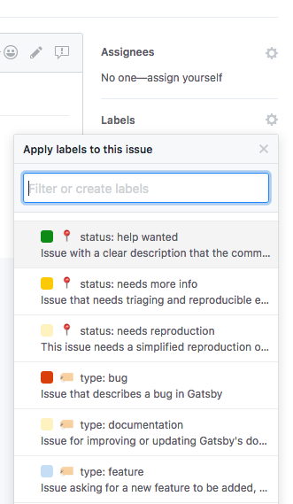

## What are issue labels?

Issue labels are a tool in GitHub that that is used to group issues into one or more categories.

[Check out Gatsby's labels (and their descriptions)](https://github.com/gatsbyjs/gatsby/issues/labels)

## Why label issues?

Gatsby is a very active project with many new issues opened each day. Labelling issues helps by identifying:

- good issues for new contributors to work on
- reported and confirmed bugs
- feature requests
- duplicate issues
- issues that are stalled or blocked

## Who can label issues?

Anyone who's a member of the [Gatsby Maintainers team](https://github.com/orgs/gatsbyjs/teams/maintainers) can label issues.

You can get an invite to the team by having a Pull Request merged into the Gatsby project. Check out the list of [`help wanted`](https://github.com/gatsbyjs/gatsby/labels/%F0%9F%93%8D%20status%3A%20help%20wanted) issues and the [How To Contribute Guide](/docs/how-to-contribute/) to get started.

**NOTE:** If you’ve already had a pull request merged and you have _not_ been invited to the maintainers team, please go to [the dashboard](https://store.gatsbyjs.org/account/dashboard) and request a discount code. You should get an invite to the team — _and you get free Gatsby swag!_ If that doesn’t work, please email team@gatsbyjs.com and we'll get you invited.

## How to label an issue

Ideally, every issue should have a single `type:` label applied to it. Optionally a `status:` label or other labels may also be applied.

Before continuing, get familiar with [Gatsby's issue labels and their descriptions](https://github.com/gatsbyjs/gatsby/issues/labels).

The broad steps to labelling an issue are:

- Read an issue
- Choose the labels that apply to that issue
- That's it - sit back and relax, maybe take a few moments to enjoy the satisfaction of a job well done

The rest of this document will describe how to choose the right labels for an issue.

### Find an issue that you're interested in

Start with [Gatsby's issues list](https://github.com/gatsbyjs/gatsby/issues) and scroll through until you see a recent one that strikes your interest. Alternatively, you can view the [list of unlabelled issues](https://github.com/gatsbyjs/gatsby/issues?q=is%3Aopen+is%3Aissue+no%3Alabel).

### Read the issue

Read the issue and any comments to understand what the issue is about.

### Choose one `type:` label

Choose a type label from the _labels_ dropdown to the right-hand side of the issue.

You can check through the [label descriptions](https://github.com/gatsbyjs/gatsby/issues/labels) for more information on each one.

The most common type of issue is `type: question or discussion`, typically you can apply this to issues that are open-ended or have no clear next step.

It's OK to change the type of an issue as more information becomes available. What starts as `type: question or discussion`, might later need to be changed to `type: bug`.

Changing labels is quick and easily reversible, so don't worry too much about applying a "wrong" label.

Choose an appropriate `type:` label and you're ready to move on to the next step.

### Choose a `status:` label (optional)

Check through the [`status:` labels (and their descriptions)](https://github.com/gatsbyjs/gatsby/issues/labels), if any apply to this issue add them as necessary.

Examples of applying `status:` labels might be:

- An issue that depends on an external dependency being changed could be labelled with `status: blocked`

- An issue with a clear description of how it can be resolved could be labelled `status: help wanted`.

- An issue that's missing information required to help the author could be labelled with `status: needs more info`

- An issue describing a bug without clear steps to reproduce could be labelled with `status: needs reproduction`

- An issue describing a bug where there are steps to reproduce the bug _and_ you've run the code locally and seen the error yourself can be labelled `status: confirmed`

### Choose any other labels

There are a few other labels that can sometimes be applied to an issue. Here are some more examples of when to use them:

- `good first issue` can be used when an issue is a small, clearly defined piece of work that could be completed by someone without in-depth knowledge of Gatsby and how it works. These issues are particularly suitable for people making their first open source contributions.

- `stale?` can be used on an issue where the author has not replied to requests for further information in at least 20 days.

### Finish

And you're done! You can call it a day or go back to the first step to label another issue.

## Conclusion

Labelling issues is a great way to help out on the Gatsby project regardless of your experience level.
