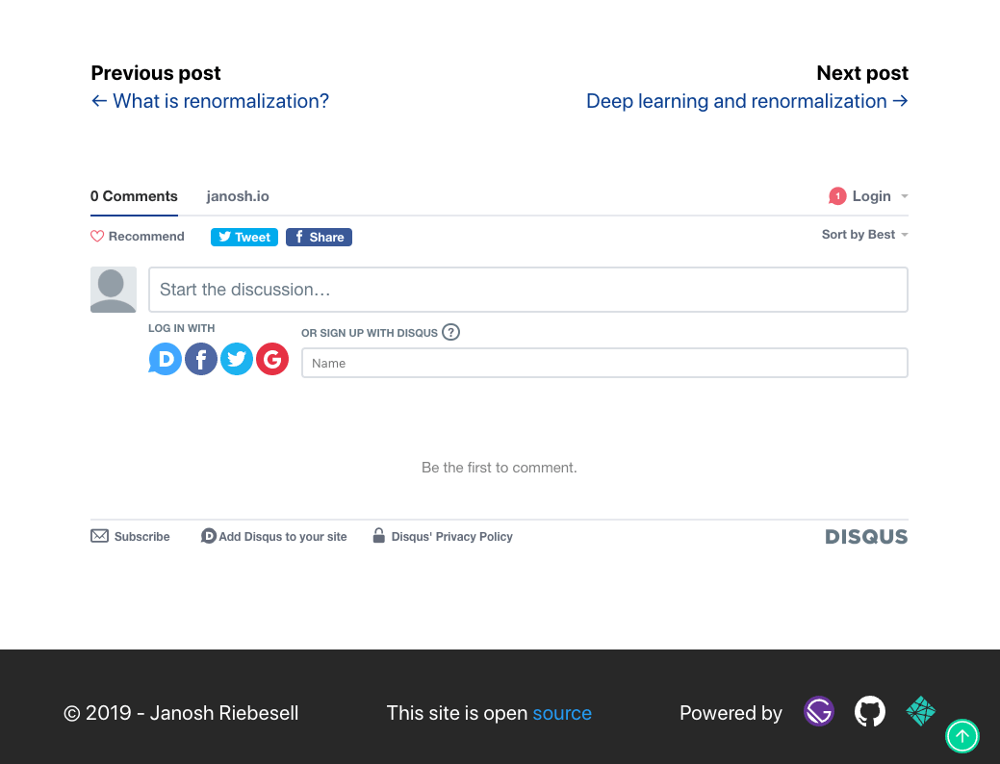

If you're using Gatsby to run a blog and you've started adding some content to it, the next thing to think about is how to increase engagement among your visitors. A great way to do that is to allow them to ask questions and express their views on what you've written. This will make your blog seem much more lively to anyone visiting it.

There are many options out there for adding comment functionality, several of them specifically targeted at static sites. While this list is by no means exhaustive, it does serve as a good starting point to illustrate what's available:

- [Disqus](https://disqus.com)
- [Commento](https://commento.io)
- [Facebook Comments](https://www.npmjs.com/package/react-facebook)
- [Fast Comments](https://fastcomments.com/)
- [Staticman](https://staticman.net)
- [TalkYard](https://www.talkyard.io)
- [Gitalk](https://gitalk.github.io)
- [Utterances](https://utteranc.es)

You can also [roll your own comment system](/blog/2019-08-27-roll-your-own-comment-system/), as Tania Rascia wrote on the Gatsby blog.

## Using Disqus for comments

In this guide, you'll learn how to implement Disqus on your blog as it has a number of nice features.

- It is low maintenance, meaning [moderating your comments and maintaining your forum](https://help.disqus.com/moderation/moderating-101) less hassle.
- It provides official [React support](https://github.com/disqus/disqus-react).
- It offers a [generous free tier](https://disqus.com/pricing).
- It [seems to be by far the most widely used service](https://www.datanyze.com/market-share/comment-systems/disqus-market-share).
- It’s easier to comment: Disqus has a large existing user base and the onboarding experience for new users is fast. You can register with your Google, Facebook or Twitter account and users can more seamlessly share the comments they write through those channels.
- The Disqus UI has a distinct but unobtrusive look that many users will recognize and trust.
- All Disqus components are lazy-loaded, meaning they won't negatively impact the load time of your posts.

Bear in mind, however, that choosing Disqus also incurs a tradeoff. Your site is no longer entirely static but depends on an external platform to deliver your comments through embedded `iframe`s on the fly. Moreover, you should consider the privacy implications of letting a third party store your visitors' comments and potentially track their browsing behavior. You may consult the [Disqus privacy policy](https://help.disqus.com/terms-and-policies/disqus-privacy-policy), the [privacy FAQs](https://help.disqus.com/terms-and-policies/privacy-faq) (specifically the last question on GDPR compliance) and inform your users [how to edit their data sharing settings](https://help.disqus.com/terms-and-policies/how-to-edit-your-data-sharing-settings).

If these concerns outweigh the benefits of Disqus, you may want to look into some of the other options above. We welcome pull requests to expand this guide with setup instructions for other services.

## Implementing Disqus

Here are the steps for adding Disqus comments to your own blog:

1. [Sign-up to Disqus](https://disqus.com/profile/signup). During the process you'll have to choose a shortname for your site. This is how Disqus will identify comments coming from your site. Copy that for later.
2. Install the Disqus React package

```shell
npm install disqus-react
```

3. Add the shortname from step 1 as something like `GATSBY_DISQUS_NAME` to your `.env` and `.env.example` files so that people forking your repo will know that they need to supply this value to get comments to work. (You need to prefix the environment variable with `GATSBY_` in order to [make it available to client-side code](/docs/how-to/local-development/environment-variables/#client-side-javascript).)

```text:title=.env.example
# enables Disqus comments for blog posts
GATSBY_DISQUS_NAME=insertValue
```

```text:title=.env
GATSBY_DISQUS_NAME=yourSiteShortname
```

4. In your blog post template (usually `src/templates/post.js`) import the `DiscussionEmbed` component.

```js:title=src/templates/post.js
import React from "react"
import { graphql } from "gatsby"
// highlight-next-line
import { DiscussionEmbed } from "disqus-react"
```

Then define your Disqus configuration object

```js
const disqusConfig = {
  shortname: process.env.GATSBY_DISQUS_NAME,
  config: { identifier: slug, title },
}
```

Where `identifier` must be a string or number that uniquely identifies the post. It could be the post's slug, title or some ID. Finally, add `DiscussionEmbed` to the JSX of your post template.

```jsx:title=src/templates/post.js
return (
  <Global>
    <PageBody>
      {/* highlight-next-line */}
      <DiscussionEmbed {...disqusConfig} />
    </PageBody>
  </Global>
)
```

And you're done. You should now see the Disqus comment form appear beneath your blog post [looking like this](https://janosh.io/blog/disqus-comments#disqus_thread). Happy blogging!

[](https://janosh.io/blog/disqus-comments#disqus_thread)
