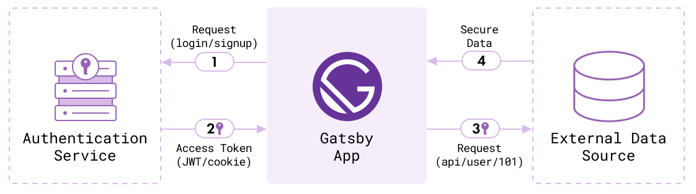

Many sites require users to be authenticated in order to protect private data.

## Understanding authentication between client and server

In many modern websites, the [client](/docs/glossary#client-side) -- or [frontend](/docs/glossary#frontend) -- is [decoupled](/docs/glossary#decoupled) from the [backend](/docs/glossary#backend). This pattern is how Gatsby functions to combine data from a myriad of backend sources to facilitate building the frontend.

In order to provide authentication functionality, another service has to be leveraged and connected to Gatsby. There are many open source technologies than can provide this functionality. Examples include:

- A Node.js app using Passport.js
- A Ruby on Rails API using Devise

Another option are third party technologies like:

- Firebase
- Auth0
- AWS Amplify
- Netlify Identity

These tools follow a process in order to verify a user on the client against an authentication service. The service returns a token that the client can use to access protected data. This diagram visualizes the process:



1. First, a request is made from a Gatsby site (the client) to an authentication service to perform an action like register a new user or login.

2. If the credentials (like a username and password) provided from the client match a user in the authentication service, it returns a token (like a JSON Web Token, abbreviated as JWT) so the user has a key they can use to prove they are who they say they are. The user data returned can be stored in the Gatsby app by passing it to components using a Provider component with the React Context API and [`wrapRootElement` API](/docs/reference/config-files/gatsby-browser/#wrapRootElement) from Gatsby.

3. With the key, the client can make a request to an external data source like an API (the server) where protected data is stored. The key is unique to a specific user and allows the client to access their specific data.

4. The server returns data back to the client that it can use to pass information into components.

_**Note**: this is the same pattern that other sites built with React (like Create React App) would need to follow._

## Implementing authentication in a Gatsby site

There are a few things to be aware of when implementing authentication in a Gatsby site, because of how Gatsby uniquely builds pages and renders static assets with dynamic capabilities.

### Setting up client-only routes

With Gatsby, you are able to create restricted areas in your app using [client-only routes](/docs/building-apps-with-gatsby/#client-only-routes).

Gatsby is a little [different from a traditional React app](/docs/adding-app-and-website-functionality/#differences-between-gatsby-and-other-react-apps) in how its routes and pages are created. Because static HTML files generated by Gatsby sit on a file server, you cannot programmatically control access to those files (for example: a user could guess or type in a URL and navigate straight to the page). As the [section from the Adding App and Website functionality](/docs/adding-app-and-website-functionality/#client-only-routes) overview page demonstrates, client-only routes can be created to route a user between pages using a React-based router, as opposed to navigating between different static HTML files on a server.

Taking advantage of this client-side routing allows you to protect or customize your routes. Using the [`@reach/router` library](https://reach.tech/router/), which comes installed with Gatsby, you can set up a router on a page and control which component loads when a certain route is called, and check for the existence of a variable like authentication state before serving the content.

<!-- prettier-ignore -->
```jsx
<Router>
  {isAuthenticated ? <PrivateRoute /> : <Login />}
</Router>
```

More specific code examples for this pattern are outlined in the [Client-only Routes & User Authentication guide](/docs/how-to/routing/client-only-routes-and-user-authentication/#implementing-client-only-routes).

### Protecting code from accessing browser globals during build

Global objects that are accessible in the browser like `localStorage` aren't available while a Gatsby site is building, because the build runs in a Node.js environment.

However, some third party services might try and access `localStorage` or the `window` object with internal methods. To keep those snippets from breaking the build, those invocations should be wrapped in checks or `useEffect` hooks to verify that the code is running in the browser and is skipped during the build process:

```javascript
import app from "firebase/app"

...

if (typeof window !== 'undefined') { // highlight-line
  app.initializeApp(config)
} // highlight-line
```

More information on build related errors is available in the guide on [debugging HTML builds](/docs/debugging-html-builds/).

## Real-world example: Gatsby store

The [Gatsby store](https://github.com/gatsbyjs/store.gatsbyjs.org) is a live application built with Gatsby that implements authentication using Auth0.

[Util functions](https://github.com/gatsbyjs/store.gatsbyjs.org/blob/master/src/utils/auth.js) in the Gatsby Store repo make use of Auth0's APIs to authenticate users with GitHub, and wrap Auth0's APIs to check that [some of the Auth0 code runs only in the browser](https://github.com/gatsbyjs/store.gatsbyjs.org/blob/master/src/utils/auth.js#L3).

In order to protect authenticated content with a private route, a `<Router />` is implemented in the `<PrivateRoute />` component that checks whether a user is authenticated or reroutes them to `/login`.

```jsx
// import ...
const PrivateRoute = ({ component: Component, ...rest }) => {
  if (
    !isAuthenticated() &&
    isBrowser &&
    window.location.pathname !== `/login`
  ) {
    // If we’re not logged in, redirect to the home page.
    navigate(`/app/login`)
    return null
  }

  return (
    <Router>
      <Component {...rest} />
    </Router>
  )
}
```

This private route pattern is also covered in the [tutorial on making a site with authentication](/tutorial/authentication-tutorial/#controlling-private-routes).

## Further reading

If you want more information about authenticated areas with Gatsby, this (non-exhaustive list) may help:

- [Making a site with user authentication](/tutorial/authentication-tutorial), an advanced Gatsby tutorial
- [Gatsby repo "simple auth" example](https://github.com/gatsbyjs/gatsby/tree/master/examples/simple-auth)
- [Live version of the "simple auth" example](https://simple-auth.netlify.app/)
- [A Gatsby email _application_](https://github.com/DSchau/gatsby-mail), using React Context API to handle authentication
- [Add Authentication to your Gatsby apps with Auth0](/blog/2019-03-21-add-auth0-to-gatsby-livestream/) (livestream with Jason Lengstorf)
- [Add Authentication to your Gatsby apps with Okta](https://www.youtube.com/watch?v=7b1iKuFWVSw&t=9s)
- [Other authentication-related posts on the Gatsby blog](/blog/tags/authentication/)
