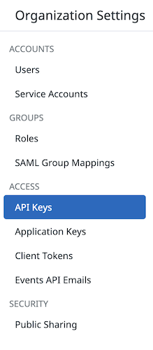
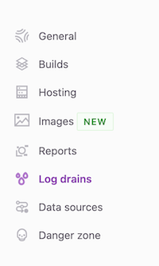
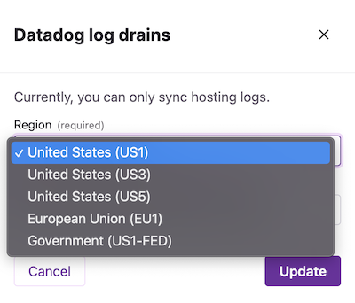
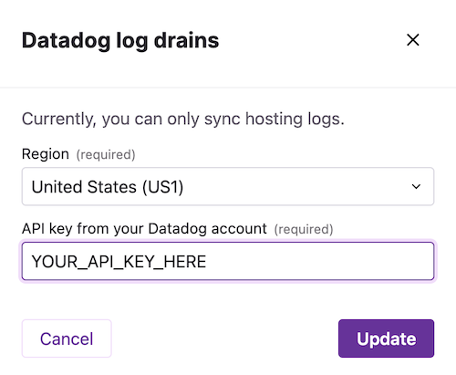

## Introduction

Gatsby Cloud can deliver hosting logs to the 3rd party services (currently only [DataDog](https://www.datadoghq.com/)), which allows developers and marketers to review server side analytics, and accelerate the troubleshooting process when hosting layer errors occur.

## Prerequisites

- The Log Drains feature is limited to enterprise plans in Gatsby Cloud, therefore this feature will only appear within site settings for sites within enterprise plans.
- You must have an account with DataDog. Currently, Gatsby Cloud only supports integration with DataDog, but will introduce additional logging targets based on customer demand in the future.

## Directions

### Enable log drains

1. [Log in](https://app.datadoghq.com/account/login) to your DataDog account
1. [Add a new API Key](https://docs.datadoghq.com/account_management/api-app-keys/#add-an-api-key-or-client-token), giving it a name that will help you remember that this key is used for receiving logs from Gatsby Cloud.

   **Notes**:

   - If you’re enabling Log Drains for multiple Gatsby Cloud sites, we recommend that you create a separate `API Key` for each Gatsby Cloud site.
   - Be sure you create an `API Key` in DataDog, not an Application Key.  
     

1. Copy the newly-created `API Key`
1. Take note of the region (["SITE" in DataDog terminology](https://docs.datadoghq.com/getting_started/site/#pagetitle)) for your DataDog account.

   **Note**: Your DataDog region may appear as the subdomain when logged into DataDog

1. [Log in](/dashboard/login) to Gatsby Cloud
1. Select the site whose logs you’d like to integrate with DataDog
1. Access "Site Settings" for that site
1. Select "Log Drains" in the left navigation  
   

   **Note**: If you do not see Log Drains, then the selected site is not likely within an enterprise plan. [Contact us](/support/) if you have any questions.

1. Click Connect  
   
1. Select the appropriate region for your DataDog instance  
   
1. In DataDog, this is the value for [Site](https://docs.datadoghq.com/getting_started/site/#pagetitle)
1. Enter the `API Key` you created in DataDog from step 3  
   
1. Click Connect
1. You will see a confirmation that DataDog is now connected  
   
1. View the [Live Tail](https://app.datadoghq.com/logs/livetail) for this Gatsby site’s logs in your DataDog account to confirm that you’re now receiving logs from Gatsby Cloud

   **Note**: It can take up to 10 minutes for your initial set of logs to appear

### Modify log drains

1. Access your site’s "Site Settings" in Gatsby Cloud
1. Navigate to "Log Drains" in the left-hand navigation
1. Click the ellipsis for Log Drains to expose the actions menu
1. Click Edit
1. Update the settings accordingly
1. Click Save

### Disconnect log drains

1. Access your site’s "Site Settings" in Gatsby Cloud
1. Navigate to "Log Drains" in the left-hand navigation
1. Click the ellipsis for Log Drains to expose the actions menu
1. Click Delete
1. Confirm Deletion of this configuration
1. Confirm that you are no longer receiving logs for this site via [Live Tail](https://app.datadoghq.com/logs/livetail) in DataDog

## Troubleshooting

- After selecting the region and specifying my `API Key`, I receive an error upon clicking Connect from Gatsby Cloud
  - Confirm that you’ve entered the DataDog `API Key` properly
  - Confirm that you’ve selected the appropriate Region in Step 10
  - If all of these are correct, please [Contact us](/support/)
- It’s been more than 10 minutes, and I still don’t see any logs in DataDog. What now?
  - Confirm that the corresponding site in Gatsby Cloud has indeed received visitor traffic historically
  - Visit the corresponding site in Gatsby Cloud yourself to ensure activities within the next drain interval and wait another 10 minutes to confirm events via [Live Tail](https://app.datadoghq.com/logs/livetail)
  - If you still see no traffic in DataDog Live Tail, please [Contact us](/support/)
