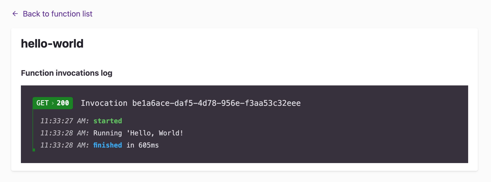
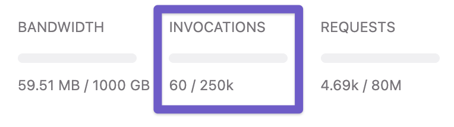

## Introduction

The Gatsby framework now supports general access to serverless functions in local development as well as in Gatsby Cloud. These [express](https://expressjs.com/)-style functions allow Gatsby developers to build out secure, scalable APIs alongside their Gatsby projects.

### Prerequisites

Functions are a Gatsby core feature and are not specific to Gatsby Cloud. To learn more about how to implement functions in the Gatsby framework, check out the [Reference guide](/docs/reference/functions/).

### Routing in Gatsby Cloud

Functions that are included in a Gatsby project and deployed on Gatsby cloud are available at any build URL. This includes any preview URLs (`gstb.io` domain) or hosting URLs (`gatsbyjs.io` or your custom domain).

```javascript:title=src/api/hello-world.js
const sample = (req, res) => {
    res.status(200).json({"message": "Hello, World!"})
};

export default sample;
```

### Environment variables

Functions will have access to any environment variables that you’ve added to either the production or preview environments in Gatsby Cloud.


```javascript:title=src/api/hello-world.js
const sample = (req, res) => {
  let key = process.env.SAMPLE_VAR;
  //run code that uses key

  res.status(200).json({ message: "Hello, World!" });
};

export default sample;
```

### Setting cache headers for functions

Users can set custom headers to control cache settings to ensure that function invocations are appropriately handled when served to [CDN](/docs/glossary/content-delivery-network/) users. Any cache-header setting that users add to their function will be passed through and respected on the CDN:

```javascript:title=src/api/hello-world.js
const sample = (req, res) => {
  res.setHeader(`Cache-Control`, `public, max-age=60`);
  res.status(200).json({ message: "Hello, World!" });
};

export default sample;
```

### Accessing logs for functions

You can access function logs by viewing the build details for the CMS Preview, Pull Request Build, or Production build. See the [Build Logs](/docs/reference/cloud/build-logs) article for more information on accessing build details.



### Tracking invocation counts

Like the bandwidth and request tracking in Gatsby Cloud, users can track their invocation count across all their Gatsby sites on any workspace landing page as well as site-specific usage on any site page.

Additionally, users can view function-specific invocation counts in the function logs of the build details for any build that implements that function. See the [Platform Limits](/docs/reference/cloud/platform-limits) article for information on function invocation limits.


