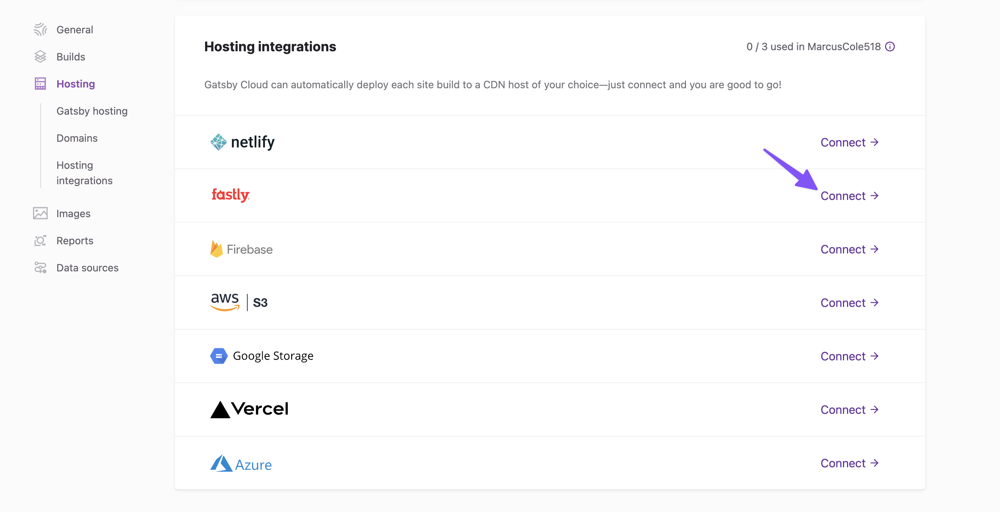

Gatsby Cloud is a performant cloud infrastructure for building your Gatsby site. Even better, it integrates with Content Delivery Networks (CDNs) like [Fastly](https://www.fastly.com/), so you can build and deploy your site seamlessly.

## Prerequisites

This guide assumes you already have:

- A Fastly account
- A site created on Gatsby Cloud

You can use either of the following site creation options if you don't have one already:

- [Create a Site from a Template](/docs/how-to/cloud/create-site-from-template)
- [Create a Site from a Repository](/docs/how-to/cloud/create-site-from-repository)

## Setting up a hosting integration

Once your site is available inside Gatsby Cloud, you can navigate to the "Site Settings" tab.

Inside the "Site Settings" select **"Hosting"** and scroll down to the Fastly logo. Click the **"Connect"** button to the right of that logo:

## Creating a deployment target

Gatsby Cloud autoconfigures Fastly for you; all it needs is an API Token!

To generate the token, you need to create a Fastly account. Once authenticated, navigate to your **"Account"**. Under your "Personal Profile" select **"Personal API Tokens"** and press the **"Create Token"** button.

For Service Access, specify the service you want the API token to be able to control or "All Services." For Scope, specify **"Global API access."** Global API access is necessary because our Fastly integration needs this to write custom VCL.

Once you create the token, be sure to copy it down as Fastly will not provide it to you again.

On the "Fastly Integration" screen, you'll be prompted for four pieces of information. Other than the API Token, these items do not need to be pre-configured in Fastly. Gatsby Cloud will create and configure the deployment target for you.

- API Token: This is what you previously created inside Fastly.
- Service Name: Choose whichever name you like so long as it does not conflict with existing Fastly services under your account.
- Hostname: This should match your intended domain name.
- Force TLS/SSL: Use this setting to enable your deployed site to force TLS/SSL. This is off by default.

Wait for your build to complete. If you navigate to your Fastly dashboard, you should see the new service. Note that you may need to refresh the page first. Your service should now be configured with a Host and Domain, and it will be Active.

Navigate to your new Fastly service by clicking on the “version” linked from the dashboard. On this screen, it will list your domains; notice the “Test domain” button. Click on this to view your site. If you’re ready to route traffic to your site, [configure your DNS settings in Fastly](https://docs.fastly.com/en/guides/adding-cname-records#updating-the-cname-record-with-your-dns-provider).

## Setting up HTTPS

You may also want to configure HTTPS for your site. You can follow the instructions provided by Fastly to set this up. This step requires Fastly to verify your domain ownership and may take up to an hour. This requires a paid Fastly account.

Once the certificate is generated, you’ll need to [configure your DNS records to serve HTTPS traffic](https://docs.fastly.com/en/guides/serving-https-traffic-using-fastly-managed-certificates#pointing-dns-to-serve-https-traffic).

HTTPS Configuration is considered separate from your Service configuration and therefore is not subject to the [overwrite rules](https://support.gatsbyjs.com/hc/en-us/articles/360053098873-Deploying-to-Fastly#i-want-to-configure-additional-settings-inside-fastly-can-i-do-that).

## Finishing Up

And that’s it! Your site is now set up to build and deploy. Gatsby Cloud will handle everything for you. Note that you can only have one hosting integration. If you choose to configure another provider, that will override your existing Fastly integration. A few things to note:

- Fastly limits users to 10 services. If your Gatsby Cloud integration sends you over that limit it will not appear in Fastly.
- At this time the configuration is reset each time your site is built. Additional custom configurations inside Fastly will be overridden.
