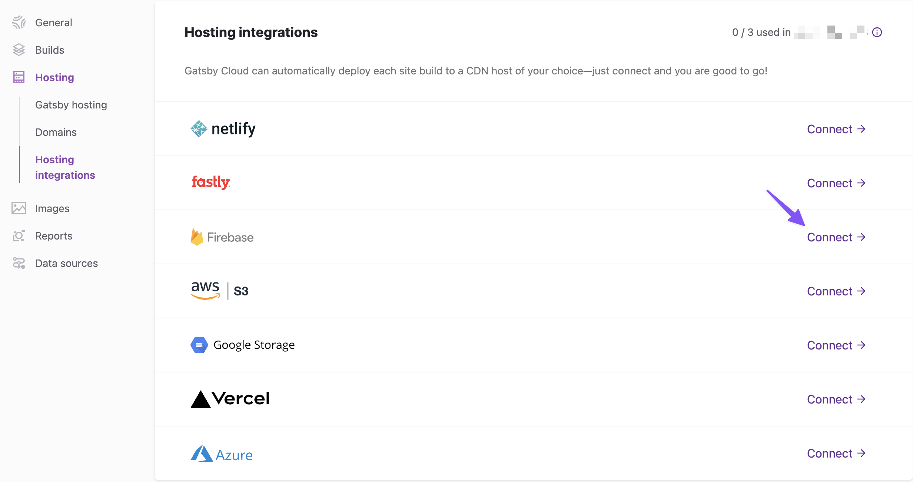

## Introduction

Gatsby Cloud is a performant platform for building your Gatsby site. Even better, it integrates with Content Delivery Networks (CDNs) like [Firebase](https://firebase.google.com/) so you can build and deploy your site seamlessly.

## Prerequisites

This guide assumes you already:

- Have a Firebase account.
- Have a Gatsby Cloud site created.

You can use either of the following site creation options if you don't have one already:

- [Create a Site from a Template](/docs/how-to/cloud/create-site-from-template)
- [Create a Site from a Repository](/docs/how-to/cloud/create-site-from-repository)

## Setting up a hosting integration

Once your site is available inside Gatsby Cloud, navigate to the "Site Settings" tab.

Inside "Site Settings," select **"Hosting > Hosting integrations."** Here you'll see Firebase listed among the other available hosting providers.



Click **“Connect”** to the right of the Firebase logo, and you’ll be prompted to login into your Firebase account. If you don’t have one, you can create one now.

Once you’re authenticated with Firebase, you’ll be prompted to authorize Gatsby Cloud to interact with Firebase on your behalf. After you’ve completed this step, you’re ready to configure deployment in Gatsby Cloud.

### Connect with a Firebase project

If you don’t already have one, create a Firebase project in your [Firebase console](https://console.firebase.google.com/).

On the “Firebase Integration” screen choose a Firebase project for deployment from the dropdown. Note that you can enter a Firebase site name for projects with multiple sites.

### Configuration with Firebase

Firebase allows you to configure customized hosting behavior such as redirects, headers, cache settings, and which files to deploy. You can define these behaviors in a `firebase.json` file. See [Deploying to Firebase](/docs/how-to/previews-deploys-hosting/deploying-to-firebase/) for the Gatsby recommended caching settings.

In order for Gatsby Cloud to use these settings for your Firebase hosting, you’ll need to make sure that your `firebase.json` file ends up in your `/public` directory when your build is complete.

One way you can accomplish this is by adding the following code to your `gatsby-node.js` file:

```javascript:title=gatsby-node.js
const fs = require("fs");
exports.onPostBuild = () => {
  fs.copyFile(`./firebase.json`, `./public/firebase.json`, (err) => {
    if (err) {
      throw err;
    }
  });
};
```

Please see the [Firebase Hosting Configuration](https://firebase.google.com/docs/hosting/full-config) documentation for more deployment customization options.

## Finishing Up

And that’s it! Your site is now set up to build and deploy. Gatsby Cloud will handle everything for you. However, if you want to make a change to your domain, you’ll want to do that directly on the Firebase dashboard.

Note that you can only have one hosting integration. If you choose to configure another provider, that will override your existing Firebase integration.
