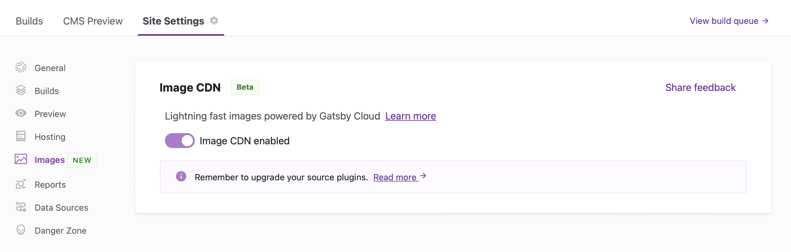

Before continuing, make sure you understand [What is Image CDN](/docs/reference/cloud/image-cdn/). Also, note that Image CDN only works on sites hosted on Gatsby cloud and doesn't work with other [hosting integrations](https://support.gatsbyjs.com/hc/en-us/articles/1500000907821-Hosting-and-Data-Source-Integrations).

## 1. Enable Image CDN

Image CDN is enabled per site on Gatsby Cloud. Go to Site Settings → Images → Enable Image CDN.



## 2. Upgrade packages

Image CDN requires the latest Gatsby 4 version. Upgrade core dependencies:

```shell
npm install gatsby@latest gatsby-plugin-image@latest gatsby-plugin-sharp@latest gatsby-transformer-sharp@latest
```

## 3. Upgrade source plugins

Upgrade supported source plugins to the latest tag. Source plugins currently supported:

```shell
gatsby-source-contentful@^7.8.0
gatsby-source-wordpress@^6.10.0
gatsby-source-sanity@^7.4.0
```

## 4. Migrate to gatsbyImage field

gatsbyImage replaces gatsbyImageData. gatsbyImage is compatible whether or not you’re using Image CDN and is the new field for using Gatsby-powered images.

If your site didn’t use gatsbyImageData previously, check the docs on Gatsby Image here. gatsbyImage works similarly to gatsbyImageData (using the <GatsbyImage /> React component). The only differences are in the GraphQL arguments - some gatsbyImageData arguments may not be supported in gatsbyImage.

Notable differences between gatsbyImage and gatsbyImageData:

- In `gatsbyImage` a `width` or `height` argument is now required.
- `TRACED_SVG` isn’t not currently supported as a placeholder for `gatsbyImage`
- Using Image CDN varies by CMS. Make sure to [review per-CMS instructions for using Image CDN](https://support.gatsbyjs.com/hc/en-us/articles/4522338898579).

## 5. Commit and push

Push these code changes to your site. This code update should trigger a new build and then Image CDN will be enabled for your site once the build completes.

To verify Image CDN is working, your images should be served from a relative URL similar to below:

```
\_gatsby/image/aHR0cHM6Ly9pbWFnZXMuY3RmYXNzZXRzLm5ldC92NnVlNGdyZ2ZhN2IvNE56d0RTRGxHRUNHSWlva0tvbXN5SS9kOTY0ODFhNzBmZjU4NGQxNzViY2I5YWVmMTJjNjRkYi9kZW55cy1uZXZvemhhaS0xMDA2OTUuanBn/dz03NTAmaD0zNzUmZm09anBnJnE9NzU=/denys-nevozhai-100695.jpg
```
