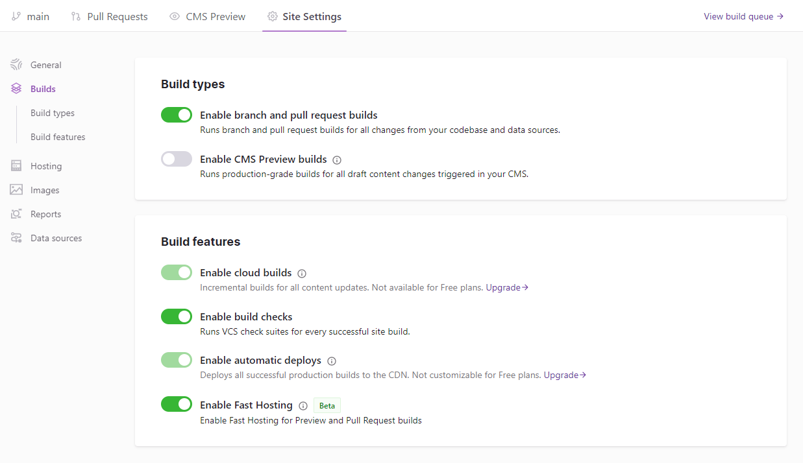

Fast Hosting (as signalled by a `gatsbyjs.io` domain) is enabled by default on production builds.

## Benefits

Fast Hosting on Gatsby Cloud provides several benefits to your site:

- More accurate Lighthouse reports
- Faster initial page loads (as well as being on a CDN)
- Better route caching for browser speed
- Unlimited redirects
- Reverse proxy behavior

## Enable Fast Hosting for All Builds

Fast Hosting for all builds (including Pull Requests and Previews) is currently available behind a toggle in the "Build feautres" section of the Gatsby Cloud dashboard.

Enable the "Fast Hosting" checkbox in Gatsby Cloud to take advantage of these benefits!
