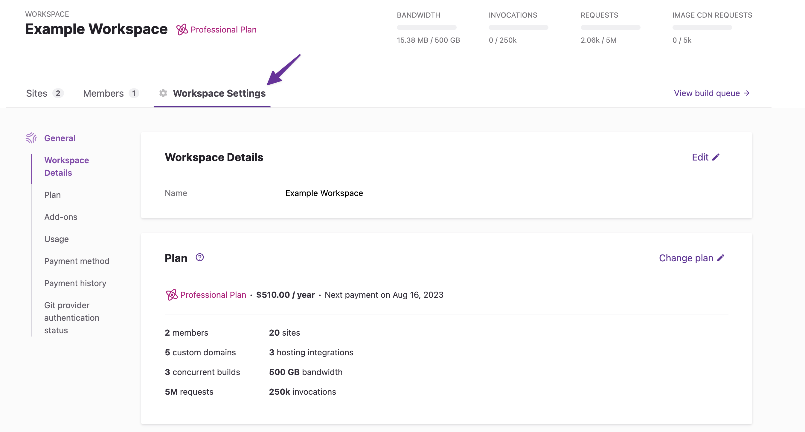
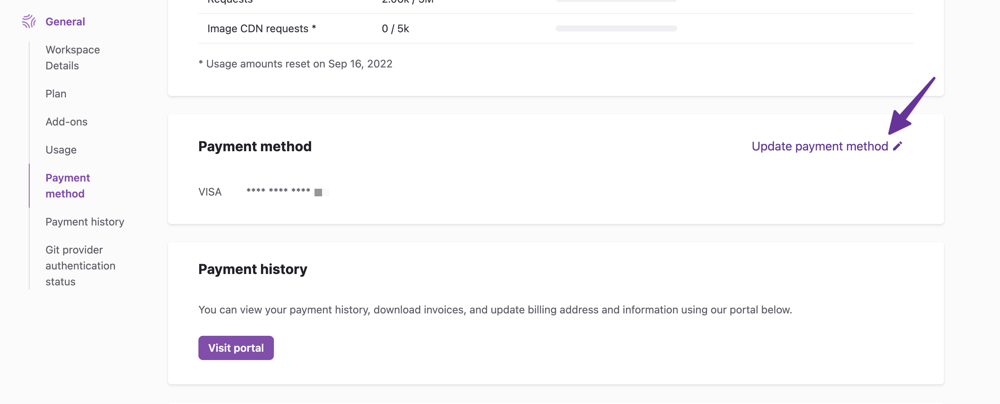
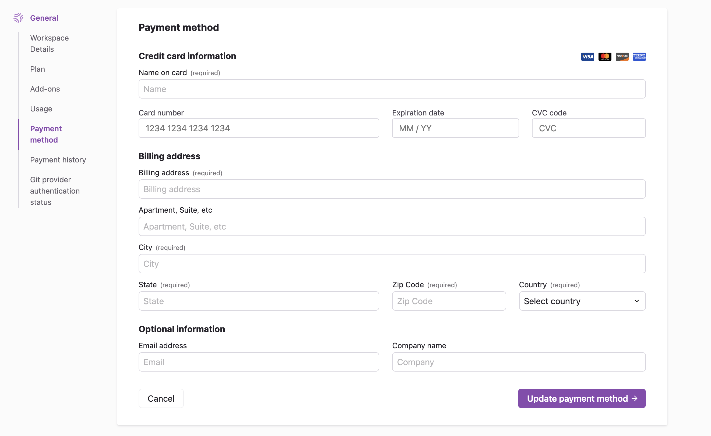
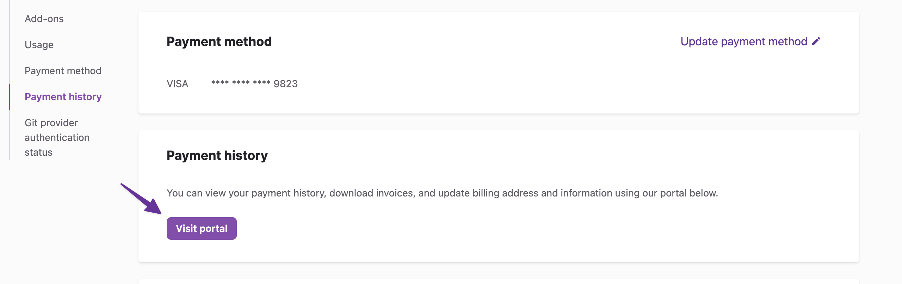
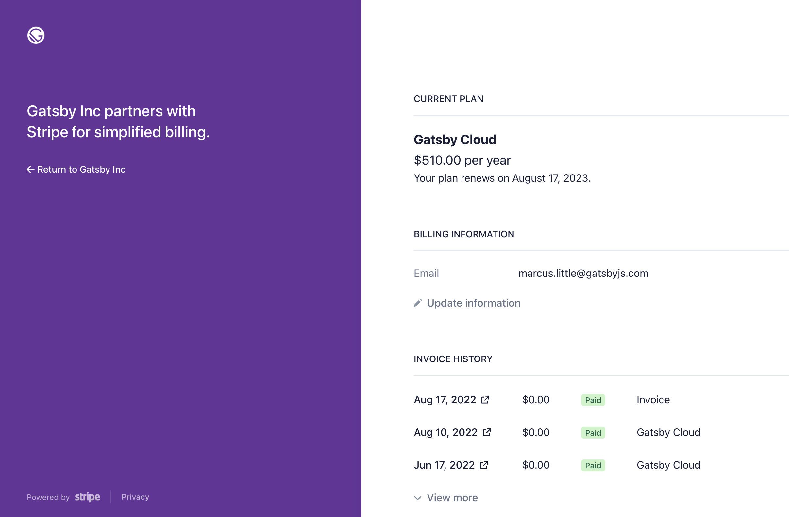
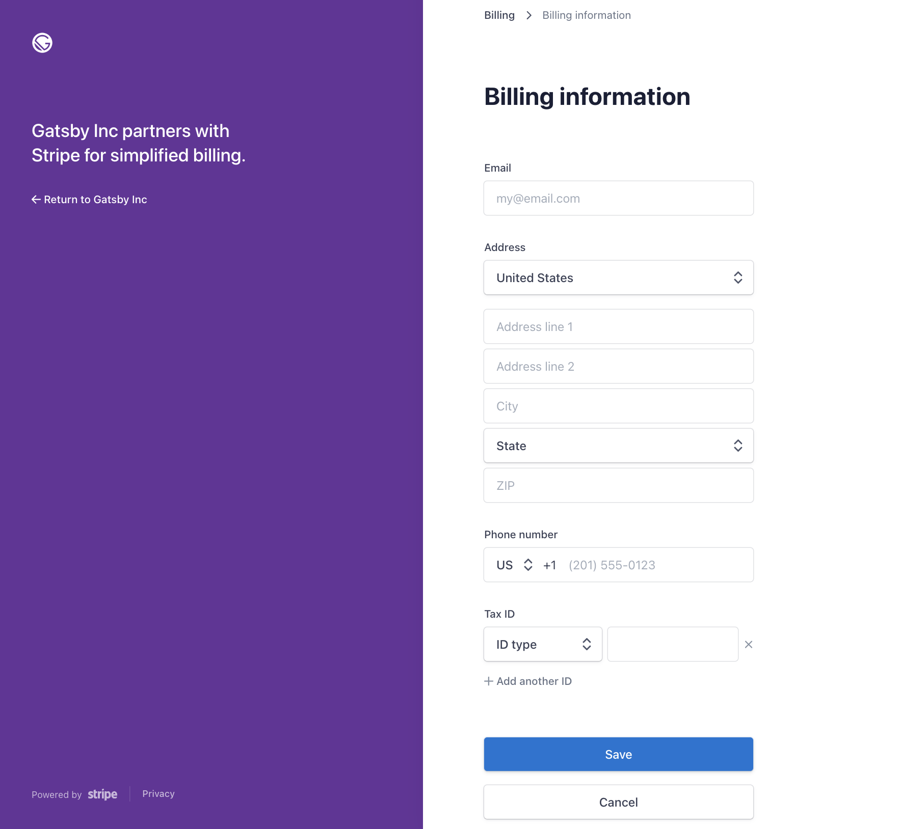
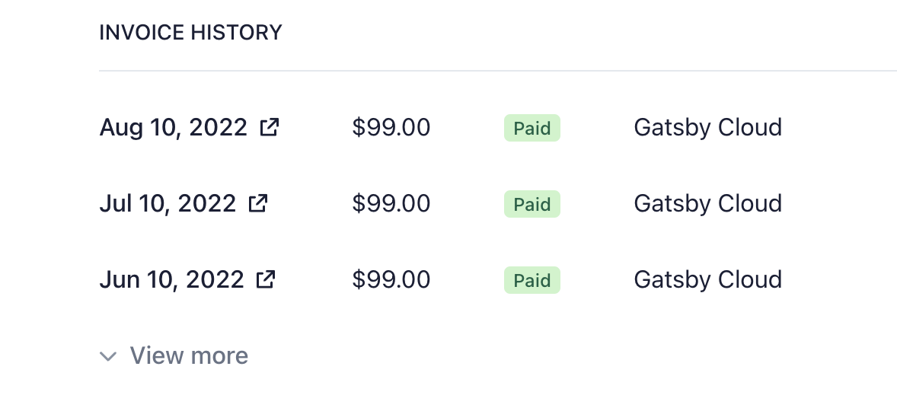
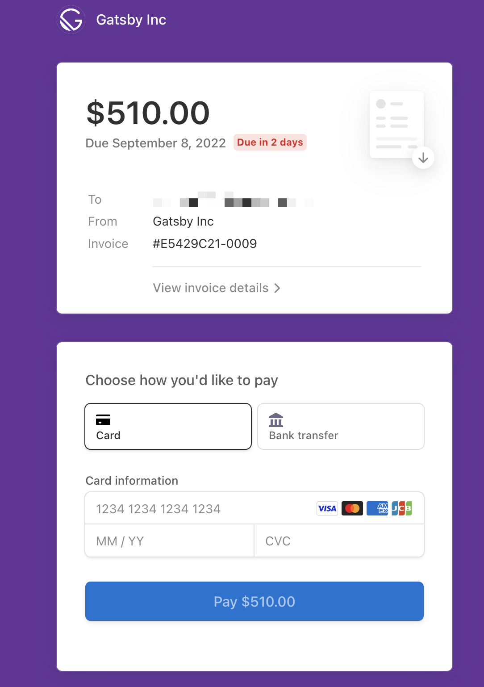

You can manage invoices and payments for your organization directly from the organization dashboard. This includes:

- Updating your payment method (for subscriptions paid by card only).
- Viewing your billing portal (to edit billing info and review history).

To access these options, navigate to **"Workspace Settings."**

## Update your payment information

Under the "Payment method" section, select **"Update payment method."**

Next, enter your card information and click the **"Update payment method"** button to complete your changes.

## View your billing portal

From your billing portal, you can access everything related to your subscription. To view the billing portal, click the **"Visit Portal"** button under "Payment history".

The portal allows you to:

1. Update billing information such as your email, address, phone, tax ID, etc.
1. View and download recent invoices and receipts.
1. Pay open invoices manually.

### Update billing information

To update billing information, select **"Update information"**. From there you can enter your information, then click **"Save"** to confirm the changes.

### View your invoice history

Under the "Invoice History" section, you can select the date for the invoice to view it. Open invoices will be labeled as "Open". Older invoices can be retrieved by clicking **"View more"**.

### Pay open invoices

When viewing an invoice, a separate window will open where you can pay (if unpaid). **"Click View invoice"** details to view details. Click the document icon to download the invoice.

After an invoice is paid, you'll be able to download a receipt.
