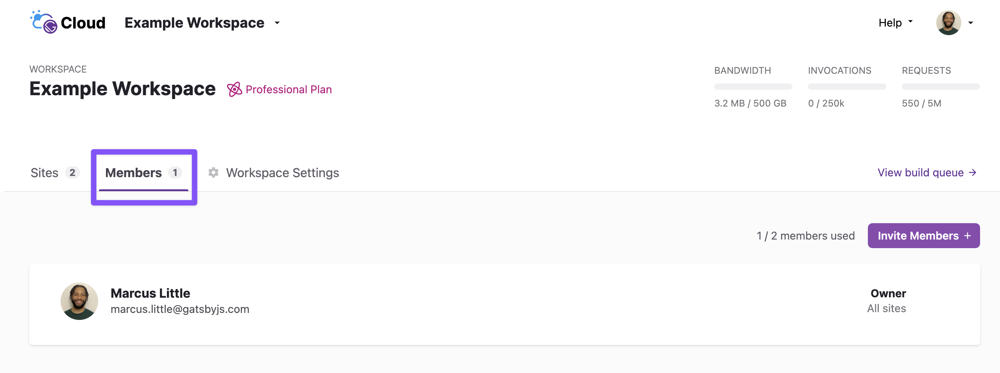
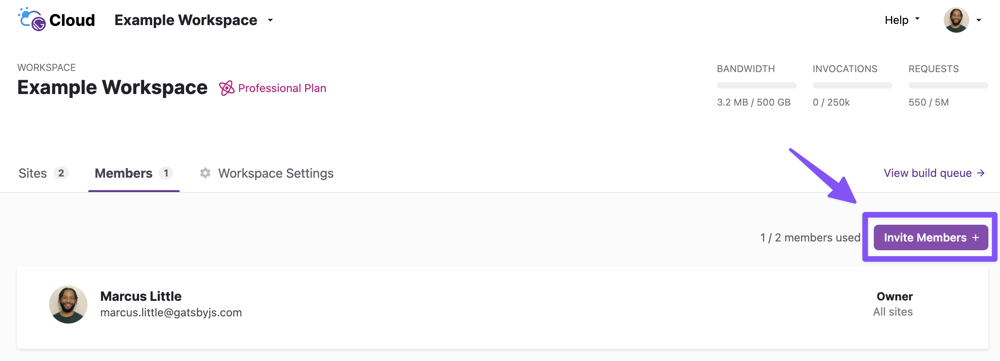
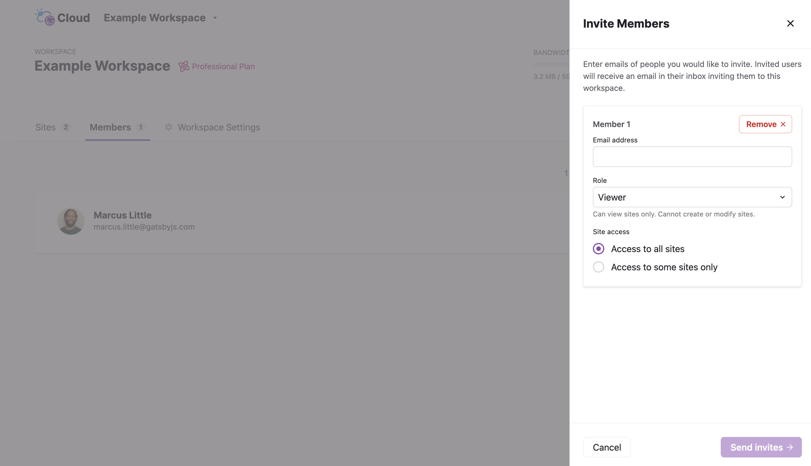
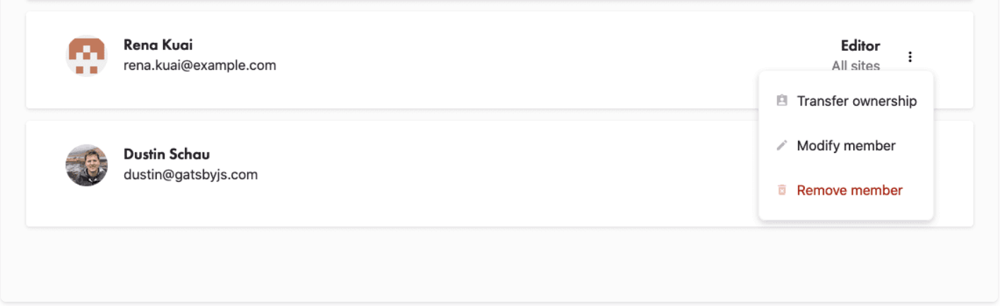

There are four possible roles a user can have on Gatsby Cloud:

1. "Owner" - The person who created the Workspace on Gatsby Cloud is the Owner. An Owner can edit the Workspace, manage billing, and invite/manage Members.
1. "Admin" - An admin can edit the Workspace, manage billing, and invite / manage Members.
1. "Editor" - An Editor can create, view, and modify sites. They cannot manage billing or other Members.
1. "Viewer" - A Viewer can only view sites. They cannot create or modify sites.

## Managing Members in a Workspace

Owners can use the Workspace’s “Members” tab to invite a Member to the Workspace, resend an invitation, cancel an invitation, or delete a Member from the Workspace.

## Inviting new Members to your Workspace

To invite a new Member to a Workspace, click the **“Add Members”** button from the “Members” tab in a Workspace.

Once opened, enter the email address of the person you’d like to invite to your Workspace. Then, choose their role in the Workspace and what sites they should have access to.

Once you invite a new Member to a Workspace, they’ll receive an email with a link to log in or create an account to join the Workspace.

## Managing existing Members

At any time, the Owner or an Admin of a Workspace can manage the Members of a Workspace. There are three options:

1. **"Transfer Ownership"** - This will transfer Ownership of the Workspace to this Member. Once confirmed, the selected Member will become the new Owner and you will become an Editor.
1. **"Modify Member"** - This allows you to change the role or site access for the selected Member.
1. **"Remove Member"** - This will remove the Member from the Workspace. It will not delete their Gatsby Cloud account, but they will no longer be able to access this Workspace.

