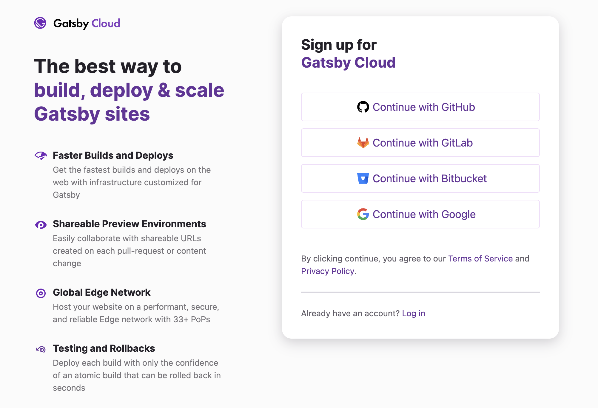
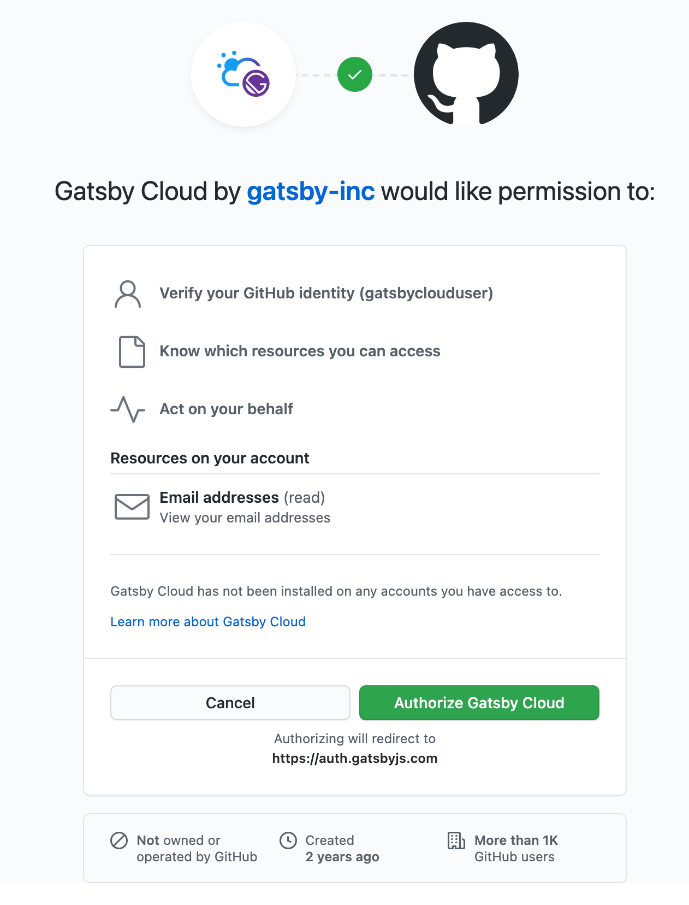
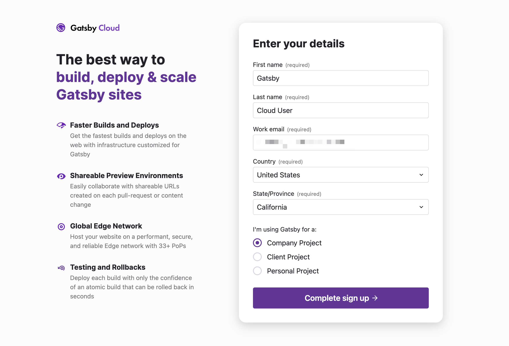
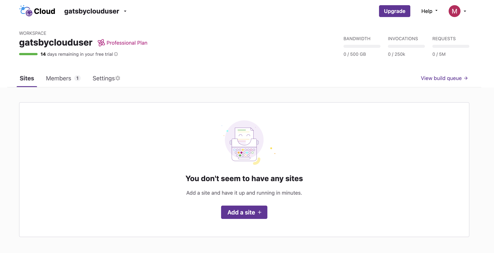

## Prerequisites

You will need an account with a version control system (VCS) provider. We currently support Github, GitLab, and Bitbucket.

To sign up for an account, visit our [sign up page](http://gatsbyjs.com/dashboard/signup) and select your authorization method.

You will be redirected to your provider's authorization page where you must grant access to the Gatsby Cloud app.

After clicking **"Authorize"**, you will be prompted to enter your name, email, location, and what brings you to Gatsby Cloud.

After selecting **"Complete sign up"** you will see your account dashboard.

